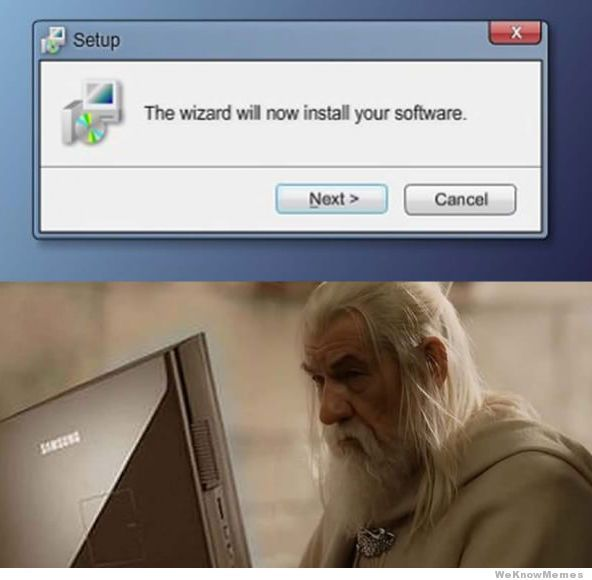
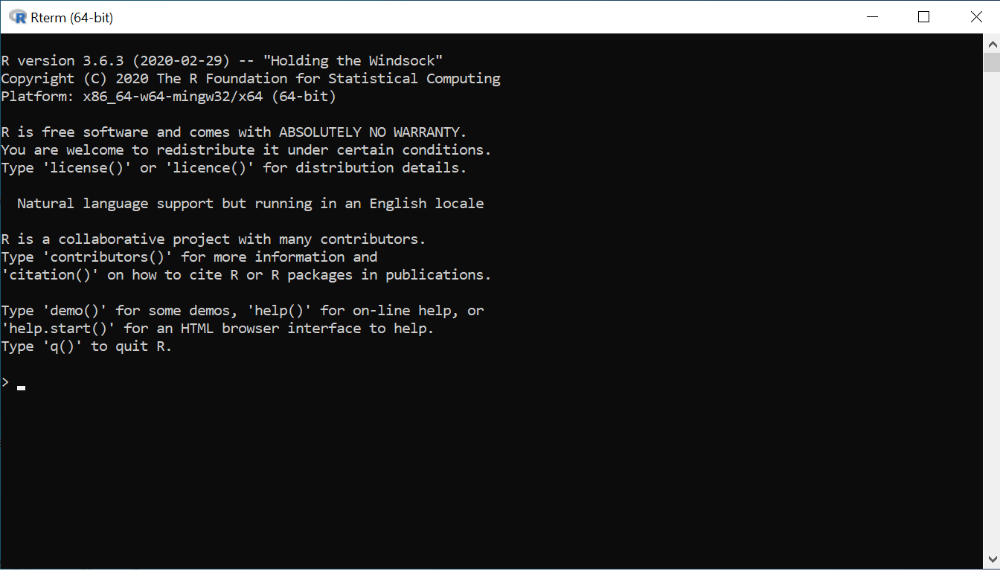
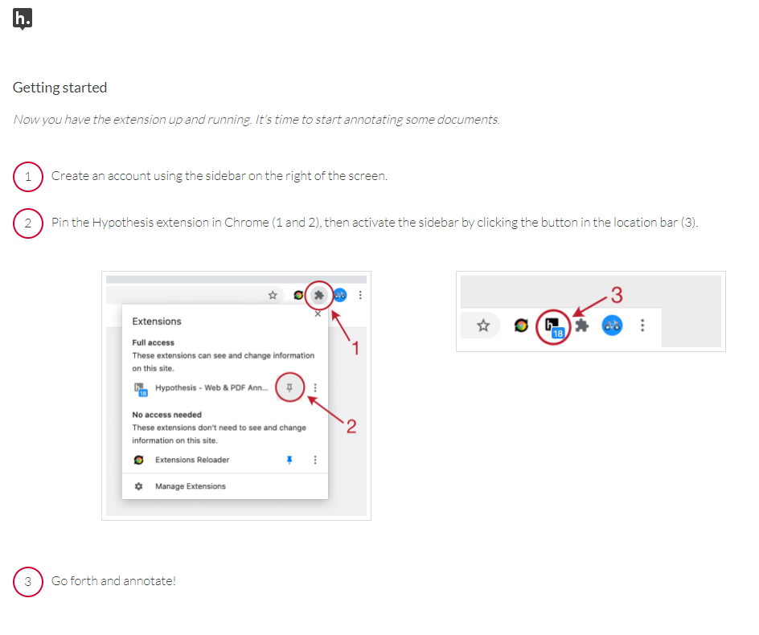

```{r setup, include=FALSE}
knitr::opts_chunk$set(echo = FALSE)

# Learn more about creating websites with Distill at:
# https://rstudio.github.io/distill/website.html

```

## Overview

In this course, you will learn the math and coding skills you need to conduct quantitative social science research. In the first half of the semester, we'll get comfortable working with data: cleaning it up, visualizing it, and summarizing it. In the second half of the semester, we'll build statistical models to help us interpret our data, communicate uncertainty, and make causal claims. A key theme of the course is that, to deeply understand your data, you must do both.

All the course materials you need will be available on this website. Check the Schedule tab for an overview of each week's topics and assignments. On the navbar, you can also find links to [read the syllabus](syllabus/POLS-7012-syllabus.pdf), [schedule an office hours appointment](https://calendly.com/jornstein/15min), [read your classmates' comments on the readings](https://hypothes.is/groups/g7pXazQj/pols-7012-fall-2021), and [visit the code repository](https://github.com/joeornstein/intro-political-methodology).

## Getting Started

There is a *lot* of software to install for this class, but in the instructions below I've tried to make it as straightforward as possible. (And everything is free!) Before the end of our first week, please complete the following steps.



### Data Analysis: R and RStudio

For starters, you will need `R`. The most current version is available [here](https://cloud.r-project.org/). To download, click link for your operating system (i.e. Mac, Windows, Linux), then follow the instructions on the page.

`R` is the programming language itself, but it comes with a pretty unfriendly interface.



You don't want to do all your typing in that lonely black box. Instead, you want **RStudio**, a piece of software that makes `R` *much* prettier. Download the RStudio Desktop version [here](https://www.rstudio.com/products/rstudio/download/#download).

### Version Control: git

Professional coders use a **version control system** called `git` to keep track of their code. If you're on a Mac, your computer *probably* already has it installed.[^1] If not, or you use a PC, follow the installation instructions [here](https://git-scm.com/downloads).

[^1]: I think? If you're on a Mac and you can't get git to work, let me know!

Once `git` is installed, it will want you to introduce yourself. To do so, follow these three steps:

1. In RStudio, click `Tools > Shell`. This will open your computer's [shell](https://happygitwithr.com/shell.html), a program that runs other programs.

2. Type and enter `git config --global user.name 'Jane Doe'` (substituting your name for Jane Doe).

3. Type and enter `git config --global user.email 'jane@example.com'` (substituting your email for that fake email address).

Using `git` to track changes in your code involves a bit of struggle on the front end, but it is well worth it [@bryan2017]. I'll walk you through the basics in class.

### Reference Management: Zotero

This software makes it blindingly simple to keep track of and format your citations. It also plays really nicely with RStudio. Download it [here](https://www.zotero.org/) and follow the setup instructions. The [Chrome extension](https://chrome.google.com/webstore/detail/zotero-connector/ekhagklcjbdpajgpjgmbionohlpdbjgc?hl=en) is particularly useful; anything you find on the Internet can be saved to your library with one click.

After Zotero is installed, create a username and password (if you click the green sync button at the top right, it will prompt you to create an account).

### Announcements and Discussion: GroupMe

Please [join our class GroupMe](https://groupme.com/join_group/62874918/MTotOtTJ) to to receive announcements and participate in class discussions.

### Social Annotation: Hypothesis

This semester, we'll be using a **social annotation** platform called [Hypothesis](https://web.hypothes.is/). That way, everyone will be able to post comments/questions/concerns/memes directly into the reading assignments. Follow these steps to get started:

1.  Click the book icon in the top-right corner of the course website. This will take you to our [Hypothesis Group Page](https://hypothes.is/groups/g7pXazQj/pols-7012-fall-2021).
2.  If you don't already have an account, you will be prompted to create one. Make your username something like `firstname_lastname` so we know who is posting!
3.  Hypothesis works best with Google Chrome. If you don't have it, install it [here](https://www.google.com/chrome/).
4.  Install the [Chrome extension](https://chrome.google.com/webstore/detail/hypothesis-web-pdf-annota/bjfhmglciegochdpefhhlphglcehbmek?hl=en). When you do, it should take you to a welcome page with instructions on how to log in, pin the extension, and start annotating pages!



5.  Go to the [syllabus](syllabus/POLS-3230-syllabus.pdf) and add your questions/comments/memes. Whenever you annotate a reading, just make sure that you are posting to the Group instead of Public (see the dropdown menu at the top of the extension).

### Memory Aid: Anki

A lot of grad school -- particularly the methods courses -- involves rote memorization of things like formulas and code syntax. This is the boring and frustrating part, but there are ways to make it somewhat less boring and frustrating. Do yourself a favor and take 20 minutes and play through @case2018. If you're convinced, download [Anki](https://apps.ankiweb.net/). It's not the prettiest spaced repetition software out there, but it is free, streamlined, highly customizable, and has a large, dedicated fanbase.

### Note-Taking Software (Optional)

While we're talking software, consider how you want to organize all the notes you generate in grad school. Information is going to be coming at you like a firehouse, and you'll want a system that you can trust as your "external brain".[^2] I highly recommend reading @ahrens2017, a book that is much more fascinating than a book about note-taking should rightfully be.

[^2]: Don't be like I was in grad school and write all your notes in a bunch of random notebooks that you throw in the trash at the end of the semester; so much wasted effort!
