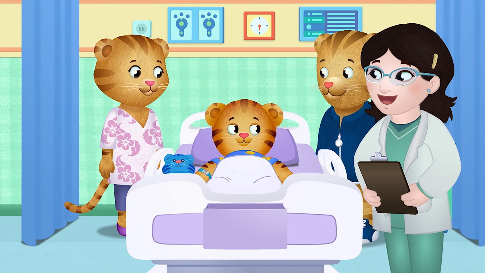
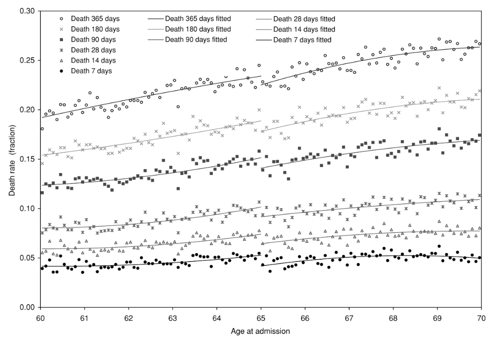

```{r Setup, include=FALSE}
library(tidyverse)
theme_set(theme_minimal(base_size = 16))
knitr::opts_chunk$set(comment=NA, fig.width=7, fig.height=5, 
                      fig.align = 'center', out.width = 600,
                      message=FALSE, warning=FALSE, echo=FALSE)
```


### How do we learn about the world?

--

We tell each other stories!

--

```{r, out.width=500}
knitr::include_graphics('img/daniel-tiger-1.png')
```

--

.pull-left[

```{r, out.width=300}

```
]
--

.pull-right[
```{r, out.width=300}

```
]

---

### How do we learn about the world?

--

- We tell stories to communicate lessons about how the world works.

--

  - Storytelling may be one of the few things shared by every culture.

--

- But there are limits...

--

  - What lessons can we actually learn from the Daniel Tiger story?
  
--

<br>

There are three things we cannot learn about from individual stories:

--

  1. Variation
  
    - "What happened to other children besides Daniel Tiger when they went to the hospital?"
  
--

  2. Counterfactuals
  
    - "What if Daniel Tiger didn't go to the hospital?"
  
--

  3. Generalizability 
  
    - "Was Daniel's story just a fluke?"

---

## Science is story-telling, but with rules.

--

- Instead of telling just one story, we tell *multiple* stories.

--

  - This allows us to look at variation in outcomes, assess counterfactuals, and more confidently draw general conclusions.

--

- Inevitably, this means abstracting away details.

--

  - *Quantitative Research*: Lots of stories, less detail

--

  - *Qualitative Research*: Fewer stories, more detail
  
--

- In POLS 7012 we learn the tools of quantitative research, to tell lots of stories simultaneously...

--

  - ...in a way that yields insights about variation, causality, and uncertainty.

---

class: center, middle, inverse

# Part 1: Discovery

---

## Part 1: Discovery

--

- When we analyze data, we're telling many different stories at a high level of abstraction.

--


| Name | Species | Age | Hospitalized | Pajama Choice |
|-------|-------|-----|-----|-----|
| Daniel     | Tiger     | 4   | Yes   | Ducks |
| Katerina     | Kitty Cat     | 4   | No   | Ballerinas  | 
| Ms. Elaina     | Human     | 5   | Yes   | Ducks |
| O     | Owl     | 4  | Yes   | Books |
| Jodi     | Platypus     | 4   | No | Books   |

This is a **dataset**. 

--

- In Part 1 of the course, we'll learn how to collect, tidy, and describe datasets.

---

## Part 1: Discovery

```{r}
set.seed(42)
n <- 100
dataset <- tibble(
  temperature = rnorm(n, 100, 2),
  hospitalized = if_else(temperature + rnorm(n, 0, 1) > 100,
                         'Yes', 'No'),
  died = if_else(temperature - as.numeric(hospitalized == 'Yes') * 2 + 
                   rnorm(n, 0, 1) > 100,
                 'Yes', 'No'))

```

```{r, echo = TRUE}
dataset
```

--

It's difficult to make sense of 100 stories all at once.

--

- We need to compute *statistics*, numbers that communicate some feature of the dataset.

---

## Part 1: Discovery

```{r, echo = TRUE}
dataset |> 
  group_by(hospitalized) |> 
  summarize(count = n(), 
            number_died = sum(died == 'Yes'), 
            pct_dead = number_died / count * 100)
```

--

- Each of these are *descriptive statistics*, which tell us something about the dataset.

--

  - For example, people in this dataset are about 10% more likely to die if they go to the hospital.

--

- Wait. What?

---

class: center, middle, inverse

# Part 2: Causality

---

## Part 2: Causality

```{r}
dataset |> 
  group_by(hospitalized) |> 
  summarize(count = n(), 
            number_died = sum(died == 'Yes'), 
            pct_dead = number_died / count * 100)
```

10% more people died in the hospitalized group than in the non-hospitalized group.

--

- But what conclusions can we draw from that?

--

- In Part 2 of the course, we think carefully about when patterns in a dataset imply a causal relationship and when they don't.

---

## Part 2: Causality

- You've likely guessed the problem.

--

  - People who go to the hospital tend to be sicker than people who don't go to the hospital.

--

```{r, echo = TRUE}
dataset |> 
  group_by(hospitalized) |> 
  summarize(avg_temp = mean(temperature))
```

--

- Comparing hospitalized vs. non-hospitalized people may be interesting, but it doesn't reveal the effect of hospitals on mortality.

--

- We need an "all else equal" comparison.

---

## Part 2: Causality

In POLS 7012, we learn a few techniques for making the right comparisons.

--

### 1. "Controlling" other variables

--

```{r, echo = TRUE}
dataset |> 
  filter(temperature > 100) |> 
  group_by(hospitalized) |> 
  summarize(count = n(), 
            number_died = sum(died == 'Yes'), 
            pct_dead = number_died / count * 100)
```


---


## Part 2: Causality

In POLS 7012, we learn a few techniques for making the right comparisons.

### 2. Experiments

--

  - Great because randomly assigning treatment ensures that the two groups are not different on average.
  
--

  - But...probably unethical in this case.

---

## Part 2: Causality

In POLS 7012, we learn a few techniques for making the right comparisons.

### 3. Discontinuity Designs

```{r,  out.width=500, fig.cap='Card et al. (2009)'}

```

---

class: center, middle, inverse

# Part 3: Uncertainty

---

## Part 3: Uncertainty

- In the final few weeks of class, we will discuss **confidence**. 

--

  - How certain can we be that the patterns we observe in our data aren't just a random fluke?
  
--

  - To answer that question, we need probability theory.

--

```{r, echo = TRUE}
dataset |> 
  filter(temperature > 100) |> 
  group_by(hospitalized) |> 
  summarize(count = n(), 
            number_died = sum(died == 'Yes'), 
            pct_dead = number_died / count * 100)
```

--

That looks like a big difference, but...maybe we just drew a weird sample?

---

## Part 3: Uncertainty

What's the chance that 8 out of 10 people would die in the hospital, given its mortality rate (34.1%)?

--

```{r}
d <- tibble(x = 0:10,
            p = dbinom(x, 10, 0.341))

ggplot(data = d,
       mapping = aes(x=factor(x),
                     y=p)) +
  geom_col() +
  labs(x = 'Number of Deaths',
       y = 'Probability')
```

---

class: center, middle, inverse

# In Summary

---

## In Summary

This semester, we'll learn to:

--

- work confidently with data

--

- organize our work in code so tht it's transparent and reproducible

--

- design research to credibly identify causation (not just correlation)

--

- build basic statistical models to quantify the uncertainty of our conclusions

--

## Today

--

1. Download R and RStudio

--

2. Become familiar with statsitical programming

--

3. Analyze our first dataset!