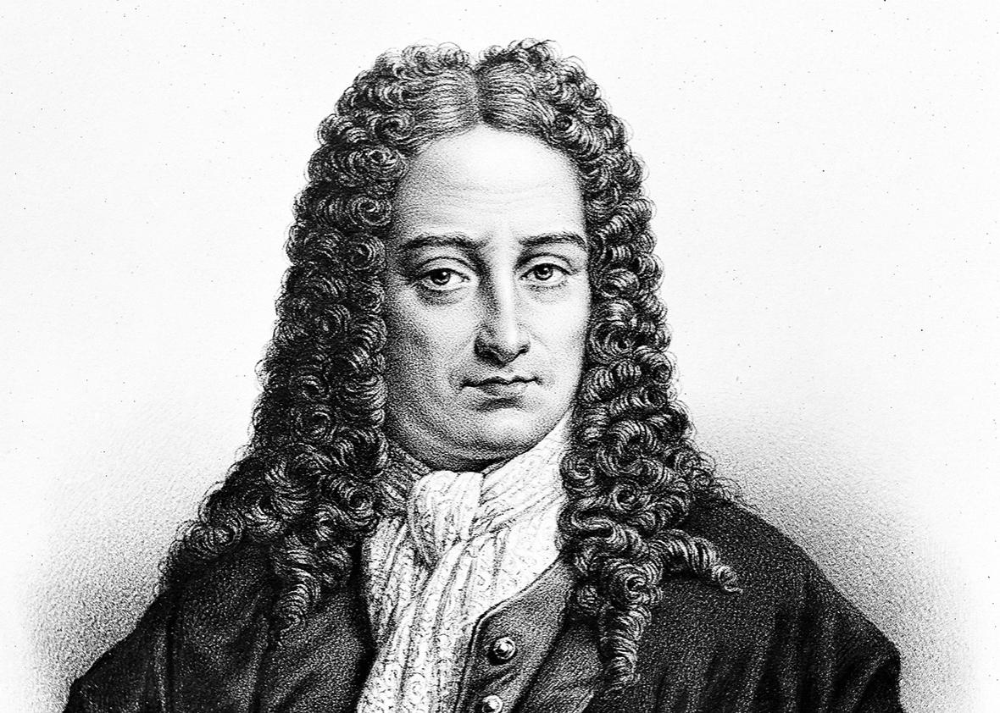
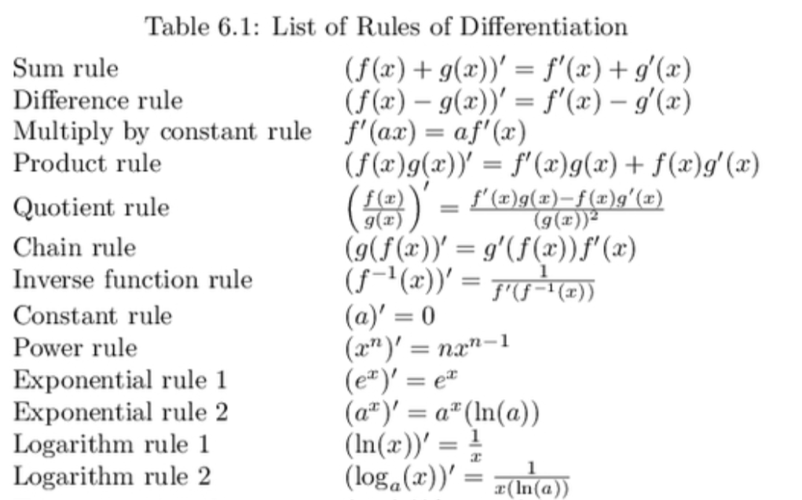
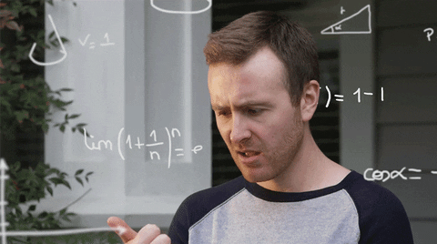

```{r Setup, include=FALSE}
library(tidyverse)
theme_set(theme_minimal(base_size = 16))
knitr::opts_chunk$set(comment=NA, fig.width=7, fig.height=5, 
                      fig.align = 'center', out.width = 600,
                      message=FALSE, warning=FALSE, echo=FALSE)
```


# The Linear Model

```{r party-data, echo = FALSE}
ches <- read_csv('../../data/ches/ches-cleaned.csv')

p <- ggplot(data = ches,
       mapping = aes(x = social, y = economic)) +
  geom_point(alpha = 0.6) +
  theme_bw() +
  scale_y_continuous(limits = c(-5, 5)) +
  coord_equal() +
  labs(title = 'European Political Parties (2019)',
       caption = 'Measures from the Chapel Hill Expert Survey (Bakker et al., 2019)',
       x = 'Position on Social Issues',
       y = 'Position on Economic Issues')

p
```

---

# The Linear Model

```{r}
p + geom_smooth(method = 'lm', se = FALSE)
```

---

# The Linear Model

$$Y = X\beta + \varepsilon$$
```{r}
p + geom_smooth(method = 'lm', se = FALSE)
```

---

# The Linear Model

Partitioning the outcome into two parts -- the part we can explain, and the part we're ignoring:

$$\underbrace{Y}_\text{outcome} = \underbrace{X\beta}_\text{explained} + \underbrace{\varepsilon}_\text{unexplained}$$
---

# The Linear Model

Partitioning the outcome into two parts -- the part we can explain, and the part we're ignoring:

$$\underbrace{Y}_\text{outcome} = \overbrace{X}^\text{explanatory variable}\beta + \varepsilon$$
---

# The Linear Model

Partitioning the outcome into two parts -- the part we can explain, and the part we're ignoring:

$$\underbrace{Y}_\text{outcome} = \overbrace{X}^\text{explanatory variable}\underbrace{\beta}_\text{parameter} + \varepsilon$$
---

# The Linear Model

Partitioning the outcome into two parts -- the part we can explain, and the part we're ignoring:

$$\underbrace{Y}_\text{outcome} = \overbrace{X}^\text{explanatory variable}\underbrace{\beta}_\text{parameter} + \overbrace{\varepsilon}^\text{residual}$$
--

**Our challenge for today**: how do we estimate the $\beta$ parameter? What is the "best" slope for the line of best fit?

---

class: center, middle

Let's play around a little bit with `R/week-07/line-of-best-fit.Rmd`.

---

class: center, middle

# Calculus

---

# An Optimization Problem

--

We have a **function** that we want to minimize.

$$SSE = \sum (Y - X\beta)^2$$
Here's what that function looks like:

```{r sse-plot, out.height='300px', out.width='500px'}
# this code chunk creates a sum of squared errors function,
# then plots it over a range of values for beta
sse <- function(y, x, beta){
  return(sum((y - x*beta)^2))
}

# iterate over a sequence of beta values and return the sum of squared error
betas <- seq(-5, 5, 0.1)
f <- map_dbl( betas, sse, 
              y = ches$social, x = ches$economic )

ggplot(mapping = aes(x=betas, y = f)) +
  geom_line() +
  labs(x = 'Beta', y = 'Sum of Squared Errors')
```

--

**Key Insight**: Function is minimized when the slope "switches" from decreasing to increasing. Exactly at the point where the slope equals zero.

---

class: center, middle

# Slopes

---

# Slopes

What is the **slope** of $f(x) = 3x + 2$?

```{r slope, out.width='70%'}
x <- -2:2
y <- 3*x + 2

ggplot(mapping = aes(x=x, y = y)) + 
  geom_line()
```

--

The slope of a linear function (a straight line) is measured by how much $y$ increases when you increase $x$ by $1$. In this case, $3$.

---

# Linear Functions

Find the slope of each function:

- $y = 2x + 4$

- $f(x) = \frac{1}{2}x - 2$

- life expectancy (years) = 18.09359 + 5.737335 $\times$ log(GDP per capita)


--

### Remember:

Slope of a line $= \frac{rise}{run}$ 

--
$= \frac{\Delta Y}{\Delta X}$

--
$= \frac{f(x+h) - f(x)}{h}$


???

Finding the slope of a line is *easy*.

Just wanted you to get comfortable with that last expression, because we'll be see it again in a moment. 

https://smartech.gatech.edu/bitstream/handle/1853/56031/effect_of_gdp_per_capita_on_national_life_expectancy.pdf

---

# Nonlinear Functions

.center[
```{r Nonlinear Function}

arbitrary_polynomial <- function(x){
  return((x-1)*(x+2)*(x-3)*(x+4)*(x-4))
 # return(x^5 + 3*x^4 - 2*x^3 + 5*x^2 - 6*x + 2)
}

#TODO: Set the interval really small when you're ready to publish
x <- seq(-4,4,0.0001) #0.0001
y <- arbitrary_polynomial(x)

p <- ggplot(data = tibble(x,y)) +
  geom_line(aes(x=x,y=y),size=1) +
  xlab('x') + ylab('y')
  

p + 
  geom_hline(yintercept = 0) +
  geom_vline(xintercept = 0)
```
]

Nonlinear functions are confusing and scary...

???

Nonlinear functions are confusing and scary. Sometimes the slope is positive. Sometimes it's negative. Sometimes it's zero. And unlike with linear functions, just looking at the formula gives you no indication what the slope is at any point.


---

# Isaac Newton


???

Developed/Discovered:
- The theory of universal gravitation
- Three Laws of Motion
- The Nature of Light
- And, as a side project so he'd have mathematical notation for those other projects, he created calculus

NB: Newton did some of his best work while stuck at home during an epidemic. So, you know, get to it.

---

# Gottfried Wilhelm Leibniz


```{r Leibniz picture}

```

???

Also invented calculus, but with better notation. A philosophical optimist who believed we lived in the "best of all possible worlds", a sentiment parodied by Voltaire, and perhaps belied by the fact that Newton took all the credit for inventing calculus.

---

# Newton and Leibniz's Insight

Any curve becomes a straight line if you "zoom in" far enough.

--

<br>

```{r enhance gif}
knitr::include_graphics('img/enhance.gif')
```

???

<https://knowyourmeme.com/memes/zoom-and-enhance>

---

# Zoom and Enhance...

```{r Show the function again}
p +
  geom_hline(yintercept = 0) +
  geom_vline(xintercept = 0)

```

---

# Zoom and Enhance...

```{r Zoom and Enhance}

# Add first rectangle
p + 
  geom_hline(yintercept = 0) +
  geom_vline(xintercept = 0) +
  geom_rect(aes(xmin=1.2, xmax=1.75, ymin=25, ymax=50), fill = NA, 
            color="black", alpha=0.5) 

```

---

# Zoom and Enhance...

```{r Zoom and Enhance 2}

# Zoom into first rectangle
p + scale_x_continuous(limits = c(1.2, 1.75)) +
  scale_y_continuous(limits = c(25, 50)) +
  geom_rect(aes(xmin=1.2, xmax=1.75, ymin=25, ymax=50), fill = NA, 
            color="black", alpha=0.5) 

```


---

# Zoom and Enhance...Again...

```{r Zoom and Enhance 3}

# Add second rectangle
p + scale_x_continuous(limits = c(1.2, 1.75)) +
  scale_y_continuous(limits = c(25, 50)) +
  geom_rect(aes(xmin=1.425, xmax=1.525, ymin=32.5, ymax=37.5), fill = NA, 
            color="black", alpha=0.5) 

```


---

# Zoom and Enhance...Again...

```{r Zoom and Enhance 4}

# Zoom into second rectangle
p + scale_x_continuous(limits = c(1.425, 1.525)) +
  scale_y_continuous(limits = c(32.5, 37.5)) +
  geom_rect(aes(xmin=1.425, xmax=1.525, ymin=32.5, ymax=37.5), fill = NA, 
            color="black", alpha=0.5) 

```

---

# Zoom and Enhance...Again...And Again...

```{r Zoom and Enhance 5}

# Add third rectangle
p + scale_x_continuous(limits = c(1.425, 1.525)) +
  scale_y_continuous(limits = c(32.5, 37.5)) +
  geom_rect(aes(xmin=1.4775, xmax=1.4875, ymin=35, ymax=35.5), fill = NA, 
            color="black", alpha=0.5) 

```

---

# Zoom and Enhance...Again...And Again...

```{r Zoom and Enhance 6}

# Zoom to third rectangle
p + scale_x_continuous(limits = c(1.4775, 1.4875)) +
  scale_y_continuous(limits = c(35, 35.5)) +
  geom_rect(aes(xmin=1.4775, xmax=1.4875, ymin=35, ymax=35.5), fill = NA, 
            color="black", alpha=0.5) 

```

--

It's basically a straight line! And finding the slope of a straight line is easy...

???

The point is that, in the limit, as you shrink the interval smaller and smaller (infinitesimally small), the function is better and better approximated by a straight line. And we already know the slope of a straight line, so the problem is solved! (That line is called the tangent line FYI.)

---

# Putting All That Into Math...


<br>

<br>

$$f'(x) = \lim_{h \to 0}\frac{f(x+h)-f(x)}{h}$$

---

# Putting All That Into Math...

<br>

<br>

$$f'(x) = \underbrace{\lim_{h \to 0}}_\text{shrink h really small}\frac{\overbrace{f(x+h)-f(x)}^\text{the change in y}}{\underbrace{h}_\text{the change in x}}$$

--

<br>


This is called the **derivative** of a function.


---

# Example

Let $f(x) = 2x + 3$. What is $f'(x)$?

--

$$f'(x) =  \lim_{h \to 0}\frac{f(x+h)-f(x)}{h}$$ 
--

$$= \lim_{h \to 0}\frac{2(x+h)+3-(2x+3)}{h}$$ 

--

$$= \lim_{h \to 0}\frac{2x+2h+3-(2x+3)}{h}$$

--

$$= \lim_{h \to 0}\frac{2h}{h}$$

--

$$= 2$$

???

Hey look what we discovered! The slope of a linear function equals the coefficient on $x$!

---

# Now A Nonlinear One

Let $f(x) = 3x^2 + 2x + 3$. What is $f'(x)$?

--

$$= \lim_{h \to 0}\frac{3(x+h)^2 + 2(x+h) + 3 - (3x^2 + 2x + 3)}{h}$$
--

$$= \lim_{h \to 0}\frac{3x^2 + 3h^2 + 6xh + 2x+ 2h + 3 - (3x^2 + 2x + 3)}{h}$$

$$= \lim_{h \to 0}\frac{3h^2 + 6xh + 2h}{h}$$
--

$$= \lim_{h \to 0}3h + 6x + 2$$

--

$$= 6x + 2$$

---

# Solution

```{r Derivative Exercise Solution}

f <- function(x){
  3*x^2 + 2*x + 3
}

f_prime <- function(x){
  6*x + 2
}

x <- seq(-2,2, 0.001)

data <- tibble(x = x,
               y1 = f(x),
               y2 = f_prime(x))

ggplot(data) +
  geom_line(aes(x=x,y=y1), color = 'black', size = 1) +
  geom_line(aes(x=x,y=y2), color = 'red', size = 1) +
  xlab('x') + ylab('y') +
  geom_hline(yintercept = 0) + geom_vline(xintercept = 0) +
  geom_text(aes(x=0.8,y=15,label="f(x) = 3x^2 + 2x + 3"), size = 5) +
  geom_text(aes(x=1.5,y=6,label="f '(x) = 6x + 2"), color = 'red', size = 5)
  


```

???

This function, $f'(x)$, outputs the slope of $f(x)$ at every point. You can "read off" the slope of $f(x)$ from the vertical of $f'(x)$.

---

class: center, middle

**Good news!** You don't have to go through that process every time. Mathematicians have done it for you, and have discovered a whole bunch of useful shortcuts.

---

## Shortcut 1: The Power Rule

If $f(x) = ax^k$, then $f'(x) = kax^{k-1}$

--

<br>

### Example:

If $f(x) = 5x^4$, then $f'(x) = 20x^3$. 

--

### Practice Problem:

Let $f(x) = 2x^3$. What is $f'(x)$?

--

<br>

$$f'(x) = 6x^2$$

---

## Shortcut 2: The Sum Rule

The derivative of a sum is equal to the sum of derivatives.

If $f(x) = g(x) + h(x)$, then $f'(x) = g'(x) + h'(x)$

--

<br>

### Example:

If $f(x) = x^3 + x^2$, then $f'(x) = 3x^2 + 2x$

--

### Practice Problem:

If $f(x) = 2x^3 + x^2$, what is $f'(x)$?

--

$$f'(x) = 6x^2 + 2x$$

---

## Shortcut 3: The Constant Rule

The derivative of a constant is zero

If $f(x) = c$, then $f'(x) = 0$

--

<br>

### Example:

If $f(x) = 5$, then $f'(x) = 0$.

--

### Practice Problem:

If $f(x) = 4x^2 + 3x + 5$, what is $f'(x)$?

--

<br>

$$f'(x) = 8x + 3$$

---

## Shortcut 4: The Product Rule

The derivative of a product is a bit trickier...

If $f(x) = g(x) \cdot h(x)$, then $f'(x) = g'(x) \cdot h(x) + g(x) \cdot h'(x)$

--

### Example:

If $f(x) = (2x)(x + 2)$, then $f'(x) = 2x + 2(x+2) = 4x + 4$

--

### Practice Problem:

$f(x) = (3x^2 + 6x)(x+2)$, what is $f'(x)$?

--

$$f'(x) = (3x^2 + 6x)(1) + (6x + 6)(x+2)$$

$$f'(x) = 3x^2 + 6x + 6x^2 + 6x + 12x + 12$$

$$f'(x) = 9x^2 + 24x + 12$$

---

## Shortcut 5: The Chain Rule

If your $f(x)$ is a function wrapped around another function...

If $f(x) = g(h(x))$, then $f'(x) = g'(x) \cdot h'(x)$

--

"The derivative of the outside times the derivative of the inside."

--

### Example:

If $f(x) = (2x^2 - x + 1)^3$, then $f'(x) = 3(2x^2 - x + 1)^2 (4x - 1)$

--

### Practice Problem:

$f(x) = \sqrt{x + 3} = (x+3)^{\frac{1}{2}}$, what is $f'(x)$?

--

$f'(x) = \frac{1}{2}(x+3)^{-\frac{1}{2}}(1) = \frac{1}{2\sqrt{x+3}}$

---

## Other Derivative Rules

There's a handy chart in Moore & Siegel:


---

<br>

<br>

<br>

.center[]

--

<br>

If you haven't seen these before, it's a lot to absorb. But practice helps.

???

Don't freak out.

---

# More Practice

### Problem 1: Sum of Powers (Polynomial)

Let $f(x) = 2x^3 + 4x + 79$. What is $f'(x)$?

### Problem 2: Multiply By A Constant

Let $f(x) = 3(x^2 + x + 42)$. What is $f'(x)$?

### Problem 3: Product Rule

Let $f(x) = (x^2 + 1)(x+3)$. What is $f'(x)$?


---

class: center, middle

# I taught you that...


---

class: center, middle

# ...so you could do *this*.


---

# Optimization

Let $f(x) = 2x^2 + 8x - 32$. At what value of $x$ is the function minimized?

```{r Optimization Function, out.width = 500}

f <- function(x){
  2*x^2 + 8*x - 32
}

f_prime <- function(x){
  4*x + 8
}

x <- seq(-10,10,0.001)

data <- tibble(x=x,
               y1 = f(x),
               y2 = f_prime(x))

p <- ggplot(data = data) +
  geom_line(aes(x=x,y=y1),size = 1) +
  xlab('x') + ylab('y')
              
p
```

--

**Key Insight**: Function is minimized when the slope "switches" from decreasing to increasing. Exactly at the point where the slope equals zero.

---

# Optimization in Three Steps

--

#### 1. Take the derivative of the function.

--

#### 2. Set it equal to zero.

--

#### 3. Solve for $x$.

---

# Optimization in Three Steps

#### 1. Take the derivative of the function.

--

$$f(x) = 2x^2 + 8x - 32$$

--

$$f'(x) = 4x + 8$$

--

#### 2. Set it equal to zero

$$4x + 8 = 0$$

--

#### 3. Solve for $x$.

--

$$x = -2$$


???

That second step is called the "First Order Condition", or FOC.

---

# Optimization in Three Steps

```{r Optimization Plot with Solution}

p + geom_text(aes(x=7,y=175,label="f(x)"), size = 5) +
  geom_line(aes(x=x,y=y2), color = 'red', size = 1) +
  geom_text(aes(x=9,y=20,label="f '(x)"), size = 5, color = 'red') +
  geom_vline(xintercept = -2, linetype = 'dashed', color = 'blue') +
  geom_text(aes(x = 0, y = 125, label = 'x = -2'), color = 'blue', size = 5)

```


???

Bonus question: how do you know if it's a maximum or a minimum? Take the second derivative! If it's positive, then the slope is increasing (so it's a minimum). If it's positive, then the slope is decreasing (so it's a maximum).

---

# Now You Try It

Suppose that happiness as a function of jellybeans consumed is $h(j) = -\frac{1}{3}j^3 + 81j + 2$. How many jellybeans should you eat? (Assume you can only eat a positive number of jellybeans).

--

```{r Jellybean Plot}

happiness <- function(j){
  (-1/3)*j^3 + 81*j + 2
}

happiness_prime <- function(j){
  81 - j^2
}

j <- seq(0, 15, 0.01)
h <- happiness(j)
h_prime <- happiness_prime(j)

ggplot(data = tibble(j, h, h_prime)) +
  geom_line(aes(x=j,y=h), size = 1) +
  geom_line(aes(x=j,y=h_prime), color = 'red', size = 1) +
  xlab('Jellybeans Consumed') + ylab('Happiness') +
  geom_text(aes(x=13,y=420,label = 'h(j)'), size = 5) +
  geom_text(aes(x=14,y=-40,label = "h'(j)"), color = 'red', size = 5) +
  geom_vline(xintercept = 9, linetype = 'dashed', color = 'blue')


```

---

class: center, middle

### Wait, how do you know if it's a maximum or a minimum?

---

## Jellybeans Again

$h(j) = \frac{1}{3}j^3 + 81j + 2$ and $h'(j) = 81 - j^2$

```{r Jellybean Plot Again, out.width = '60%'}

ggplot(data = tibble(j, h, h_prime)) +
  geom_line(aes(x=j,y=h), size = 1) +
  geom_line(aes(x=j,y=h_prime), color = 'red', size = 1) +
  xlab('Jellybeans Consumed') + ylab('Happiness') +
  geom_text(aes(x=13,y=420,label = 'h(j)'), size = 5) +
  geom_text(aes(x=14,y=-40,label = "h'(j)"), color = 'red', size = 5) +
  geom_vline(xintercept = 9, linetype = 'dashed', color = 'blue')


```

--

It's a maximum when the slope is **decreasing**, and a minimum when then slope is **increasing**. How do you figure out if the slope is increasing or decreasing?

--

That's right. You find the **slope of the slope** (aka the **second derivative**).

---

## The Second Derivative Test

$h(j) = \frac{1}{3}j^3 + 81j + 2$ and $h'(j) = 81 - j^2$

What is $h''(j)$? Is it positive or negative when you eat $9$ jellybeans?

--

$$h''(j) = -2j$$

```{r second derivative, out.width='60%'}

happiness_prime_prime <- function(j){
  -2*j
}

h_prime_prime <- happiness_prime_prime(j)

ggplot(data = tibble(j, h, h_prime)) +
  geom_line(aes(x=j,y=h), size = 1) +
  geom_line(aes(x=j,y=h_prime), color = 'red', size = 1) +
  geom_line(aes(x=j,y=h_prime_prime), color = 'purple', size = 1) +
  xlab('Jellybeans Consumed') + ylab('Happiness') +
  geom_text(aes(x=13,y=420,label = 'h(j)'), size = 5) +
  geom_text(aes(x=14,y=-60,label = "h'(j)"), color = 'red', size = 5) +
  geom_text(aes(x=1,y=-20,label = "h''(j)"), color = 'purple', size = 5) +
  geom_vline(xintercept = 9, linetype = 'dashed', color = 'blue')

```


---

class: center, middle

# Partial Derivatives


---

# Partial Derivatives

What if you have a multivariable function?

$$f(x,y) = 2x^2y + xy - 4x + y -6$$

--

Same procedure! To get the derivative of a function *with respect to* $x$ or $y$, treat the other variable as a constant.

--

$$\frac{\partial f}{\partial x} = 4yx + y - 4$$

--

$$\frac{\partial f}{\partial y} = 2x^2 + x + 1$$

---

# Now You Try...

Suppose happiness as a function of jellybeans and Dr. Peppers consumed is

$$h(j,d) = 8j -\frac{1}{2}j^2 + 2d - 3d^2 + jd + 100$$
How many jellybeans should you eat? How many Dr. Peppers should you drink?

--

Intuitively, the $jd$ term is an **interaction effect**. The effect of jellybeans on happiness increases if you also drink more Dr. Peppers. 

---

# Now You Try...

$$h(j,d) = 8j -\frac{1}{2}j^2 + 2d - 3d^2 + jd + 100$$

--

$$\frac{\partial h}{\partial j} = 8 - j + d = 0$$
--

$$\frac{\partial h}{\partial d} = 2 - 6d + j = 0$$
--

$$j = 8 + d$$

$$j = 6d - 2$$
--

<br>

$$d^* = 2$$
$$j^* = 10$$

---

## Visualizing That Function

$$h(j,d) = 8j -\frac{1}{2}j^2 + 2d - 3d^2 + jd + 100$$

```{r plotly}
library(plotly)

# thanks: https://www.datamentor.io/r-programming/3d-plot/

f <- function(j,d){
  8*j - 0.5*j^2 + 2*d - 3*d^2 + j*d + 100
}

j <- seq(0, 20, length= 20)
d <- seq(0, 4, length = 4)

happiness <- outer(j, d, f)

p <- plot_ly(z = happiness, type = "surface") %>% 
  layout(
    scene = list(
      xaxis = list(title = "Dr. Peppers"),
      yaxis = list(title = "Jellybeans"),
      zaxis = list(title = "Happiness")
    ))
p

```


---

class: center, middle

## Back to our motivating example...

---

## Back to our motivating example...

Error function we wanted to minimize:

$f(b) = \sum (y - xb)^2$

--

To compute the derivative, apply the sum rule and the chain rule...

$\frac{\partial f}{\partial b} = \sum 2(y - xb)(-x) = \sum(2x^2b - 2xy)$

--

Set that derivative equal to zero and solve:

$0 = \sum (2x^2b - 2xy)$

--

$\sum (2xy) = \sum (2x^2b)$

--

$2 \sum (xy) = 2b\sum (x^2)$

--

$b = \frac{\sum xy}{\sum x^2}$

???

Note: suppressing index notation for the brains of the students


---

## Back to our motivating example...

The Linear Model:

$$y = x\beta + \varepsilon$$
The thing we want to minimize:

$$SSE = \sum (y - x\beta)^2$$
The solution to the minimization problem:

$$b = \frac{\sum xy}{\sum x^2}$$

--

Some terminology:

- $\beta$ in that first equation is called the **estimand**. It's the thing we're trying to estimate.
- $b$ in that final equation is called the **estimator**, or the **estimating equation**. It's the procedure we use to produce an estimate.

---

# The Linear Model is Everywhere

--

- **OLS / Regression Analysis (POLS 7014)** = The Linear Model

- **MLE / Logit / Probit / Count Models (POLS 8501)** = The Linear Model + another function

- **t-tests** = The Linear Model + a binary predictor

- **Instrumental Variables** = Two Linear Models

- **Regression Discontinuity** = Two Linear Models

- **Matching** = The Linear Model + Weights

- **Fixed Effects / Random Effects / ANOVA** = The Linear Model + Categorical Predictor Variables

- **Difference-in-differences** = The Linear Model + Time

--

Statistical modeling can seem pretty daunting when you think about it as a bunch of tests with no obvious connections. But fundamentally, the linear model is what unifies all these approaches...

<!-- --- -->

<!-- # Why Build Models? -->

<!-- -- -->

<!-- 1. To *describe* complex data -->

<!-- -- -->

<!-- 2. To make *predictions* -->

<!-- -- -->

<!-- 3. To help infer *causality* -->

<!-- ??? -->

<!-- Up to now, we've been using visualization as our primary mode of inquiry. This is a great, and underrated, tool! But there are limits to what it can do for us. Models allow us to more precisely describe the relationships we can only see in a chart. They allow us to make predictions about unseen data. And, coupled with theory, they can help us uncover causal relationships. -->

---


class: center, middle

Back to the `R` script!