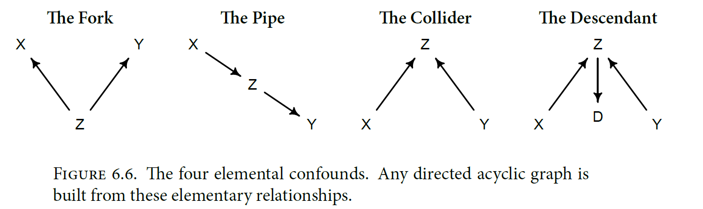
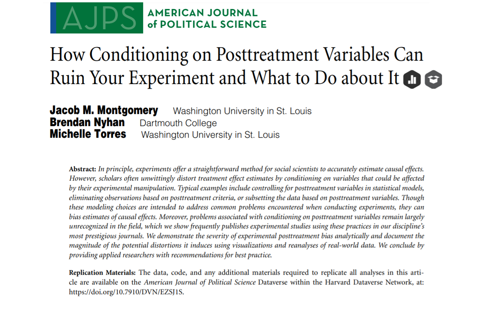
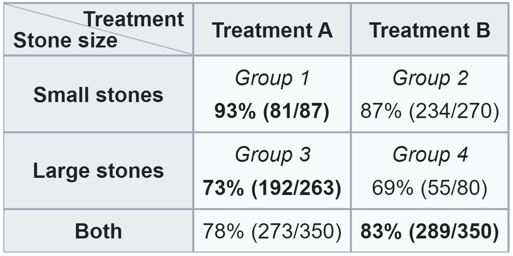
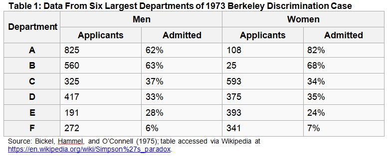
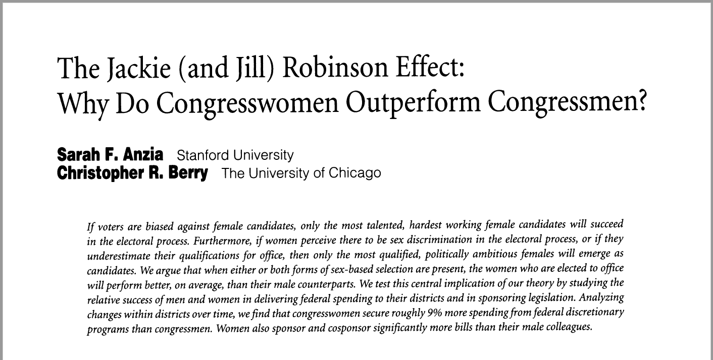

```{r Setup, include=FALSE}
library(tidyverse)
library(dagitty)
library(ggdag)
set.seed(42)
theme_set(theme_minimal(base_size = 16))
knitr::opts_chunk$set(comment=NA, fig.width=7, fig.height=5, 
                      fig.align = 'center', out.width = 600,
                      message=FALSE, warning=FALSE, echo=TRUE)
```

## Schedule

<br>

### Last Week

$Y = X\beta + \varepsilon$, and how to estimate the best $\beta$ using calculus.

<br>

### Today

How to combine the linear model with theory to make credible causal inferences. 

???

Last week we learned the basics of the lienar model, which is this all-purpose technology we use to describe the relationship between two variables. We learned calculus so that we could optimize, finding the value of $\beta$ that was the best fit to the data.

But we ended last week with a note of disappointment, because the linear model alone can't get us where we want to go. At its core, it's still just describing observed correlations. Today, we explore how, by combining that linear model engine with deep substantive knowledge of your topic to make credible causal inferences.

---

class: center, middle

## The Fundamental Problem of Causal Inference

---

## The Fundamental Problem of Causal Inference

- I have some treatment $(X)$ and some outcome $(Y)$. I want to know if $X$ causes $Y$. In other words, if changing the value of $X$ would result in a different value of $Y$.

- The **Fundamental Problem of Causal Inference** is that every observation is either treated or not treated. I can't see what would happen in the alternate universe where an untreated observation is treated.

---

## The Potential Outcomes Framework

| Alive w/o Hospital $(Y_0)$ | Alive w/ Hospital $(Y_1)$ | Hospital $(X)$ | Alive $(Y)$ |
|-------|-------|-----|-----|
| 0     | 1     | 1   | 1   |
| 1     | 1     | 0   | 1   |
| 0     | 0     | 1   | 0   |
| 0     | 1     | 1   | 1   |
| 1     | 1     | 0   | 1   |
| 0     | 0     | 1   | 0   |
| 0     | 1     | 1   | 1   |
| 0     | 0     | 1   | 0   |
| 1     | 1     | 0   | 1   |
| 1     | 1     | 1   | 1   |

--

The big problem here is that the **potential outcomes** and the **treatment** are correlated. Sick people are more likely to go to the hospital!

???

We'd like to know $Y_1$ - $Y_0$, the treated outcome minus the untreated outcome. If we knew all the potential outcomes, then it would be clear that hospitals don't cause death. There's no one on the table here that has a worse outcome because of the hospital. But we can't do that, because we only ever see one of the potential outcomes. The best we can do is estimate the **average treatment effect**.

---

## Causal Diagrams Help Make Sense of All This

```{r echo = FALSE, fig.width=12}
dagify(Hospital ~ Severity, Death ~ Hospital + Severity) %>% 
  ggdag_classic() +
  theme_dag()
```

The relationship between hospitals and death is **confounded** by the severity of a person's illness. Unless we can hold severity constant, we won't be able to do a good job assessing whether hospitals are good for your health.

---

# Drawing Causal Diagrams

Today, we're going to draw some causal diagrams and use them to address this Fundamental Problem of Causal Inference. 

### Some Useful R Packages

```{r}
# for working with DAGs
library(dagitty)

# for visualizing DAGs
library(ggdag)
```

---

## Shapes to Recognize

<br>

<br>



---

class: center, middle

## Shape 1: The Fork

---

## Forks

```{r, out.width = '500px'}
fork <- dagify(Y ~ Gender,
               X ~ Gender)

ggdag_classic(fork) + theme_dag()
```

---

## Forks

- The relationship between $X$ and $Y$ is **confounded** by the presence of the backdoor path through gender.

```{r, echo = FALSE, out.width='400px'}
ggdag_classic(fork) + theme_dag()
```

---

## Forks

Simulate some example data:

```{r}
# number of observations
n <- 1000

# create a data frame of simulated data
simulated_data <- tibble(
  # randomly assign each observation as female or male
  female = sample(c(0,1) , size = n, replace = TRUE),
  
  # X is caused by gender + some random value (epsilon)
  X = 2 * female + rnorm(n, 0 , 1),
  
  # Y is caused by gender + some random value (epsilon)
  Y = 3 * female + rnorm(n, 0 , 1)
) 
```

--

Notice that $X$ is not causally related to $Y$ at all. Any observed relationship between the two is driven by gender.

---

## Forks

```{r}
ggplot(data = simulated_data, mapping = aes(x=X, y=Y)) +
  geom_point() +
  geom_smooth(method = 'lm', se = FALSE)
```

---

## Forks

- Every backdoor path is an *alternative explanation* for the observed correlation between $X$ and $Y$.

```{r echo = FALSE, out.width = '500px'}
ggdag_classic(fork) + theme_dag()
```

- To account for that alternative explanation, we must find a way to *condition on gender*. If gender is held constant, then it cannot explain the relationship between $X$ and $Y$.

---

## Forks

Here's what conditioning on gender looks like graphically...

```{r, out.width='500px'}
ggplot(data = simulated_data, mapping = aes(x = X, y = Y)) + 
  geom_point() +
  geom_smooth(method = 'lm', se = FALSE) +
  facet_wrap(~female)
```

---

## Forks

And with a linear model...

```{r}
lm(Y ~ X, data = simulated_data)

lm(Y ~ X, data = filter(simulated_data, female == 0))
```

---

## Exercise

In groups, take five minutes to draw as many examples of forks as you can. 

---

class: center, middle

## Backdoor Paths


---

## Backdoor Paths

Backdoor paths are essentially giant forks: they start with a variable that causes the treatment and end with a variable that causes the outcome. 

--

```{r, out.width = '300px'}
gnarly_dag <- dagify(X ~ Z, Z ~ Q, Q ~ W, U ~ W, Y ~ U, Y ~ X)

ggdag_classic(gnarly_dag) + theme_dag()
```

--

Conveniently, you can shut down a backdoor path by conditioning on *any* variable along it. Conditioning on $Z$ or $Q$ or $W$ or $U$ would close the backdoor path.

---

## Backdoor Paths

```{r, echo=FALSE, out.width='400px'}
ggdag_classic(gnarly_dag) + theme_dag()
```

The `adjustmentSets()` function from `daggity` is useful as your DAGs get more and more complex.

```{r}
adjustmentSets(gnarly_dag, exposure = 'X', outcome = 'Y')
```

---

## Exercise

What variables can you condition on to close the backdoor paths between $X$ and $Y$?

```{r echo=FALSE}
dagify(Y ~ X + C, C ~ A + B, X ~ A + B, A ~ B) %>% 
  ggdag_classic() +
  theme_dag()
```

---

## Closing backdoor paths is like...

<br>

<br>

.center[


*"Once you eliminate the impossible, whatever remains, no matter how improbable, must be the truth."*
]

---

class: center, middle

But...why not just condition on *everything*? It would definitely close all the backdoor paths, right?

---

### The Kitchen Sink Approach to Causal Inference

Why not just condition on every variable that could possibly influence your outcome?

```{r, echo = FALSE, out.width='500px'}

```

--

This approach has several major flaws, and you should avoid taking it. To better understand these flaws, let's explore the other shapes we might find in a causal diagram...

???

The kitchen sink approach is intuitively appealing. Control for everything that could possibly influence the outcome. But this approach has some major flaws, and you should never do it. Chief among its flaws is **post-treatment bias**.

---

class: center, middle

## Shape 2: The Pipe (aka the Mediator)

---

## Mediators

```{r, out.width='400px'}
dagify(M ~ X, Y ~ M) %>% 
  ggdag_classic() +
  theme_dag()
```

--

$X$ causes $Y$ through its influence on $M$. Another way of saying that is that $M$ is the *mechanism* through which $X$ causes $Y$.

---

## Mediators

Here, we'll simulate some data with that $X \rightarrow M \rightarrow Y$ structure.

```{r}
# simulated data
simulated_data <- tibble(
  
  # X is drawn randomly
  X = rnorm(n, 0, 1),
  
  # M is caused by X
  M = as.numeric(X > rnorm(n, 0, 0.5)),
  
  # Y is caused by M
  Y = 3*M + rnorm(n,0,1)
)
```

---

## Mediators

Plotting that data shows that $X$ is strongly correlated with $Y$...

```{r, out.width='400px'}
ggplot(data = simulated_data, mapping = aes(x=X, y=Y)) +
  geom_point() +
  geom_smooth(method = 'lm', se = FALSE)
```

---

## Mediators

...unless you condition on $M$.

```{r, out.width='400px'}
ggplot(data = simulated_data, mapping = aes(x=X, y=Y)) +
  geom_point() +
  geom_smooth(method = 'lm', se = FALSE) +
  facet_wrap(~M)
```

---

## Mediators

```{r}
lm(Y ~ X, data = simulated_data)

lm(Y ~ X, data = filter(simulated_data, M == 1))
```

---

## Mediators

Conditioning on a mediator closes the path between treatment and outcome. This is called **post-treatment bias**.



---

## Mediators

But sometimes you may want to condition on a mediator -- for example, when you're performing a **mediation analysis** (Baron & Kenny, 1986). If conditioning on $M$ weakens the association between $X$ and $Y$, that lends support to your theory that it was a mediator!

```{r, echo = FALSE, fig.width=11}
dagify(Confidence ~ Training, Job ~ Confidence + Training) %>% ggdag_classic() + theme_dag()
```

--

The point is to never blindly condition on a post-treatment variable unless you *want* to shut down that causal pathway.


---

## Exercise

In groups, take five minutes to draw as many examples of mediators as you can.


---

class: center, middle

## Simpson's Paradox

---

## Simpson's Paradox

Sometimes, conditioning on a third variable can completely reverse the relationship between $X$ and $Y$.

--

### Classic Example (Charig et al., 1986):

```{r, echo = FALSE, out.width = '500px'}

```

Which is the better treatment?

---

## Simpson's Paradox

```{r echo = FALSE, fig.width=8}
dagify(Treatment ~ Severity, Outcome ~ Treatment + Severity) %>% 
  ggdag_classic() +
  theme_dag()
```

---

## Simpson's Paradox

Relatedly, it seems like hospitals cause death unless you condition on illness...

```{r echo = FALSE, fig.width=8}
dagify(Hospital ~ Severity, Death ~ Hospital + Severity) %>% 
  ggdag_classic() +
  theme_dag()
```

---

## Simpson's Paradox

Another classic example: in 1973 a lawsuit was brought against UC Berkeley for discriminating against women in graduate admissions. That year, only 35% of women applicants were admitted versus 43% of male applicants.

--

But when you look at the breakdown by department...


--

So, was Berkeley discriminatory or not? Does being female cause your chances of admission to decrease?


---

## Simpson's Paradox: Exercise

```{r cleanup-ces, echo = FALSE}
load('../../data/ces-2020/cleaned-CES.RData')

ces <- ces %>% 
  filter(!is.na(educ),
         !is.na(trump_approval),
         !is.na(national_economy)) %>% 
  # reorder factors
  mutate(educ = factor(educ,
                       levels = c('No HS', 'High school graduate', 'Some college', '2-year', '4-year', 'Post-grad')))
```

Should you condition by Trump approval?

```{r ces-simpson-1}
ces %>% 
  group_by(educ) %>% 
  summarize(pct_much_worse = sum(
    national_economy == 'Gotten much worse') / n() * 100)
```

---

## Simpson's Paradox: Exercise

Should you condition by Trump approval?

```{r}
ces %>% 
  filter(trump_approval %in% c('Strongly approve',
                               'Somewhat approve')) %>% 
  group_by(educ) %>% 
  summarize(pct_much_worse = sum(
    national_economy == 'Gotten much worse') / n() * 100)
```


---

class: center, middle

## Colliders

---

## Colliders

$X$ does not cause $Y$, but $X$ and $Y$ both cause $Z$.

```{r, out.width='400px'}
collider_dag <- dagify(Z ~ X + Y) 

ggdag_classic(collider_dag) + theme_dag()
```

The path between $X$ and $Y$ is naturally closed. Unless you condition on $Z$...

---

## Colliders: Example

```{r, echo=FALSE}
# mean verbal and math SAT scores from Georgia: https://nces.ed.gov/programs/digest/d17/tables/dt17_226.40.asp

n <- 1000
verbal <- rnorm(n, 535, 92)
math <- rnorm(n, 515, 95)

# cap at 800
verbal[verbal > 800] <- 800
math[math > 800] <- 800

# and 200
verbal[verbal < 200] <- 200
math[math < 200] <- 200


p <- ggplot(mapping = aes(x=verbal, y=math)) +
  geom_point(alpha = 0.5) +
  labs(x = 'SAT Verbal Score', y = 'SAT Math Score',
       title = 'Georgia SAT Scores (2017)',
       caption = 'Simulated based on Georgia disribution reported by NCES')

p
```

---

## Colliders: Example

Now select only those with combined scores greater than 1200 and admit them to UGA...

```{r, out.width='400px'}
collider_dag <- dagify(Admitted ~ Verbal + Math) 

ggdag_classic(collider_dag) + theme_dag()

admitted <- if_else(verbal + math > 1200, 1, 0)
```

---

## Colliders: Example

```{r echo = FALSE}
d <- tibble(verbal, math, admitted)

p <- ggplot() +
  # all the points
  geom_point(data = d,
             mapping = aes(x=verbal, y = math),
             alpha = 0.1) +
  # just the admitted points
  geom_point(data = d %>% filter(admitted == 1),
             mapping = aes(x=verbal, y = math),
             alpha = 0.7) +
  labs(x = 'SAT Verbal Score', y = 'SAT Math Score',
       title = 'Georgia SAT Scores (2017)',
       caption = 'Simulated based on Georgia disribution reported by NCES')

p
```

---

## Collider Bias

Just like conditioning on a mediator, conditioning on a collider is a form of **post-treatment bias**. 

- Conditioning on a mediator closes a true causal path between $X$ and $Y$. 

- Conditioning on a collider opens up a non-causal path between $X$ and $Y$.

--

### Also called:

- Selection-distortion effect

- Berkson's Paradox

- Surivorship bias

---

## Collider Examples

Once you start looking for collider bias, it pops up everywhere...

- [Hollywood Ruins All The Best Books](https://www.youtube.com/watch?v=FUD8h9JpEVQ)

- [Restaurants with terrible ambience often have the best food](https://www.amazon.com/Economist-Gets-Lunch-Everyday-Foodies/dp/B00B1KZ8JG)

- ["Why are handsome men such jerks?"](https://slate.com/human-interest/2014/06/berksons-fallacy-why-are-handsome-men-such-jerks.html)



???

Take a few minutes and discuss how these observations could have arisen from a collider. 

---

## Exercise

There's a dataset in the repository at `data/causal-inference/dag-data.csv`. This is the DAG I used to generate it:

```{r, echo = FALSE, out.width='500px'}
set.seed(2)

dag <- dagify(Y ~ Z + Q + U + X,
              W ~ Y + P,
              D ~ X + Q + R,
              X ~ R + U + P,
              R ~ Q, 
              Z ~ U)

ggdag_classic(dag) +
  theme_dag()
```

Using `daggity` or pen-and-paper, identify which variable(s) you can condition on to recover the true causal effect of $X$ on $Y$. Then estimate it in `R`. Compare your estimate with the confounded estimate you get from `lm(Y~X)`.

---

## Further Reading

```{r, out.width='300px', echo = FALSE}

```

---

## Looking Ahead

<br>

Broadly speaking, there are two ways you can make credible causal claims:

1. Close all the back door paths between your treatment and outcome. 

2. Find a *front door path*.

<br>

We'll tackle the first one next week, and the second one the week after that.