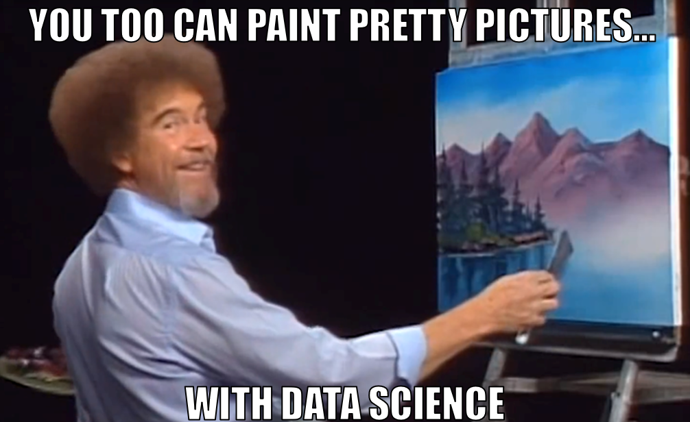

```{r setup, include=FALSE}
knitr::opts_chunk$set(echo = FALSE, warning = FALSE, message = FALSE)
```

In its raw form, data is completely unintelligible to the human mind.[^1] It's just a bunch of numbers. So, over time, we humans have developed three techniques to help make sense of data: visualizations, summaries, and models. We're going to start hte course with visualization, because it is the most intuitive of the three. This week and next, we discuss what makes an informative, compelling data visualization, and learn how to construct them ourselves in `R`.

[^1]: Yes, I know that the word "data" is technically plural, but the sentence "In their raw form, data are completely unintelligible" seemed...unintelligible to me.



The human mind is hardwired to detect patterns in images, and a well-crafted data visualization can take advantage of that fact to communicate lots of information in an aesthetically pleasing way. And it's about more than communication. Charts can reveal patterns in data that summary statistics alone might miss, as the [Datasaurus Dozen](https://www.autodesk.com/research/publications/same-stats-different-graphs) artfully reveals...


This week, we start building our own visualizations using the `ggplot2` package (a part of the `tidyverse`). It will take some time to learn all of the function syntax, so be patient with yourself. Once you get the hang of it, you'll have an endlessly flexible tool for exploring and communicating patterns in your data. Let's get started.

## Reading Assignments

Next week, we'll build some more intricate visualizations, and consider what to do if your dataset isn't formatted exactly that way you need it to be prior to visualizing. Please read and annotate the following before next week:

-   [Healy Chapter 4](https://socviz.co/groupfacettx.html)
-   [Healy Chapter 5](https://socviz.co/workgeoms.html)
-   [R4DS Chapter 5: Data Transformation](https://r4ds.had.co.nz/transform.html)

Optional:

-   If you want to learn how to make maps in `ggplot`, [Healy Chapter 7](https://socviz.co/maps.html) is a great resource.
-   For more practice with `ggplot`, this [chapter](https://r4ds.had.co.nz/data-visualisation.html) in Hadley Wickham's book is a nice resource.[^2]

[^2]: Hadley is the author of `ggplot`, so he knows a trick or two.

## Problem Set

Using one of the datasets we've been working with in class, submit create a data visualization using `ggplot`. Your submission should:

1. Communicate some interesting result
2. Use more than one aesthetic
3. Be easy to interpret at a glance (you can include a short caption -- `labs(caption = ...)` -- if you would like). 
4. Be *reproducible*; submit your figure as a `.png` file, plus the `.R` script that produced it.

Consider this a friendly competition! I will look through the sumbmissions and pick my favorites, and their creators will receive honor, glory, and adoration.