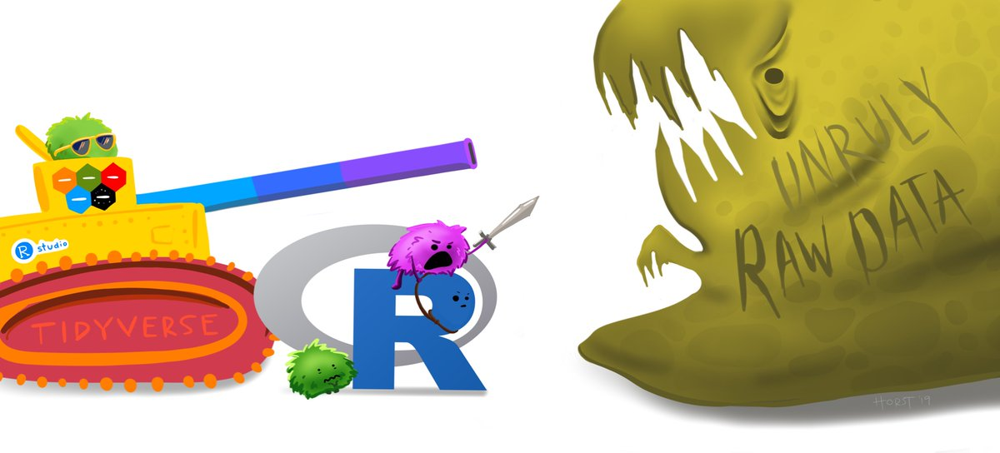

```{r setup, include=FALSE}
knitr::opts_chunk$set(echo = FALSE, warning = FALSE, message = FALSE)
```

## Reading

- [Teacup Giraffes](https://tinystats.github.io/teacups-giraffes-and-statistics/04_variance.html): Spread of the Data
- [Wrangling Penguins](https://allisonhorst.shinyapps.io/dplyr-learnr/)
-   [R4DS Chapter 9: Wrangle](https://r4ds.had.co.nz/wrangle-intro.html)
-   [R4DS Chapter 11: Import](https://r4ds.had.co.nz/data-import.html) (skip sections 11.3 and 11.4)
- [R4DS Chapter 12: Tidy Data](https://r4ds.had.co.nz/tidy-data.html)


### Optional Practice

- [Tidy Your Data](https://rstudio.cloud/learn/primers/4) (RStudio Primer)
- I'm assigning what I think are the crucial chapters of R4DS, but if you really want to get deep into `R` programming, feel free to look over the chapters we skipped. In particular, the chapter on "Strings" if you want to work with text data, and "Dates & Times" if you want to work with time series.


## Overview

Up to now, we've been working with pretty tidy datasets. Every column is a variable, every row is an observation, and every value is where it should be. But things are not always this way. More often than you're going to like, data comes to you an unruly mess, and you'll need to tidy it up before you can even start to explore it.



This week, we'll learn some of the most important functions in the `tidyverse` for data importing, wrangling, and summarizing.

## Problem Set

TBD