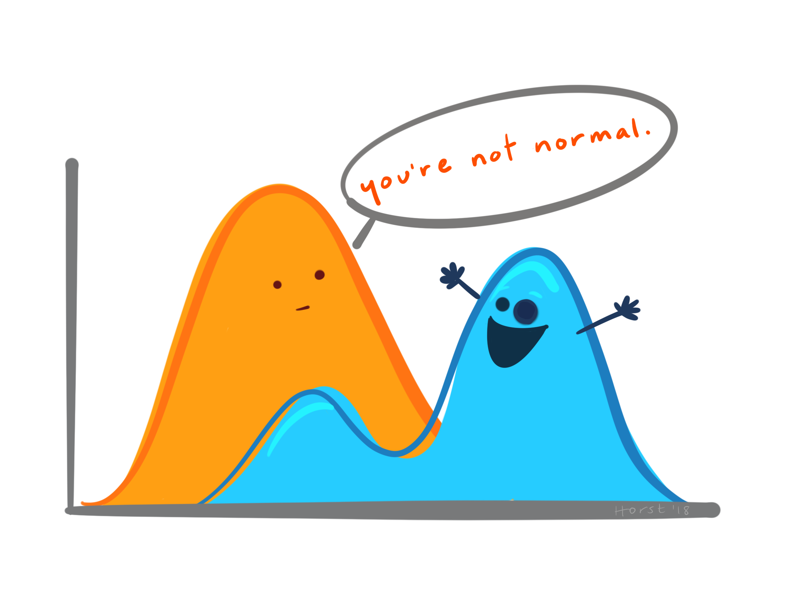

```{r setup, include=FALSE}
knitr::opts_chunk$set(echo = FALSE, warning = FALSE, message = FALSE)
```

This week we review the essential **summary statistics** that social scientists use to describe their data, including measures of central tendency, dispersion, and correlation.

```{r img, fig.cap='Artwork by Allison Horst'}

```

## Reading Assignments

Take a break from reading (or catch up on the reading you missed in previous weeks)!

## Problem Set

For the midterm mini-conference next week, please prepare a 10 minute presentation about a dataset you find interesting (feel free to use one of the datasets we've looked at in class, or strike out on your own). Your presentation should describe each step in your analysis pipeline: importing, tidying, summarizing, and visualizing. Submit the code you used in your analysis to eLC (both the R script and a PDF report from the script).

Please send me the title of your presentation at least two days in advance so I can create the mini-conference program.
