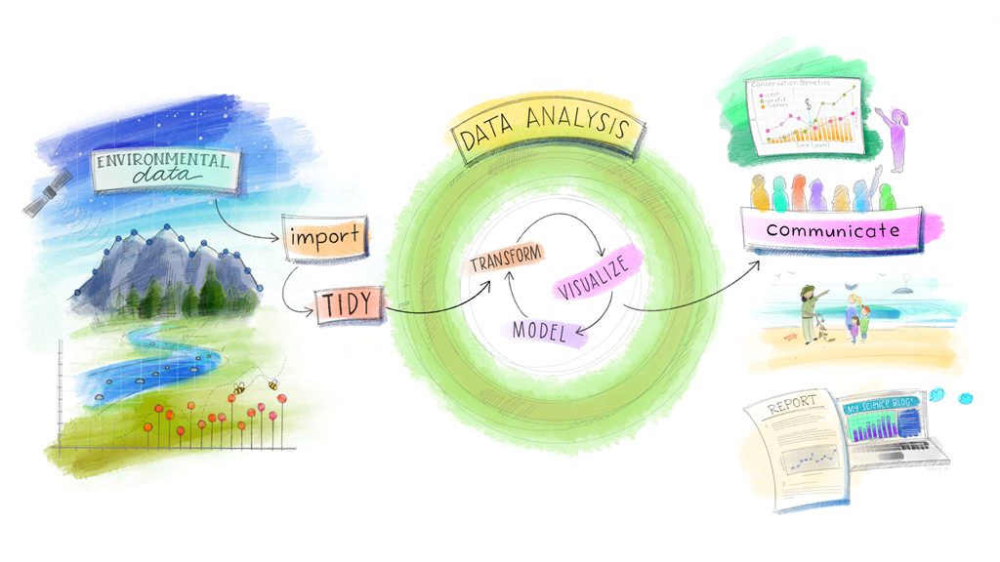

```{r setup, include=FALSE}
knitr::opts_chunk$set(echo = FALSE, warning = FALSE, message = FALSE)
```

This week you'll present a project that follows the entire data analysis pipeline from start to finish: finding the data, importing it, cleaning it up, summarizing it, and building visualizations.



If you're looking for additional practice with the skills we've learned over the past five weeks, I highly recommend the [RStudio primers](https://rstudio.cloud/learn/primers), a set of interactive online tutorials. To review the functions we've covered so far, check out "The Basics", "Work With Data", "Visualize Data", and "Tidy Your Data". The other primers are more advanced `R` functions -- you may try them if you're looking for an extra challenge. 

## Reading Assignments

Next week, we start building mathematical models to help us understand what's going on in our data. Before then, please read:[^link]

- [The Joy of X](https://ebookcentral.proquest.com/lib/ugalib/reader.action?docID=3304559), Chapters 17 and 18.
- [Moore & Siegel](https://ebookcentral.proquest.com/lib/ugalib/reader.action?docID=1205618), Chapter 5.

## Problem Set

No problem set!

[^link]: Both links take you to the ebook version hosted by the UGA library. Log in to your library account and they should work. Hypothesis highlights don't play  nicely with the library ebooks, but you can leave page notes if you have questions.