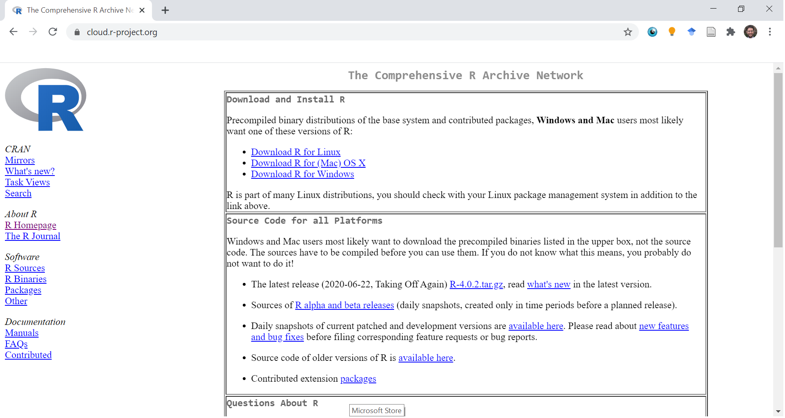
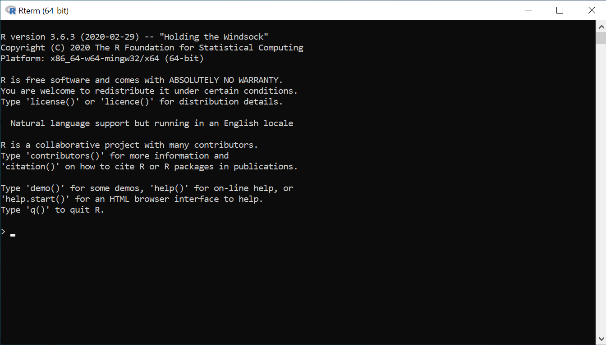
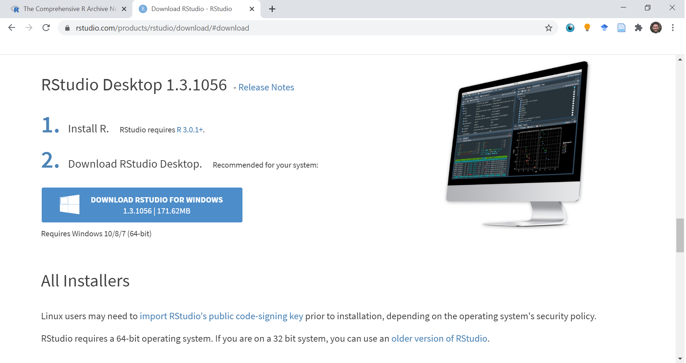
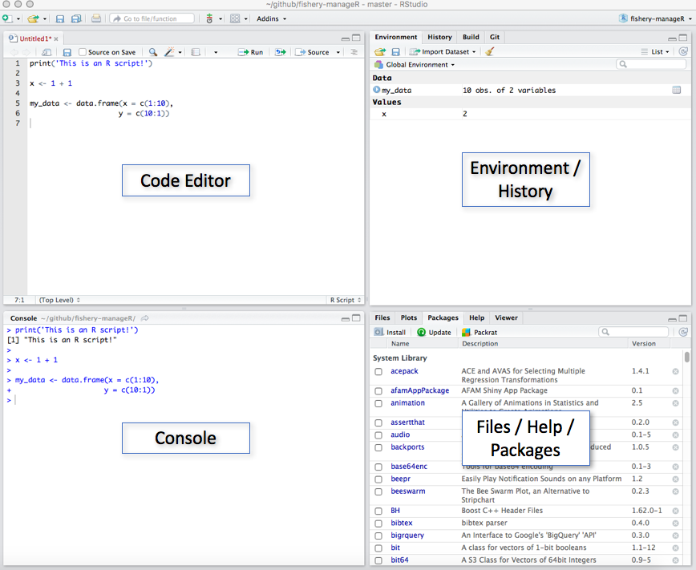

```{r Setup, include=FALSE}
library(tidyverse)
theme_set(theme_minimal(base_size = 16))
knitr::opts_chunk$set(comment=NA, fig.width=7, fig.height=5, 
                      fig.align = 'center', out.width = 600,
                      message=FALSE, warning=FALSE, echo=TRUE)
```

# Learning Objectives

By the end of this week, you will be able to:

--

- Write basic R scripts for loading and exploring data

--

- Navigate around RStudio

--


- Compute useful summary statistics (e.g. mean, mode, standard deviation)

---

class: center, middle

# What Are We Doing Here?

---


---

# So...this is a weird semester...

---


---

class: center, middle

# `R`


---

# What is R?

R is a programming language specifically designed for statistical computing.

--

It is widely used in academia and data science communities. By some measures it is the [8th most popular programming language](https://www.tiobe.com/tiobe-index/).

???

That's out of *all programming languages*, including whatever they use to make Bejeweled.

---

# Why use R?

**Major Alternatives**: Microsoft Excel, Stata, SPSS, SAS, Python

--

*Short Answer*: 

 - I use R and I'm comfortable teaching it.

--

*Long Answer*:

- It's free
- It's open-source
- It's reproducible
- It has a huge user community building useful packages (add-ons)
- In academic social science, R is now fairly predominant (particularly among younger cohorts)
- It has a shorter learning curve than Python

???

- So many research bungles come from non-reproducible analyses in Excel or point-and-click workflows in Stata/SPSS/SAS. More on reproducibility in a few weeks.
- Python is a good choice too, and very popular in the data science world. If you want to become a professional data scientist, definitely learn Python too! But for our purposes, it's a bit much. Python is a *general-purpose* programming language. It can do so much more than statistical analysis. And so getting it set up / learning the basics takes a bit longer. It's like teaching you to fly a Boeing 737 when all you really want to do is learn how to drive a car. Sure, if you can pilot an aircraft, you'd probably become pretty good at driving too. But when starting out, it's probably easier to just start with the car. 


--- 


---

# Download R

Here (click the picture):

[](https://cloud.r-project.org/)


---

# Download R

You could stop there, and work with R in this nice black terminal box...

```{r terminal figure, out.width = '85%', echo=FALSE}

```

...or we could use an IDE (integrated development environment) called RStudio.

---

# Download RStudio

Here:

[](https://rstudio.com/products/rstudio/download/#download)

---

class: center, middle

# Navigating RStudio

---

# Navigating RStudio

Open RStudio, and you should see *this*:

```{r RStudio IDE figure, out.width='70%', echo = FALSE}

```


---

class: middle, center

# R is a Fancy Calculator


---

# R is a Fancy Calculator

Type `2+2` into the console.

--

```{r 2+2}
2 + 2
```

--

I basically use R whenever I need a calculator now. 

--

(I Kon-Maried my Texas Instruments TI-83. Thank you, old friend.)


---

# R is a Fancy Calculator

#### Subtraction, Multiplication, and Division
```{r calculator 1}
2 - 2

2 * 2

2 / 2
```

---

# R is a Fancy Calculator

#### Exponentiation

$2^4 = 2 \times 2 \times 2 \times 2 = ?$

--

```{r calculator 2}
2^4
```

--

Now you try. Compute $3^6$.

--

```{r calculator 3}
3^6
```

---

# R is a Fancy Calculator

### Fractional Exponents

Remember what happens when you raise a number to a fractional power? Say, $9^\frac{1}{2}$?

--

```{r fractional exponents}
9^0.5
```

--

$9^\frac{1}{2} = \sqrt{9}$

---

# R is a Fancy Calculator

### Fractional Exponents

What is $(4^3)^\frac{1}{3}$?

--

```{r fractional exponents 2}
(4^3)^(1/3)
```

--

**General Rule**: When you have nested exponents like that, you can just multiply the exponents.

```{r more exponents}
(2^3)^6

2^18
```

---

# R is a Fancy Calculator

Hey, remember logarithms?

--

### Logarithms

Subtraction reverses addition. 

$2+3-3=2$

--

Division reverses multiplication.

$2 \times 3 \div 3 = 2$

--

Logarithms reverse exponentiation.

$\log_{3}(3^2) = 2$

--

The subscript is the "base" of the logarithm. When you see $\log_x(y)$, think "how many times do I have to multiply $x$ by itself to get $y$? 

---

# R is a Fancy Calculator

What is $\log_{10}(100)$?

--

```{r logarithms 1}
log(100, base = 10)
```

--

Because $10^2 = 100$.

--

What is $\log_2(100)$?

--

```{r logarithms 2}
log(100, base = 2)
```

--

Because $2^6 = 64$ and $2^7 = 128$, so you need to multiply 2 by itself roughly 6.6 times in order to get 100.

--

Weird. I know.

---

# R is a Fancy Calculator

R respects the **Order of Operations**.

- Parentheses, Exponents, Multiplication, Division, Addition, then Subtraction

--

- (**P**lease **E**xcuse **M**y **D**ear **A**unt **S**ally)

--

Try $\frac{2(3+2)^2 - 2}{3}$

--

$$
\frac{2(3+2)^2 - 2}{3} = \frac{2(5)^2 - 2}{3} = \frac{2(25) - 2}{3} = \frac{50-2}{3} = \frac{48}{3} = 16
$$
--

Or, in R:

```{r order of operations}
(2*(3+2)^2 - 2)/3
```


---

class: middle, center

# Objects


---


class: middle, center

# Functions


---

# Functions

A **function** transforms an input into an output. 

```{r function figure, out.width = '50%', echo = FALSE}
knitr::include_graphics('img/function.png')
```

--

$f(x) = 2x + 2$

--

$f(2) = ?$

---

Hey while we're talking about functions, remember the properties of functions?

---


class: center, middle

# Data

---

# Vectors


---

# Vectors

.pull-left[
### Adding Vectors

$\begin{bmatrix} 1 \\ 3 \\ 4 \end{bmatrix} + \begin{bmatrix} 3 \\ 2 \\ 2 \end{bmatrix} = \begin{bmatrix} 4 \\ 5 \\ 6 \end{bmatrix}$

```{r vector addition}
x <- c(1,3,4)
y <- c(3,2,2)

x + y
```

]

--

.pull-right[
### Scalar Multiplication

$2 \times \begin{bmatrix} 1 \\ 3 \\ 4 \end{bmatrix} = \begin{bmatrix} 2 \\ 6 \\ 8 \end{bmatrix}$

```{r scalar multiplication}
x <- c(1,3,4)

2*x
```

]

---


---

# Matrices

A **matrix** (the plural is **matrices**) is a bunch of vectors smushed together.

$$
A = 
\begin{bmatrix}
1 & 2 & 3\\
3 & 1 & 2
\end{bmatrix}
$$

$$
B = 
\begin{bmatrix}
3.2 & 1 & 7\\
9 & 8 & 42\\
1 & 12 & \pi
\end{bmatrix}
$$

--

Each row is a vector and so is each column.


---

# Let's Play with Matrices

To create a matrix in R, we **bind** together a set of vectors using the `rbind()` or `cbind()` functions.

```{r matrices, echo = TRUE}
A <- rbind(c(1, 2, 3), 
           c(2, 1, 3), 
           c(42, 1, pi))

A
```

--

Now you try. Create the matrix `A` again, but this time use `cbind()` to paste the columns together. 

---

# Let's Play with Matrices

Get entries in the matrix like so:

--

```{r get matrix entry 1}
A[1,2]
```

--

```{r get matrix entry 2}
A[3,3]
```

--

```{r get matrix entry 3}
A[3,] # the third row
```

--

```{r get matrix entry 4}
A[,2] # the second column
```


---


# Tidy Data

Tidy data is a rectangular matrix, arranged like this:


--

**Unit of Observation**: What are the rows? 
 - Could be countries, people, "country-years", etc. Just keep it consistent!

---

# Load Data


---

class: center, middle

# USE THE CODE EDITOR. SERIOUSLY.

---

# USE THE CODE EDITOR. SERIOUSLY.

--

We've been having a lot of fun typing commands into the console. It's fast, easy...addictive.

--

**NEVER ACTUALLY DO YOUR WORK THERE.**

--

Why?

--

Because go ahead and close your RStudio window. Then reopen it.

--

Go ahead, I'll wait.

--

AAAAAAAAAAAAAAAAAAAHHHHHHHHHH WHAT HAPPENED TO MY WORK??? IT'S GONE! HOW WILL I EVER REMEMBER WHAT I DID TO GET MY RESULT????

--

Don't let this sort of thing happen to you. Use the **Code Editor**.

???

I was once like you are now. Fancy free. Typing all of my commands into the console. When I was a research assistant right out of college, I did an entire data analysis and made a nice chart right from the console. Showed it to the Fellow I was working with. She said "looks great! could you make a few changes?" Um....no?

---

class: center, middle

# Writing R Scripts

---

# Writing R Scripts
