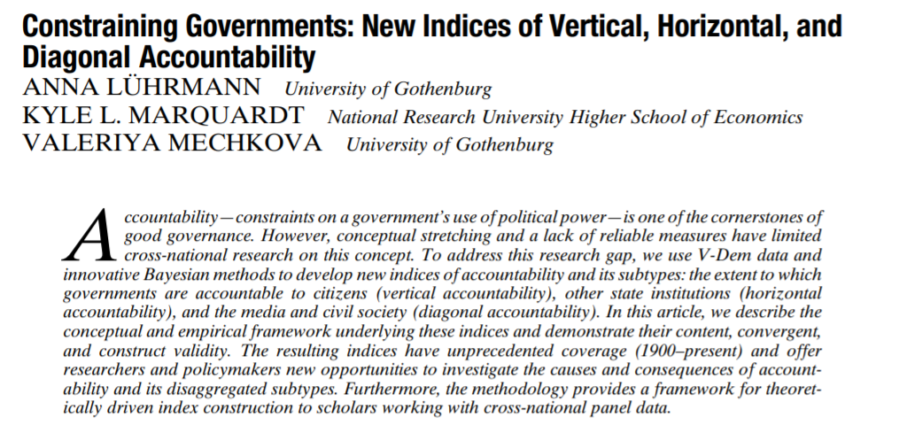
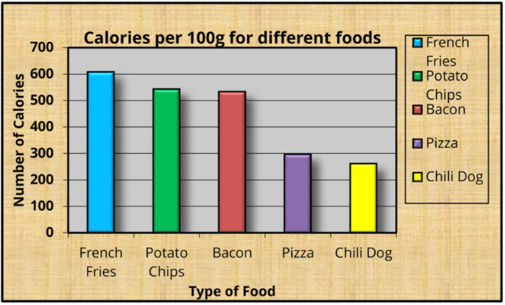
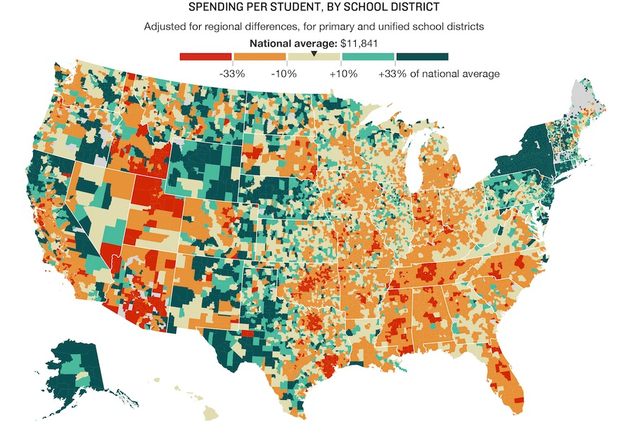
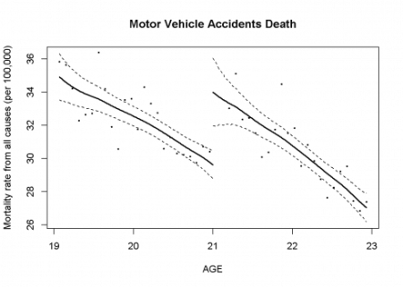
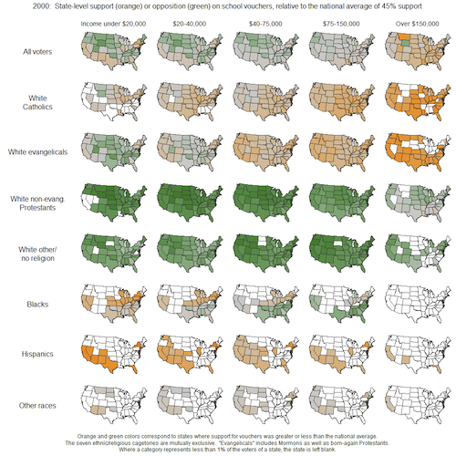

```{r Setup, include=FALSE}
library(tidyverse)
theme_set(theme_minimal(base_size = 16))
knitr::opts_chunk$set(comment=NA, fig.width=7, fig.height=5, 
                      fig.align = 'center', out.width = 600,
                      message=FALSE, warning=FALSE, echo=TRUE)
```

## Today's Objectives

By the end of this week, you will be able to...

--

1. Explain what makes an effective data visualization

--

2. Build basic plots (scatter, bar, histogram, jitter, boxplots, violin) with the `ggplot2` package

--

3. Clean and filter datasets with the `tidyverse` package

---

class: center, middle

# Look At Your Data

???

An underrated skill in political methodology, and it's also the easiest to learn without needing a bunch of math/statistics.

---

# Why Look At Your Data?

--

### 1. To Understand It Yourself!

--

```{r anscombe quartet, echo = FALSE}
knitr::include_graphics('img/anscombes-quartet.png')
```

???

So many researchers skip this step entirely! See Anscombe's Quartet

---

# Why Look At Your Data?

### 1. To Understand It Yourself!

<br>

```{r dinosaur, echo = FALSE}
knitr::include_graphics('img/DinoSequentialSmaller.gif')
```

???

Link: [The Datasaurus Dozen](https://www.autodeskresearch.com/publications/samestats)

---

# Why Look At Your Data?

### 2. To Communicate Your Findings

--

[](img/apsr-skim.pdf)

---

# Why Look At Your Data?

### 2. To Communicate Your Findings


---

class: center, middle

## What Makes An Effective Data Visualization?

---

# Effective Data Visualization

### 1. Be Kind To The Reader

--

- Easy to interpret at a glance

--

- Self-explanatory, without having to read a big caption

--

### 2. Convey Information Efficiently

--

- Use multiple channels (e.g. color, position, shape, transparency)

--

- Avoid "chartjunk" and maximize your "data-to-ink" ratio [(Tufte, 1983)](https://www.amazon.com/Visual-Display-Quantitative-Information/dp/1930824130)


---

class: center, middle

## The Gallery Of Bad Charts

---

## Too Much Information (Also It's A Pie Chart)


---

## Low Data-to-Ink Ratio



???

Classic 1990s Excel data visualization; where could we cut down on junk?

---

## Low Data-to-Ink Ratio

```{r chartjunk gif, echo = FALSE, out.width='100%'}
knitr::include_graphics('img/data-ink.gif')
```

---

## Not Colorblind-Friendly

```{r colorblind, echo = FALSE, out.width='110%'}

```


---

class: center, middle

## The Gallery of Good Charts

---

## Tufte's Favorite Chart

Charles Minard's Map of Napoleon's Russia Campaign


---

## Uncluttered, Clearly Integrates Data and Analysis

```{r rd21, echo = FALSE, out.width = '105%'}

```

???

Link: [Carpenter & Dobkin (2009)](https://www.colabug.com/2019/0804/6628029/)

---

## Nice Use of Small Multiples (Facets)

```{r small multiples, echo = FALSE, out.width='70%'}

```

---

class: center, middle

## `tidyverse` + `ggplot2`

