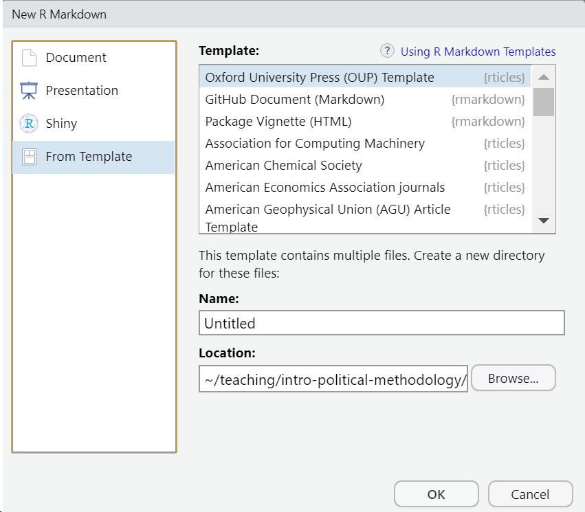
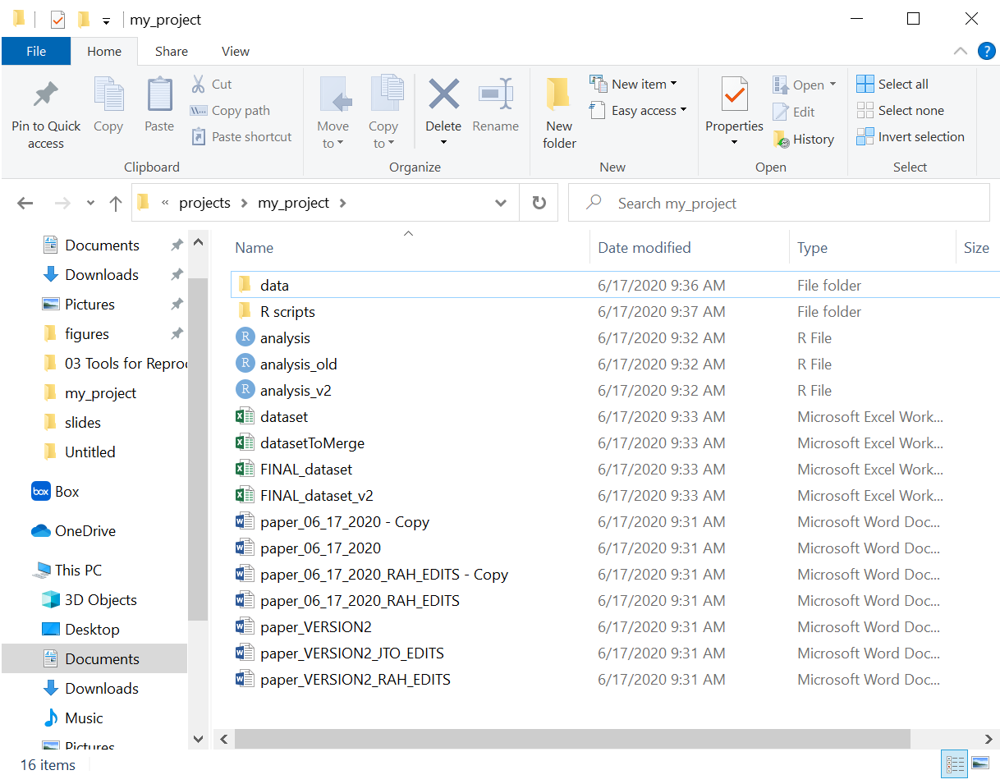

```{r setup, include=FALSE}
library(tidyverse)
theme_set(theme_minimal(base_size = 16))
knitr::opts_chunk$set(comment=NA, fig.width=7, fig.height=5, 
                      fig.align = 'center', out.width = 600,
                      message=FALSE, warning=FALSE, echo=FALSE)
```

## Reasons to think seriously about reproducibility

--

#### (From most high-minded to least high-minded...)

--

1. Science

--

2. awawet

--

3. awet

--

4. Increasingly, top journals require it.

???

1.

2. 

3. 

4. In order to publish at journals like *APSR* and *Political Analysis*, you need to submit code and data such that a third-party can independently reproduce all of your tables and charts. 

---

# Three Tools

1. Reproducible Reports (`RMarkdown`)

2. Version Control (`git` and `GitHub`)

3. Citation Management (Zotero, Meneley, perma.cc)

--

There are others, but this will get you started...


---

# R Markdown

This is an R Markdown presentation. Markdown is a simple formatting syntax for authoring HTML, PDF, and MS Word documents. For more details on using R Markdown see <http://rmarkdown.rstudio.com>.

When you click the **Knit** button a document will be generated that includes both content as well as the output of any embedded R code chunks within the document.

---

## Slide with Bullets

- Bullet 1
- Bullet 2
- Bullet 3

---

## `rticles` package for academic papers

```{r rticles, eval=FALSE, echo=TRUE}
install.packages('rticles')
```

```{r rticles image}

```

---

## Try It!

---

## Further Reading

**Links:**

[RMarkdown Tutorial](https://rmarkdown.rstudio.com/lesson-1.html)

[RMarkdown Cheat Sheet](https://github.com/rstudio/cheatsheets/raw/master/rmarkdown-2.0.pdf)

[Common Symbols in \LaTeX](https://artofproblemsolving.com/wiki/index.php/LaTeX:Symbols) 

---

class: center, middle

# Version Control (`git` and `GitHub`)

---

## The Typical Academic's Version Control System

.center[]

---

## The Typical Academic's Version Control System

**Problems:**

- It's a psychic nightmare.
- Which is the most recent copy of the paper? `paper_VERSION2_RAH_EDITS` or `paper_VERSION2_JTO_EDITS`?
- All those copies waste memory.
- What's up with the directory structure? Why is some data outside of the `data/` folder?

---

## Actual Version Control System (VCS)

Picture of GitHub

- Requires an initial investment to learn, but it's **WORTH IT**.

---

## Slide with R Output

```{r cars, echo = TRUE}
summary(cars)
```

---

## Slide with Plot

```{r pressure}
plot(pressure)
```

