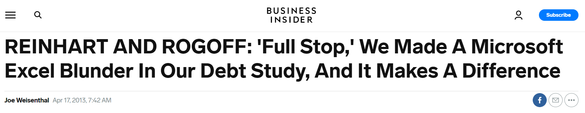
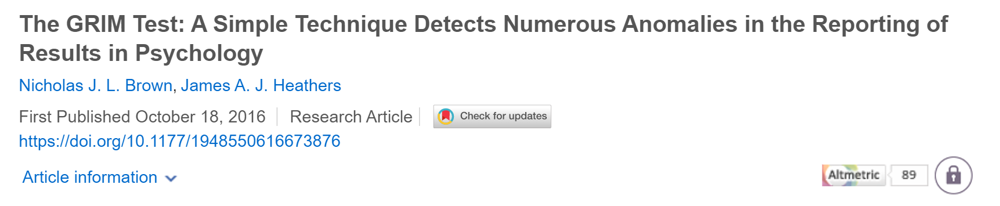
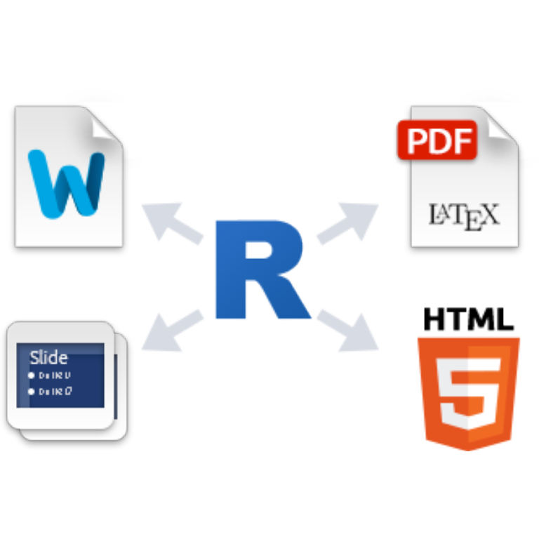
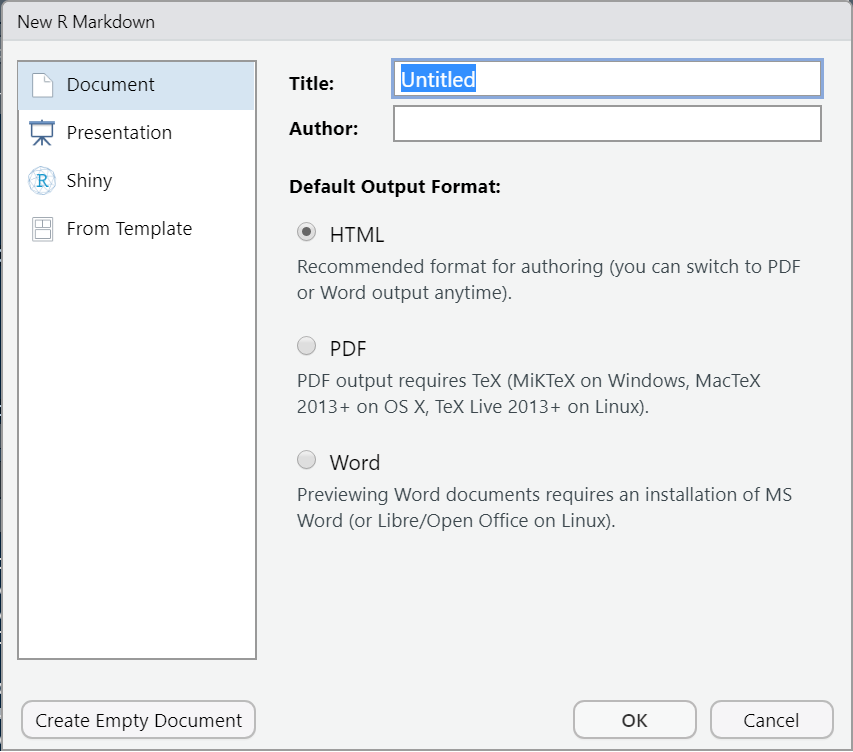
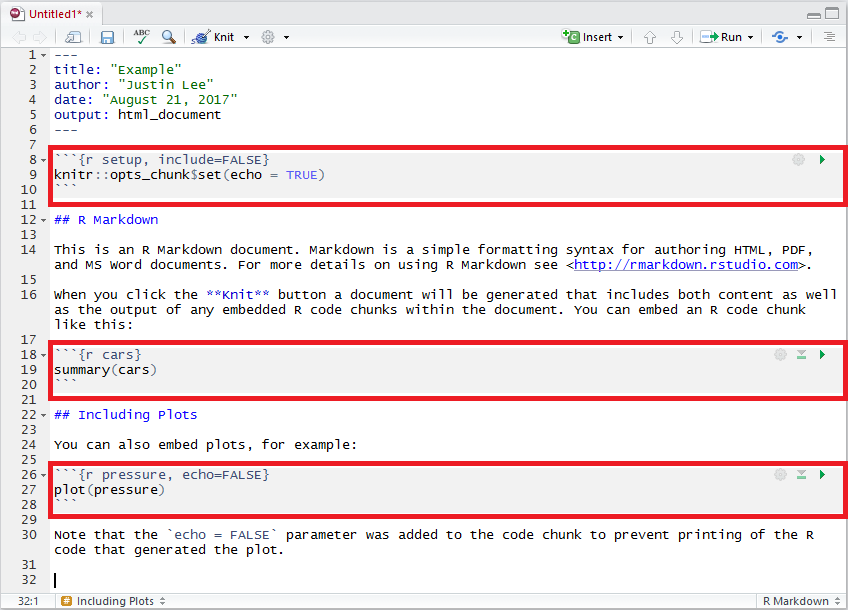
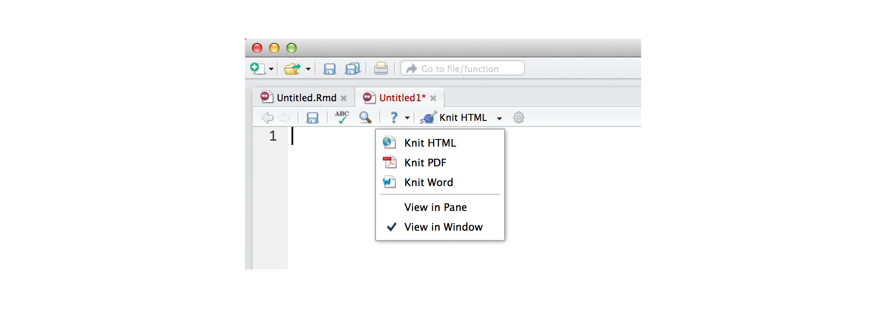
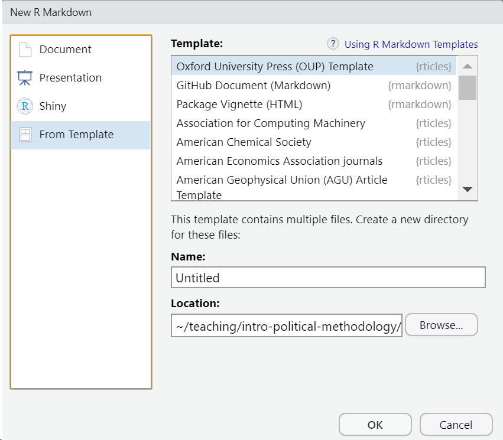
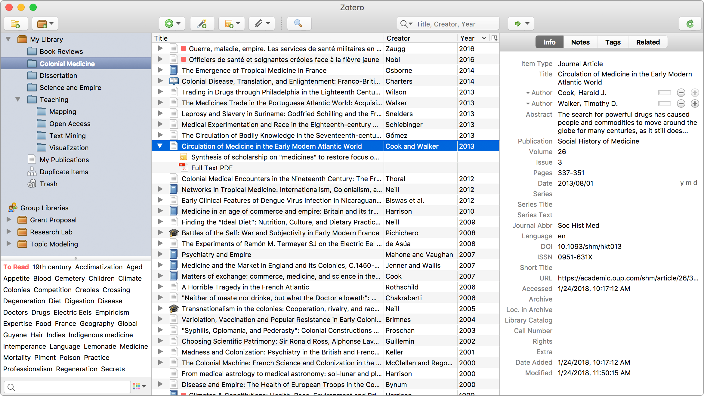
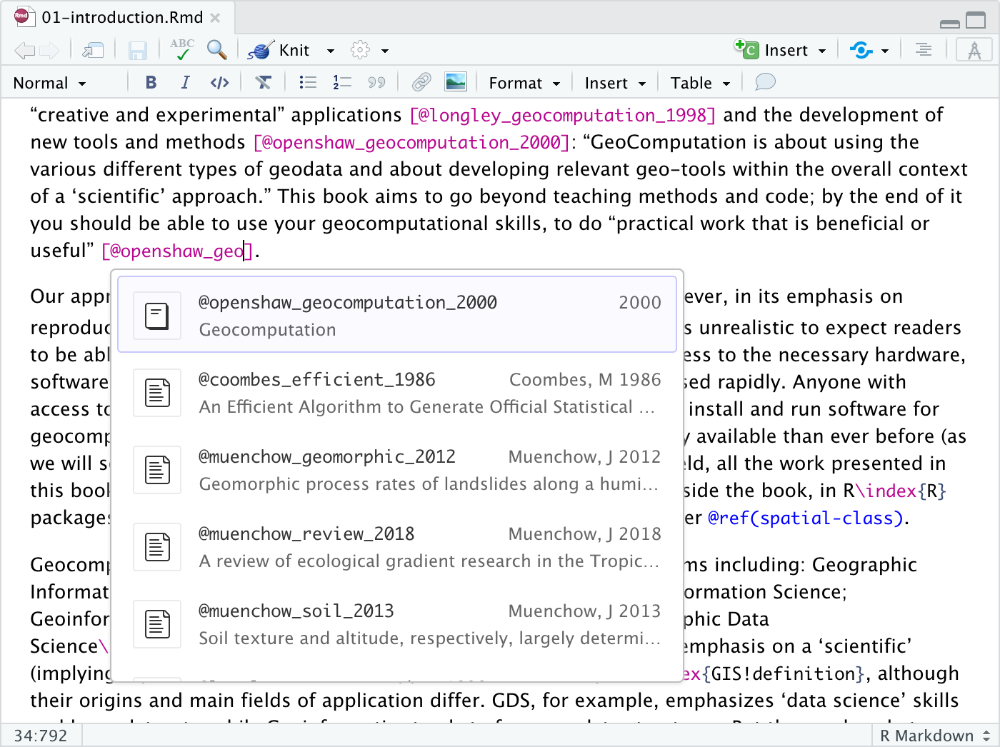

```{r setup, include=FALSE}
library(tidyverse)
theme_set(theme_minimal(base_size = 16))
knitr::opts_chunk$set(comment=NA, fig.width=7, fig.height=5, 
                      fig.align = 'center', out.width = 600,
                      message=FALSE, warning=FALSE, echo=FALSE)
```

---

class: center, middle

## **Reproducible Research**

Provides a complete set of instructions on how to replicate a study's results.


---

## Why make your research reproducible? 

--

*(From most high-minded to least high-minded...)*

--

1. Science is **defined** by reproducibility.

--

2. Makes it easier for others to replicate and build on your results.

--

3. Makes it easier for your *future self* to replicate and build on your results.

--

4. Increasingly, journals require it.

???

1. 

2. 

3. 

4. In order to publish at journals like *APSR* and *Political Analysis*, you need to submit code and data such that a third-party can independently reproduce all of your tables and charts. 

---

## This Week's Objectives

By the end of this week, you will be able to...

--

1. Write **dynamic manuscripts** (`R Markdown`)

--

2. Use version control software (`git`)

--

3. Collaborate with others and share your work online (`GitHub`)

--

4. Manage your citations without transcription errors (Zotero)


--

<br>

Each tool requires an initial investment, but they're WORTH IT.

???

My hope is that by forcing you to make that initial investment in class, you'll be more likely to adopt good habits in your work.

---

class: center, middle

# `R Markdown`

---

# A Tale of Two Workflows

--

.pull-left[
```{r office image, out.width='40%'}

```

1. Edit data in Excel

2. Statistical analysis in Excel, or maybe `R`

3. Write a paper in Word.

4. Copy-paste results from analysis.

5. Email to coauthors for edits

6. Copy-paste results into Powerpoint.

]

???

Where might errors leak into Workflow 1?


---

# The Office Workflow is Error-Prone

<br>

[](https://www.businessinsider.com/reinhart-and-rogoff-admit-excel-blunder-2013-4)

--

```{r wansick, out.width = '100%'}

```


---

# A Tale of Two Workflows

.pull-left[
```{r office image 2, out.width='40%'}

```

1. Edit data in Excel

2. Statistical analysis in Excel, or maybe `R`

3. Write a paper in Word.

4. Copy-paste results from analysis.

5. Email to coauthors for edits

6. Copy-paste results into Powerpoint.

]

--

.pull-right[

```{r rmarkdown image, out.width='45%'}

```

1. Write paper in `R Markdown`

2. Embed analysis directly into the source

3. Track revisions with `git`

4. Share `GitHub` repository with coauthors

]

???

No copy-and-paste. Whenever you change something in the code, it changes in the paper too!

---


## Step 1: Create an R Markdown Document

```{r new rmd}

```

---

## Step 2: Write Text Using `Markdown`

- Plain text "markup language"

- Very different ethos than WYSIWYG editors

--

```{r syntax}
knitr::include_graphics('img/quicktourexample.png')
```

---

## Step 3: Add Code Chunks


```{r, out.width = '60%'}

```

- Each code chunk should serve a single purpose.

- Can also include inline code, like '`r` `mean(data$ftbiden)`'

  - (Just replace those parentheses with back ticks.)


---

## Step 4: Knit to a Document





---

### `rticles` package for academic papers

```{r rticles, eval=FALSE, echo=TRUE}
install.packages('rticles')
```

```{r rticles image, out.width='70%'}

```

---

## Try It!

Take your `R` code from Problem Set 2 and create an `R Markdown` document.

### Further Reading

**Links:**

[RMarkdown Tutorial](https://rmarkdown.rstudio.com/lesson-1.html)

[RMarkdown Cheat Sheet](https://github.com/rstudio/cheatsheets/raw/master/rmarkdown-2.0.pdf)

[Common Symbols in $\LaTeX$](https://artofproblemsolving.com/wiki/index.php/LaTeX:Symbols) 

---

class: center, middle

## Version Control (`git` and `GitHub`)

---

## The Typical Academic's Version Control System

```{r phdcomics, out.width = '50%'}
knitr::include_graphics('img/final-phd-comics.gif')
```

---

## The Typical Academic's Version Control System

We too fall prey...


---

## The Typical Academic's Version Control System

**Problems:**

- It's a psychic nightmare.

- Which is the most recent copy of the paper? `paper_VERSION2_RAH_EDITS` or `paper_VERSION2_JTO_EDITS`?

- All those copies waste memory.

---

## Actual Version Control System (VCS)


---

## Warning: gitignore your big data files

- I had this problem this morning. 

- If you have a really big data file (>100MB), GitHub will reject it, and it will be a **pain** to fix.

- Easy fix: tell `git` to ignore the folder where you put your data and have it focus on the code.

  - Just select your data folder in the `Git` pane in RStudio and click "Ignore".

---

class: center, middle

## Reference Management (Zotero)

---

## Reference Management (Zotero)

```{r zotero screenshot}

```

- Keep all your citations in one place.

- Drag-and-drop or use browser extension; automatically collects metadata.

- Export to BibTeX to easily format citations & bibliography.

---

## Download Better BibTeX

[](https://retorque.re/zotero-better-bibtex/installation/)

- Allows you to easily look up your *cite keys*.

- Ensures that cite keys are unique.

---

## A Note on RStudio v1.4

The next version of RStudio will streamline so much of this!

```{r visual r markdown}

```

---

## Problem Set 3

Take all of your new skills and coauthor a (tiny) paper with one or two of your classmates. 

1. Write the paper in `R Markdown`.

2. Maintain all materials on a private `GitHub` repository.

3. Embed figures and analyses in the text.

4. Include in-line citations and a bibliography.

5. I should be able to:

  - Delete your paper.
  
  - Click `Knit` on my computer and the paper will reproduce itself.

6. After you submit, I'll play reviewer and ask you to revise a few things.