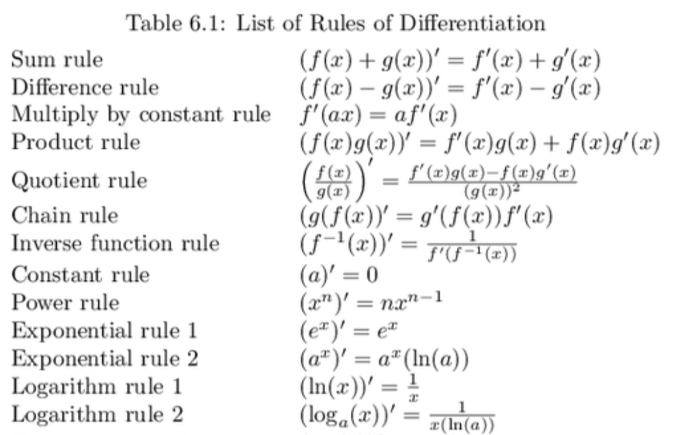
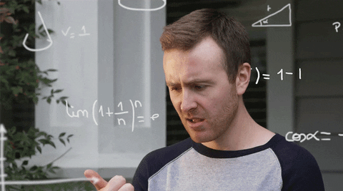

```{r Setup, include=FALSE}
library(tidyverse)
theme_set(theme_minimal(base_size = 16))
knitr::opts_chunk$set(comment=NA, fig.width=7, fig.height=5, 
                      fig.align = 'center', out.width = 600,
                      message=FALSE, warning=FALSE, echo=FALSE)
```

# Warm Up

--

1. What is a **function**?

--

  A **function** takes one or more inputs and produces an output.
  
--

<br>

2. If $f(x) = 2x^2 + 2x + 3$, what is $f(2)$?

--

$$f(2) = 2(2)^2 + 2(2) + 3 = 8 + 4 + 3 = 15$$


---

# Warm Up

What is the **slope** of $f(x) = 3x + 2$?

```{r slope, out.width='70%'}
x <- -2:2
y <- 3*x + 2

tibble(x,y) %>% 
  ggplot + 
  geom_line(aes(x=x,y=y))
```

--

The slope of a linear function (a straight line) is measured by how much $y$ increases when you increase $x$ by $1$. In this case, $3$.

---

# Warm Up

What is the **area** of this rectangle?

```{r rectangle, out.width = '80%'}

ggplot() + 
  geom_rect(aes(xmin = 0, xmax = 2, ymin = 0, ymax = 5), 
            fill = NA, color = 'black') +
  geom_text(aes(x = 1, y = 0.25, label = '2'), size = 5) +
  geom_text(aes(x = 1.95, y = 2.5, label = '5'), size = 5) +
  theme_void()

```

--

Area $= bh = 2 \times 5 = 10$

---

class: center, middle

**Good news!** You're super close to knowing all the calculus you need.

???

You know what a function is; you know how to compute the slope of a line; you know how to compute the area of a rectangle.

It's just **one** conceptual step from there to calculus. The hard part is the tedious computation. But you don't have to do that stuff. Computers can do it now.

---

# Learning Objectives

By the end of this week, you will be able to:

--

- Find the slope of a function at any point

--

- Identify the *minimum* or *maximum* value of a function

--


- Compute the area under a curve

--

- Explain the Fundamental Theorem of Calculus


???

- Optimization is central to game theory, statistical estimation. So much of mathematical social science is maximizing a value function or minimizing a cost function.
- When we get to inference and hypothesis testing, we'll need to know how to take the area under a probability distribution function.
- And the FOTC is just cool. It shows that those two things that seem very different are in fact fundamentally unified on a deep level.

---


class: center, middle

# Slopes


---

# Linear Functions

<!-- $y = ax + b$ -->

```{r Plot Linear Function}

a <- 2
b <- 1

x <- seq(-1,1,0.01)
y <- a*x + b

p <- ggplot(data = tibble(x,y)) +
  geom_line(aes(x=x,y=y),size=1) +
  geom_hline(yintercept = 0) +
  geom_vline(xintercept = 0) +
  ggtitle('y = ax+b')

p
```


---

# Linear Functions

Find the slope of each function:

- $y = 2x + 4$

- $f(x) = \frac{1}{2}x - 2$

- life expectancy (years) = 18.09359 + 5.737335 $\times$ log(GDP per capita)


--

### Remember:

Slope of a line $= \frac{rise}{run}$ 

--
$= \frac{\Delta Y}{\Delta X}$

--
$= \frac{f(x+h) - f(x)}{h}$


???

Finding the slope of a line is *easy*.

Just wanted you to get comfortable with that last expression, because we'll be see it again in a moment. 

https://smartech.gatech.edu/bitstream/handle/1853/56031/effect_of_gdp_per_capita_on_national_life_expectancy.pdf

---

# Nonlinear Functions

.center[
```{r Nonlinear Function}

arbitrary_polynomial <- function(x){
  return((x-1)*(x+2)*(x-3)*(x+4)*(x-4))
 # return(x^5 + 3*x^4 - 2*x^3 + 5*x^2 - 6*x + 2)
}

#TODO: Set the interval really small when you're ready to publish
x <- seq(-4,4,0.005)
y <- arbitrary_polynomial(x)

p <- ggplot(data = tibble(x,y)) +
  geom_line(aes(x=x,y=y),size=1) +
  xlab('x') + ylab('y')
  

p + 
  geom_hline(yintercept = 0) +
  geom_vline(xintercept = 0)
```
]

???

Nonlinear functions are confusing and scary. Sometimes the slope is positive. Sometimes it's negative. Sometimes it's zero. And unlike with linear functions, just looking at the formula gives you no indication what the slope is at any point.


---


# Isaac Newton


???

Developed/Discovered:
- The theory of universal gravitation
- Three Laws of Motion
- The Nature of Light
- And, as a side project so he'd have mathematical notation for those other projects, he created calculus

NB: Newton did some of his best work while stuck at home during an epidemic. So, you know, get to it.

---

# Gottfried Wilhelm Leibniz


```{r Leibniz picture}
knitr::include_graphics('img/leibniz.jpg')
```

???

Also invented calculus, but with better notation. A philosophical optimist who believed we lived in the "best of all possible worlds", a sentiment parodied by Voltaire, and perhaps belied by the fact that Newton took all the credit for inventing calculus. 

---

# Newton and Leibniz's Insight

Any curve becomes a straight line if you "zoom in" far enough.

--

background-image: url("img/enhance.gif")

???

<https://knowyourmeme.com/memes/zoom-and-enhance>

---

# Zoom and Enhance...

```{r Show the function again}
p +
  geom_hline(yintercept = 0) +
  geom_vline(xintercept = 0)

```

---

# Zoom and Enhance...

```{r Zoom and Enhance}

# Add first rectangle
p + 
  geom_hline(yintercept = 0) +
  geom_vline(xintercept = 0) +
  geom_rect(aes(xmin=1.2, xmax=1.75, ymin=25, ymax=50), fill = NA, 
            color="black", alpha=0.5) 

```

---

# Zoom and Enhance...

```{r Zoom and Enhance 2}

# Zoom into first rectangle
p + scale_x_continuous(limits = c(1.2, 1.75)) +
  scale_y_continuous(limits = c(25, 50)) +
  geom_rect(aes(xmin=1.2, xmax=1.75, ymin=25, ymax=50), fill = NA, 
            color="black", alpha=0.5) 

```


---

# Zoom and Enhance...Again...

```{r Zoom and Enhance 3}

# Add second rectangle
p + scale_x_continuous(limits = c(1.2, 1.75)) +
  scale_y_continuous(limits = c(25, 50)) +
  geom_rect(aes(xmin=1.425, xmax=1.525, ymin=32.5, ymax=37.5), fill = NA, 
            color="black", alpha=0.5) 

```


---

# Zoom and Enhance...Again...

```{r Zoom and Enhance 4}

# Zoom into second rectangle
p + scale_x_continuous(limits = c(1.425, 1.525)) +
  scale_y_continuous(limits = c(32.5, 37.5)) +
  geom_rect(aes(xmin=1.425, xmax=1.525, ymin=32.5, ymax=37.5), fill = NA, 
            color="black", alpha=0.5) 

```

---

# Zoom and Enhance...Again...And Again...

```{r Zoom and Enhance 5}

# Add third rectangle
p + scale_x_continuous(limits = c(1.425, 1.525)) +
  scale_y_continuous(limits = c(32.5, 37.5)) +
  geom_rect(aes(xmin=1.4775, xmax=1.4875, ymin=35, ymax=35.5), fill = NA, 
            color="black", alpha=0.5) 

```

---

# Zoom and Enhance...Again...And Again...

```{r Zoom and Enhance 6}

# Zoom to third rectangle
p + scale_x_continuous(limits = c(1.4775, 1.4875)) +
  scale_y_continuous(limits = c(35, 35.5)) +
  geom_rect(aes(xmin=1.4775, xmax=1.4875, ymin=35, ymax=35.5), fill = NA, 
            color="black", alpha=0.5) 

```

--

It's basically a straight line! And finding the slope of a straight line is easy...

???

The point is that, in the limit, as you shrink the interval smaller and smaller (infinitesimally small), the function is better and better approximated by a straight line. And we already know the slope of a straight line, so the problem is solved! (That line is called the tangent line FYI.)

---

# Putting All That Into Math...


<br>

<br>

$$f'(x) = \lim_{h \to 0}\frac{f(x+h)-f(x)}{h}$$

---

# Putting All That Into Math...

<br>

<br>

$$f'(x) = \underbrace{\lim_{h \to 0}}_\text{shrink h really small}\frac{\overbrace{f(x+h)-f(x)}^\text{the change in y}}{\underbrace{h}_\text{the change in x}}$$

--

<br>


This is called the **derivative** of a function.


---

# Example

Let $f(x) = 2x + 3$. What is $f'(x)$?

--

$$f'(x) =  \lim_{h \to 0}\frac{f(x+h)-f(x)}{h}$$ 
--

$$= \lim_{h \to 0}\frac{2(x+h)+3-(2x+3)}{h}$$ 

--

$$= \lim_{h \to 0}\frac{2x+2h+3-(2x+3)}{h}$$

--

$$= \lim_{h \to 0}\frac{2h}{h}$$

--

$$= 2$$

???

Hey look what we discovered! The slope of a linear function equals the coefficient on $x$!

---

# Now A Nonlinear One

Let $f(x) = 3x^2 + 2x + 3$. What is $f'(x)$?


---

# Solution

```{r Derivative Exercise Solution}

f <- function(x){
  3*x^2 + 2*x + 3
}

f_prime <- function(x){
  6*x + 2
}

x <- seq(-2,2, 0.001)

data <- tibble(x = x,
               y1 = f(x),
               y2 = f_prime(x))

ggplot(data) +
  geom_line(aes(x=x,y=y1), color = 'black', size = 1) +
  geom_line(aes(x=x,y=y2), color = 'red', size = 1) +
  xlab('x') + ylab('y') +
  geom_hline(yintercept = 0) + geom_vline(xintercept = 0) +
  geom_text(aes(x=0.8,y=15,label="f(x) = 3x^2 + 2x + 3"), size = 5) +
  geom_text(aes(x=1.5,y=6,label="f '(x) = 6x + 2"), color = 'red', size = 5)
  


```

???

This function, $f'(x)$, outputs the slope of $f(x)$ at every point. You can "read off" the slope of $f(x)$ from the vertical of $f'(x)$.

---

class: center, middle

More **good news!** You don't have to go through that process every time. Mathematicians have done it for you, and have discovered a whole bunch of useful shortcuts.

---

## Shortcut 1: The Power Rule

If $f(x) = ax^k$, then $f'(x) = kax^{k-1}$

--

<br>

### Practice Problem:

Let $f(x) = 3x^2$. What is $f'(x)$?

--

<br>

$$f'(x) = 6x$$

---

## Shortcut 2: The Sum Rule

The derivative of a sum is equal to the sum of derivatives.

If $f(x) = g(x) + h(x)$, then $f'(x) = g'(x) + h'(x)$

--

<br>

### Practice Problem:

If $f(x) = 2x^3 + 3x$, what is $f'(x)$?

--

$$f'(x) = 6x + 3$$

---


## Shortcut 3: The Constant Rule

The derivative of a constant is zero

If $f(x) = c$, then $f'(x) = 0$

--

<br>

### Practice Problem:

If $f(x) = 4x^2 + x + 5$, what is $f'(x)$?

--

<br>

$$f'(x) = 8x + 1$$

---

TODO: Add exponentials and product rule.

---

## Other Derivative Rules


---

<br>

<br>

<br>

.center[]

--

<br>

If you haven't seen these before, it's a lot to absorb. But practice helps.

???

Don't freak out.

---

# More Practice

### Problem 1: Sum of Powers (Polynomial)

Let $f(x) = 2x^3 + 4x + 79$. What is $f'(x)$?

### Problem 2: Multiply By A Constant

Let $f(x) = 3(x^2 + x + 42)$. What is $f'(x)$?

### Problem 3: Product Rule

Let $f(x) = (x^2 + 1)(x+3)$. What is $f'(x)$?


---

class: center, middle

# I taught you that...


---

class: center, middle

# ...so you could do *this*.


---

# Optimization

Let $f(x) = 2x^2 + 8x - 32$. At what value of $x$ is the function minimized?

```{r Optimization Function, out.width = 500}

f <- function(x){
  2*x^2 + 8*x - 32
}

f_prime <- function(x){
  4*x + 8
}

x <- seq(-10,10,0.001)

data <- tibble(x=x,
               y1 = f(x),
               y2 = f_prime(x))

p <- ggplot(data = data) +
  geom_line(aes(x=x,y=y1),size = 1) +
  xlab('x') + ylab('y')
              
p
```

--

**Key Insight**: Function is minimized when the slope "switches" from decreasing to increasing. Exactly at the point where the slope equals zero.

---

# Optimization in Three Steps

--

#### 1. Take the derivative of the function.

--

#### 2. Set it equal to zero.

--

#### 3. Solve for $x$.

---

# Optimization in Three Steps

#### 1. Take the derivative of the function.

--

$$f(x) = 2x^2 + 8x - 32$$

--

$$f'(x) = 4x + 8$$

--

#### 2. Set it equal to zero

$$4x + 8 = 0$$

--

#### 3. Solve for $x$.

--

$$x = -2$$


???

That second step is called the "First Order Condition", or FOC.

---

# Optimization in Three Steps

```{r Optimization Plot with Solution}

p + geom_text(aes(x=7,y=175,label="f(x)"), size = 5) +
  geom_line(aes(x=x,y=y2), color = 'red', size = 1) +
  geom_text(aes(x=9,y=20,label="f '(x)"), size = 5, color = 'red') +
  geom_vline(xintercept = -2, linetype = 'dashed', color = 'blue') +
  geom_text(aes(x = 0, y = 125, label = 'x = -2'), color = 'blue', size = 5)

```


???

Bonus question: how do you know if it's a maximum or a minimum? Take the second derivative! If it's positive, then the slope is increasing (so it's a minimum). If it's positive, then the slope is decreasing (so it's a maximum).

---

# Now You Try It

Suppose that happiness as a function of jellybeans consumed is $h(j) = -\frac{1}{3}j^3 + 81j + 2$. How many jellybeans should you eat? (Assume you can only eat a positive number of jellybeans).

--

```{r Jellybean Plot}

happiness <- function(j){
  (-1/3)*j^3 + 81*j + 2
}

happiness_prime <- function(j){
  81 - j^2
}

j <- seq(0, 15, 0.01)
h <- happiness(j)
h_prime <- happiness_prime(j)

ggplot(data = tibble(j, h, h_prime)) +
  geom_line(aes(x=j,y=h), size = 1) +
  geom_line(aes(x=j,y=h_prime), color = 'red', size = 1) +
  xlab('Jellybeans Consumed') + ylab('Happiness') +
  geom_text(aes(x=13,y=420,label = 'h(j)'), size = 5) +
  geom_text(aes(x=14,y=-40,label = "h'(j)"), color = 'red', size = 5) +
  geom_vline(xintercept = 9, linetype = 'dashed', color = 'blue')


```

---

class: center, middle

### Wait, how do you know if it's a maximum or a minimum?

---

## Jellybeans Again

$h(j) = \frac{1}{3}j^3 + 81j + 2$ and $h'(j) = 81 - j^2$

```{r Jellybean Plot Again, out.width = '60%'}

ggplot(data = tibble(j, h, h_prime)) +
  geom_line(aes(x=j,y=h), size = 1) +
  geom_line(aes(x=j,y=h_prime), color = 'red', size = 1) +
  xlab('Jellybeans Consumed') + ylab('Happiness') +
  geom_text(aes(x=13,y=420,label = 'h(j)'), size = 5) +
  geom_text(aes(x=14,y=-40,label = "h'(j)"), color = 'red', size = 5) +
  geom_vline(xintercept = 9, linetype = 'dashed', color = 'blue')


```

--

It's a maximum when the slope is **decreasing**, and a minimum when then slope is **increasing**. How do you figure out if the slope is increasing or decreasing?

--

That's right. You find the **slope of the slope** (aka the **second derivative**).

---

## The Second Derivative Test

$h(j) = \frac{1}{3}j^3 + 81j + 2$ and $h'(j) = 81 - j^2$

What is $h''(j)$? Is it positive or negative when you eat $9$ jellybeans?

--

$$h''(j) = -2j$$

```{r second derivative, out.width='60%'}

happiness_prime_prime <- function(j){
  -2*j
}

h_prime_prime <- happiness_prime_prime(j)

ggplot(data = tibble(j, h, h_prime)) +
  geom_line(aes(x=j,y=h), size = 1) +
  geom_line(aes(x=j,y=h_prime), color = 'red', size = 1) +
  geom_line(aes(x=j,y=h_prime_prime), color = 'purple', size = 1) +
  xlab('Jellybeans Consumed') + ylab('Happiness') +
  geom_text(aes(x=13,y=420,label = 'h(j)'), size = 5) +
  geom_text(aes(x=14,y=-60,label = "h'(j)"), color = 'red', size = 5) +
  geom_text(aes(x=1,y=-20,label = "h''(j)"), color = 'purple', size = 5) +
  geom_vline(xintercept = 9, linetype = 'dashed', color = 'blue')

```


---

class: center, middle

# Partial Derivatives


---

# Partial Derivatives

What if you have a multivariable function?

$$f(x,y) = 2x^2y + xy - 4x + y -6$$

--

Same procedure! To get the derivative of a function *with respect to* $x$ or $y$, treat the other variable as a constant.

--

$$\frac{\partial f}{\partial x} = 4yx + y - 4$$

--

$$\frac{\partial f}{\partial y} = 2x^2 + x + 1$$

---

# Now You Try...

Suppose happiness as a function of jellybeans and Dr. Peppers consumed is

$$h(j,d) = -\frac{3}{4}j^2 + 10j + 10d - 2d^2 - jd + 100$$
How many jellybeans should you eat? How many Dr. Peppers should you drink?

--

Intuitively, the $-jd$ term is an **interaction effect**. The effect of jellybeans on happiness decreases if you also drink a lot of Dr. Peppers. 

---

# Now You Try...

$$h(j,d) = -\frac{3}{4}j^2 + 10j + 10d - 2d^2 - jd + 100$$

--

$$\frac{\partial h}{\partial j} = 10 - \frac{3}{2}j - d = 0$$
--

$$\frac{\partial h}{\partial d} = 10 - 4d - j = 0$$
--

$$d = 10 - \frac{6}{4}j$$

$$d = 2.5 - \frac{1}{4}j$$
--

$$10 - \frac{3}{2}j = 2.5 - j$$
$$ $$


---

class: center, middle

# Integrals

---

# The Area Under a Curve

Rectangles are easy. $A = bh$

```{r rectangular area}

data = tibble(x = -2:2,
              y = 2)

ggplot() +
  geom_rect(aes(xmin = -2, xmax = 2, ymin = 0, ymax = 2),
            alpha = 0.3, fill = 'blue') + 
  geom_line(data = data, aes(x=x,y=y), size = 1) +
  scale_x_continuous(limits = c(-4,4)) +
  scale_y_continuous(limits = c(-4,4)) +
  geom_hline(yintercept = 0) + geom_vline(xintercept = 0) + 
  xlab('x') + ylab('y') + 
  geom_text(aes(x=2.4,y=2, label='f(x)'), size = 5)


```

---

# The Area Under a Curve

Curves are harder. We didn't learn this in geometry!


```{r plot curve}

f <- function(x){
  x^3 - 2*x^2 + 2
}

# f <- function(x){
#   0.7*x^2
# }

x <- seq(-2,2,0.01)

data <- tibble(x=x,
               y=f(x))

ggplot() +
  geom_line(data = data, aes(x=x,y=y), size = 1) +
  scale_x_continuous(limits = c(-4,4)) +
  scale_y_continuous(limits = c(-4,4)) +
  geom_hline(yintercept = 0) + geom_vline(xintercept = 0) + 
  xlab('x') + ylab('y') + 
  geom_text(aes(x=2.4,y=2, label='f(x)'), size = 5)


```

---

# The Area Under a Curve

 - With derivatives, we approximated a hard problem (the slope of a curve) using an easy problem (the slope of a line) by zooming in close enough.

--

 - With integrals, we'll use a similar trick.

--

 - We approximate a hard problem (the area under a curve) using an easy problem (the area of a bunch of rectangles) by making the rectangles *really* small.

---

# Riemann Sum

```{r reimann sum}

f <- function(x){
  x^3 - 2*x^2 + 2
}


rectangles <- tibble(xmin = 1:10,
                     xmax = 2:11,
                     ymin = 0,
                     ymax = 1:10)


ggplot() +
  geom_rect(data = rectangles,
            aes(xmin = xmin, xmax = xmax, ymin = ymin, ymax = ymax),
            fill = 'blue', color = 'black', alpha = 0.3) +
  theme_bw()

```

---

TODO: Introduce integral notation; show that shrinkage.

$$\sum $$

---

# Riemann Sum

As $h$ approaches zero...

$$F(x+h) - F(x) \approx f(x) \cdot h$$

--

Rearranging yields:

$$f(x) = \lim_{h \to 0} \frac{F(x+h) - F(x)}{h}$$

--

Hey. We've seen that before!

--

$f(x) = F'(x)$. In other words, $F(x)$ is the *antiderivative* of $f(x)$.


---

# The Fundamental Theorem of Calculus

$$\int_a^b f(x)dx =  F(b) - F(a)$$

--

Computing the area under the curve and taking the antiderivative are equivalent operations!

---

# The Area Under a Curve

If $f(x) = x$, find the area under the curve between $x=0$ and $x=4$.

```{r plot triangle}

x = -1:5

ggplot(data = tibble(x)) +
  geom_line(aes(x=x,y=x), size = 1) +
  geom_vline(xintercept = 0) +
  geom_hline(yintercept = 0) +
  xlab('x') + ylab('f(x)') +
  geom_vline(xintercept = 4, linetype = 'dashed', color = 'blue')

```

--

**Hint**: It's a triangle, so the answer should be 8.

---

# The Area Under a Curve

If $f(x) = x$, find the area under the curve between $x=0$ and $x=4$.

Use the Fundamental Theorem of Calculus:

$$\int_0^4 f(x)dx = F(4) - F(0)$$
--

$F(x) = \frac{1}{2}x^2 + C$

--

$F(4) - F(0) = \frac{1}{2}\cdot4^2 = 8$

---

# Now You Try!

If $f(x) = x^3 - 2x^2 + 2$, find the area under the curve between $x=1$ and $x=3$.

--

$$\int_1^3 f(x)dx = F(3) - F(1)$$

--

$F(x) = \frac{1}{4}x^4 - \frac{2}{3}x^3 + 2x + C$

--

$F(3) - F(1) = \frac{1}{4}3^4 - \frac{2}{3}3^3 + 2(3) - [\frac{1}{4}1^4 - \frac{2}{3}1^3 + 2(1)]$

--
$= 6 \frac{2}{3}$

---

class: center, middle

## ...and that's All The Calculus You Need To Know