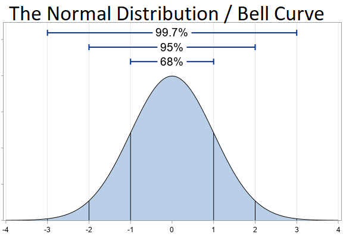

<style>

.center-middle {
  margin: 0;
  position: absolute;
  top: 50%;
  left: 50%;
  -ms-transform: translate(-50%, -50%);
  transform: translate(-50%, -50%);
}

</style>

```{r Setup, include=FALSE}
library(tidyverse)
theme_set(theme_minimal(base_size = 16))
knitr::opts_chunk$set(comment=NA, fig.width=7, fig.height=5, 
                      fig.align = 'center', out.width = 600,
                      message=FALSE, warning=FALSE, echo=TRUE)
set.seed(42)
```


# Warm Up

- Create an `R` project where you can keep all your code from this session.

- Create `week7.R` in your project folder. Load `tidyverse`.

--

- Create a object `x` and assign it a vector with the elements 1, 2, 3, and 4.

--

```{r vector x}
x <- c(1,2,3,4)

# this works too
x <- 1:4
```

--

- Find the sum of your vector `x`. Find the length of your vector `x`.

--

```{r x functions}
sum(x)

length(x)
```

---

# Warm Up

- What does this expression mean?

$$\int_{-\infty}^{+\infty} f(x)dx = 1$$
--

The area under the entire curve $f(x)$, from positive to negative infinity, equals $1$. 

--

<br>

Keep a copy of these slides open so that you can copy-paste code into your script when needed!

---

## Outline

A lot of probability/statistics courses are pretty abstract; the great thing about learning `R` first is that we can introduce this in a really hands-on way!

- We'll start by learning about probability distribution functions, and learn how to draw random values in `R`.

- We'll see how this procedure underlies **all** statistical inference.

<!-- Then, I think, Central Limit Theorem. A little backwards compared to the usual approach, but trust me, let's front-load the good stuff. -->

<!-- Random Variables and their properties: Expectation, Variance, Law of Large Numbers -->

<!-- Multivariable PDFs: Covariance, Joint Probability, Conditional Probability, Bayes Rule -->

<!-- As a bonus, you'll get to practice creating your own functions...very useful when you want to customize / mix-and-match the built-in functions we've learned. -->

--

For every statistical test...

--

1. I'm going to first show you how it works using the random number generator in `R`. This will involve a bunch of code.

--

2. Then, once we're comfortable with the intuition, I will show you how you can perform the statistical test with one line of `R` code.

--

<br>

.center[
Please don't feel betrayed.
]

???

The point is to give you a strong foundation upon which to build your understanding of statistical methods. I don't want you to leave this class with a "use this test for this kind of data" cookbook mentality, because that's where things go wrong.

---

## Learning Objectives

By the end of this module, you will be able to...

- Write your own functions and generate random values in `R`

- Explain several foundational concepts in probability theory
  - Probability Distribution Functions (PDFs)
  - Random Variables
  - Expectation
  - Variance
  - Central Limit Theorem
  - Law of Large Numbers
  - Bayes Rule 

- Make inferences about populations from sample data

---

class: center, middle

## The Trick Coin Problem

---

## The Trick Coin Problem

Suppose someone flips a coin 100 times and it lands on heads 65 times.

```{r coin gif, echo = FALSE}
knitr::include_graphics('img/flipping-coin-animated-gif-1.gif')
```

--

**The Challenge:** Is it a trick coin? Or did they just get lucky? How would we know? What is the *probability* of getting that many heads with a fair coin?

---

## The Trick Coin Problem

**Our Approach**: Take a fair coin, flip it 10 million times, and see how often we get 65 heads in 100 flips.

--

```{r schitts creek gif, echo = FALSE, out.width = '70%'}

```

On second thought, that would be exhausting, so let's make the computer do it instead.

---

class: center, middle

## Probability Distribution Functions (PDFs)

---

## Probability Distribution Functions (PDFs)

A special kind of function that describes the likelihood of random events.

--

### Property 1

$$P(x) \geq 0$$

Nothing has a less-than-zero chance of happening.

--

### Property 2

$$\sum_{x} P(x) = 1$$

$$\int_{-\infty}^{+\infty} P(x)dx = 1$$

The probability of **something** happening equals 1.

???

- (Probability not about coin flips and card games; probability is a function that characterizes our uncertainty over outcomes)

Functions take inputs and produce outputs. PDFs output the probability of an event.

(As Wasserman says, rigor and clarity not synonymous; if you want rigor, check out the books.)

---

## Example PDF: Flipping a Coin

$$\Omega = \{\text{heads}, \text{tails}\}$$

$$P(\text{heads}) = 0.5$$

$$P(\text{tails}) = 0.5$$

--

<br>

For you logophiles out there, this is also known as the **Bernoulli** distribution.

 - Two outcomes (0 and 1)
 - $P(1) = p$ and $P(0) = 1-p$

---

class: center, middle

## Generating Random Values

---

## Generating Random Values in `R`

The `sample` function draws values at random (with equal probability) from a vector:

```{r sample}
coin_outcomes <- c('Heads', 'Tails')

sample(coin_outcomes, size = 1)
```

--

```{r sample 2}
sample(coin_outcomes, size = 30, replace = TRUE)
```

--

(Your values will probably be different than mine. That's good!)

---

## Generating Random Values in `R`

### Exercise 1

Flip the coin 100 times, and assign the result to an object called `flips`.

--

```{r flip exercise}
flips <- sample(coin_outcomes, size = 100, replace = TRUE)
```

--

### Exercise 2

Draw 5 letters at random from the alphabet. (Note: the vector `LETTERS` is built-in to R.)

--

```{r sample exercise}
sample(LETTERS, size = 5, replace = TRUE)
```

---

class: center, middle

## Creating Your Own Functions

---

## Creating Your Own Functions

- An **enormous** strength of working with `R`

- Get comfortable with creating your own functions, and you can make `R` do whatever you want.

---

## Creating Your Own Functions

Here's a (silly) function that takes two inputs and adds 1 to their sum:

```{r funtion syntax}
add_one <- function(x, y = 1){
  x + y + 1
}
```

--

- `add_one` is the name
- `<- function()` assigns a function to that name
- `x, y = 1` are the inputs (aka arguments); `y` has a default value of 1.
- The code within the brackets executes whenever you call the function, and the last line is the function's output.

---

## Creating Your Own Functions

Here's a (silly) function that takes two inputs and adds 1 to their sum:

```{r funtion syntax 2}
add_one <- function(x, y = 1){
  x + y + 1
}
```

What happens if you call `add_one(x = 1, y = 2)`?

--

```{r add one example 1}
add_one(x = 1, y = 2)
```

--

What about `add_one(1)`?

--

```{r add one example 2}
add_one(1)
```


---

## Creating Your Own Functions

Here's a function that will flip a coin $N$ times and return the result.

```{r flip coin}
flip_coin <- function(N = 100){
  # specify the sample space of outcomes
  coin_outcomes <- c('Heads', 'Tails')
  
  # return a vector of N random coin flips
  sample(coin_outcomes,
         size = N,
         replace = TRUE)
}

flip_coin(N = 8)
```

---

## Creating Your Own Functions

Here's a function that will flip a coin $N$ times and return the number that landed on heads. (**Note**: it calls the `flip_coin()` function we just made!)

```{r count_heads()}
count_heads <- function(N){
  
  # flip the coin N times, assign to 'flips' vector
  flips <- flip_coin(N)
  
  # return the number of heads divided by number of flips
  sum(flips == 'Heads')
}
```

--

```{r call count_heads}
count_heads(N = 100)
```

???

Functions are like Las Vegas.

---

## Creating Your Own Functions

### Exercise 1

Create a function called `sample_n_letters()`, which samples $N$ letters at random from the alphabet.

--

```{r create sample letters function}
sample_n_letters <- function(num_letters = 5){
  sample(LETTERS, size = num_letters, replace = TRUE)
}

sample_n_letters(num_letters = 10)
```

---

## Creating Your Own Functions

### Exercise 2

Create a function called `fraction_Q()`, which samples $N$ letters from the alphabet at random and returns the fraction that are Q's.

--

```{r create function 2}
fraction_Q <- function(num_letters = 5){
  
  # draw n letters
  sample_letters <- sample_n_letters(num_letters)
  
  # return the number of Q's
  sum(sample_letters == 'Q') / num_letters
}

fraction_Q(100)
```

---

class: center, middle

## Back to the Trick Coin Problem

---

## The Trick Coin Problem

We can solve this now. We have the technology.

--

```{r call count_heads once}
count_heads(N = 100)
```

--

Let's repeat that 100,000 times and see how often you get 65 heads.

--

```{r replicate}
# Flip a coin 100 times and count the number of heads. 
# Repeat that 100,000 times and save the results
results <- replicate(100000, count_heads(N = 100))
```

???

TODO: Questioning lifecycle; okay here's the approach:
create functions to draw the variable, compute the summary statistic, and replicate the heck out of it. Histogram that distribution.

---

## The Trick Coin Problem

```{r hist coin flips, out.width = '65%'}
tibble(results) %>% 
  ggplot() +
  geom_histogram(aes(x=results), color = 'black', 
                 binwidth = 1) +
  geom_vline(xintercept = 65, color = 'red') +
  labs(x = 'Number of Heads in 100 Fair Coin Flips',
       y = 'Count')
```

---

## The Trick Coin Problem

```{r hist coin flips 2, out.width = '40%'}
tibble(results) %>% 
  ggplot() +
  geom_histogram(aes(x=results), color = 'black', 
                 binwidth = 1) +
  geom_vline(xintercept = 65, color = 'red') +
  labs(x = 'Number of Heads in 100 Fair Coin Flips',
       y = 'Count')
```

By the way, that's called the **binomial** distribution. Take $n$ Bernoulli random variables and add them together. 

???

Out of 100,000 tries we only got a result like 65 a handful of times. It's a low-frequency event.

Next time I see that guy, I'm gonna say "hey let me see that coin". I can't prove it's fake, but, y'know, it's suspicious.

---

## The Trick Coin Problem

A **p-value** is the probability that we observe a result at least as extreme as our test statistic.

--

```{r compute p-value}
# the frequency of draws >= 65 as a fraction of all draws
sum(results >= 65) / length(results)
```

--

The probability of getting 65 or more heads from a fair coin is roughly 0.1%.

---

## WARNING: P-values are widely misunderstood!

--

### Warning 1: You can't reverse the interpretation

$p = 0.001$ means the probability of observing 65 heads is very small for a fair coin. It does **not** mean that there is a 99.9% chance the coin is unfair.

--

### Warning 2: A low p-value doesn't mean that the result is "strong"

It just means that there's a real "pattern" that is difficult to explain as the product of chance alone.

--

### Warning 3: p-hacking

If I flipped 1,000 fair coins, at least one of them would probably come up heads 65 times out of 100. I can't then say **AHA! A FAKE COIN!**

---

class: center, middle

## So What?

---

## The Polling Problem

**Exercise:** You've taken a random sample of 1,000 voters. 526 say they plan to vote for the Democrat and 474 say they plan to vote for the Republican.

If 50% of all voters planned to vote for the Republican, what is the probability you would observe a poll so favorable to Democrats?

---

## The Polling Problem

```{r polling problem}
# create 10,000 random polls of 1,000 respondents each
results <- replicate(10000, count_heads(N = 1000))

# what's the probability of getting at least 526 Democratic voters?
sum(results >= 526) / length(results)
```

```{r polling histogram, echo = FALSE, out.width = '45%'}
tibble(results) %>% 
  ggplot() +
  geom_histogram(aes(x=results), color = 'black', binwidth = 5) +
  geom_vline(xintercept = 526, color = 'red') +
  labs(x = 'Support for Democrat in a Random Poll',
       y = 'Number of Polls')
```

--

That's called the **sampling distribution**, distribution that you would get if you repeatedly sampled from a population and recomputed the test statistic each time.

???

Because it's the one weird trick we use over and over and over and over again.

---

## Statistical Inference in Three Steps

--

1. Specify your Null Hypothesis $(H_0)$

2. Generate the **sampling distribution** of the test statistic under $H_0$

3. Compare the test statistic from your observed data with the sampling distribution.

--

<br>

Every (frequentist) hypothesis test is a variation on this! The only thing that changes is the PDF. 

---

class: center, middle

## Expected Value and Variance

---

## Expected Value

The **expected value** is the average value of a random variable $X$.

- Specifically, a *weighted average* of all possible outcomes times their probability.

Discrete: 
$$E(X) = \sum_x x P(x)$$

Continuous:
$$E(X) = \int_{-\infty}^{+\infty} x P(x)dx$$

---

## Expected Value

**Exercise**: Suppose $X$ is distributed as follows:

$P(X = 0) = 1-p$ and $P(X = 1) = p$

What is $E(X)$?

--

$$E(X) = 0 \times (1-p) + 1 \times p = p$$

---

## Expected Value

Why do we call it the expected value? 

--

Because if you take a large enough sample, we would expect that the average result will equal $E(X)$

--

```{r law of large numbers}
num_draws <- 10000 # draw 10,000 Benoulli random variables
p <- 0.4 # p = 0.4

draws <- sample(c(0,1), num_draws, replace = TRUE, prob = c(1-p, p))

# create a dataframe and plot sample mean as n increases
fig <- tibble(n = 1:num_draws,
       draws) %>% 
  mutate(sample_mean = cumsum(draws) / n) %>% 
  ggplot() + 
  geom_line(mapping = aes(x = n, y = sample_mean)) + 
  geom_hline(yintercept = p, color = 'red', linetype = 'dashed') +
  labs(x = 'Sample Size (n)', y = 'Sample Mean')
```

---

## Expected Value

```{r lln fig, echo = FALSE}
fig
```

---

class: center, middle

## The Law of Large Numbers

If you repeatedly draw a random variable a **large number of times**, the sample mean will converge on the expected value.

$$\bar{X}_n \overset{P}{\to} E(X)$$

???

As we get larger and larger samples, the average value gets closer and closer to the expected value. That's why we like to have large samples. We can be more certain that our sample mean accurately captures the population mean.

Quite easy to understand Law of Large Numbers once you understand CLT. In the limit, SE = 0.

---


<!-- --- -->

<!-- ## Properties of Expected Values -->

<!-- $$E(aX) = aE(X)$$ -->
<!-- <TODO: Is this useful?> -->

## Variance

The **variance** of a random variable $X$ is the average squared distance from the expected value. In math:

$$\text{Var}(X) = \sigma^2_X = E[(X-E(X))^2]$$
--

The **standard deviation** $(\sigma)$ of a random variable $X$ is the square root of its variance.

$$\sigma_X = \sqrt{\text{Var(X)}}$$

---

class: center, middle

## The Normal Distribution

---

<br>

<br>

```{r normal distribution structure, echo = FALSE}

```

???

"The unofficial sovereign of all statistics"

---

class: center, middle

## Where Does The Normal Distribution Come From?

---

## Import CCES

```{r load CCES, out.width = '40%'}
# Load CCES
CCES <- read_rds('data/CCES_2018.RDS') %>% 
  mutate(gender = if_else(gender == 1, 'Male', 'Female'),
         age = 2018 - birthyr,
         party = case_when(pid3 == 1 ~ 'Democrat',
                           pid3 == 2 ~ 'Republican',
                           pid3 == 3 ~ 'Independent')) %>% 
  filter(!is.na(party))
```

---

## The Population Distribution of Age

```{r age distribution, out.width='50%'}
ggplot(data = CCES) + 
  geom_histogram(aes(x=age), color = 'black', binwidth = 2) +
  labs(x = 'Age', y = 'Count')

mean(CCES$age)
```

---

## Take a Sample

```{r sample age}
# draw a sample of ages and take the mean
mean_age_of_sample <- function(data, n){
  data %>%
    pull(age) %>%
    sample(size = n) %>%
    mean
}

mean_age_of_sample(data = CCES, n = 100)

mean_age_of_sample(data = CCES, n = 100)
```

--

The mean from any one sample will always be off a bit.

---

## The Sampling Distribution

```{r repeat mean sample ages histogram, out.width='50%'}
sampling_distribution <- replicate(10000, mean_age_of_sample(data = CCES, n = 100))

tibble(sampling_distribution) %>% 
  ggplot() + 
  geom_histogram(mapping = aes(x=sampling_distribution), color = 'black') +
  labs(x = 'Mean Age From Sample', y = 'Count')
```

--

It's the normal distribution!

---

class: center, middle

## The Central Limit Theorem

The mean of a large number of independent random variables will be (approximately) normally distributed around the true mean.

---

## Central Limit Theorem

<iframe width="860" height="455" src="https://upload.wikimedia.org/wikipedia/commons/d/dc/Galton_box.webm" frameborder="0" allow="accelerometer; encrypted-media; gyroscope; picture-in-picture" allowfullscreen></iframe>

???

Imagine that each ball is a sample: when it goes left that means we randomly selected a person younger than the average, when it goes right that means we randomly selected a person older than the average. Most samples end up pretty close to the true mean, but sometimes you get really unlucky and draw a bunch of old people or a bunch of young people.

---

class: center, middle

## Standard Errors

---

## Standard Errors

The **standard error** is the standard deviation of the sampling distribution. 

--

> What is the standard deviation of the sampling distribution you just created?

--

```{r standard error}
sd(sampling_distribution)
```

--

> What if you increased the sample size to 400?

--

```{r quadruple sample size}
sampling_distribution <- replicate(10000, mean_age_of_sample(data = CCES, n = 400))

sd(sampling_distribution)
```


---

## Standard Errors

Quadrupling the sample size cut the standard error in half.

--

That's because the standard error of the mean equals:

$$SE = \frac{\sigma}{\sqrt{N}}$$
---


class: center, middle

## Confidence Intervals

---

## Confidence Intervals

A **confidence interval** is the set of values for which we can't reject the null hypothesis with $p < 1-\alpha$.

--

For example, the 95% confidence interval for a sample mean would be:

$$\left[\bar{X} - 2\frac{\sigma}{\sqrt{N}}, \bar{X} + 2\frac{\sigma}{\sqrt{N}}\right]$$

--

Because 95% of the normal distribution lies within two standard deviations (technically 1.96, but two is okay as a rule of thumb).

If you were to repeat this procedure a large number of times, the true value would lie within the confidence interval 95% of the time. 

---

## Confidence Intervals

**Exercise:** Draw a vector of 100 ages from CCES and compute a 95% confidence interval around your sample mean.

--

```{r confidence interval time}
age_sample <- sample(CCES$age, 100)

confidence_interval_low <- mean(age_sample) - 2 * sd(age_sample) / sqrt(100)

confidence_interval_high <- mean(age_sample) + 2 * sd(age_sample) / sqrt(100)

confidence_interval_low

confidence_interval_high
```


---

# Glossary of Terms

--

### Probability Distribution Function (PDF)

--

A function that describes the likelihood of random events. Must be greater than or equal to zero and sum to 1.

--

### Expected Value

--

The average value of a PDF. $\sum xf(x)$ or $\int xf(x)dx$

--

### Law of Large Numbers

--

As your sample size approaches infinity, the sample mean converges on the expected value. $\bar{X}_n \to E(X)$

---

# Glossary of Terms

--

### Variance

--

The average squared distance of a random variable from its expected value. Denoted $\sigma^2$.

--

### Standard Deviation

--

The square root of variance. Denoted $\sigma$.

---

# Glossary of Terms

--

### Sampling Distribution

--

The distribution of a test statistic from repeated resampling. (E.g. if you were to repeatedly rerun a random poll, your sampling distribution would be binomial centered around the true mean.)

--

### Standard Error

--

The standard deviation of the sampling distribution. $SE = \frac{\sigma}{\sqrt{N}}$ for the mean of a sample.

--

### Central Limit Theorem

--

The sampling distribution of the mean of a large number $(n>30)$ of independent random variables will be normally distributed around the true mean.

---

# Glossary of Terms

--

### Bernoulli Distribution

$P(X=1) = p$ and $P(X=0) = 1-p$

--

### Binomial Distribution

The sum of $n$ Bernoulli random variables

--

### Normal Distribution

--

A continuous, symmetric probability distribution function; 95% of the distribution falls within $[\mu - 2\sigma, \mu + 2\sigma]$.


---

class: center, middle


---

class: center, middle

## Multivariable Probability Distributions


---

## Multivariable Probability Distributions


---


class: center, middle

## Bivariate Hypothesis Testing

---

## Bivariate Hypothesis Testing

<br>

|                    |             | Independent Variable                |                         |
|--------------------|-------------|-------------------------------------|-------------------------|
|  |             | Categorical                         | Continuous              |
|                    | Categorical | Tabular Analysis (chi-squared test) | MLE (probit/logit)      |
|   **Dependent Variable**                 | Continuous  | Difference in Means (t-test)        | OLS (linear regression) |


---

## Bivariate Hypothesis Testing

```{r t test}
CCES %>% 
  group_by(party) %>% 
  summarize(mean_age = mean(age))
```

---

## Difference In Means

$H_0$: There is no difference between the average age of Republicans and Democrats.

```{r sample ages democrats vs republicans}

# sample 100 Republicans ages
rep_age <- CCES %>% 
  filter(pid3 == 2) %>% 
  pull(age) %>% 
  sample(100)

# sample 100 Democrats ages
dem_age <- CCES %>% 
  filter(pid3 == 1) %>% 
  pull(age) %>% 
  sample(100)

mean(rep_age)

mean(dem_age)

```

The Republicans seem to be older on average, but is that just sampling error?

--

How would you test it?

---

## Function: Compute Test Statistic

```{r compute test statistic}
difference_in_means <- function(population, n1 = 100, n2 = 100){
  
  # get the mean age of a random sample of size n1
  mean_age_dem <- population %>%
    pull(age) %>%
    sample(size = n1) %>%
    mean
  
  # get the mean age of a random sample of size n2
  mean_age_rep <- population %>%
    pull(age) %>%
    sample(size = n2) %>%
    mean
  
  # return the difference
  mean_age_rep - mean_age_dem
}

difference_in_means(CCES, n1 = 100, n2 = 100)
```

---

## Get Sampling Distribution

```{r hypothesis test: ages, out.width  = '45%'}
observed <- mean(rep_age) - mean(dem_age)
sampling_distribution <- replicate(10000, difference_in_means(CCES, n1 = 100, n2 = 100))

# sampling distribution
tibble(sampling_distribution) %>% 
  ggplot() + 
  geom_histogram(aes(x=sampling_distribution), color = 'black') +
  labs(x = 'Difference in Means', y = 'Count') +
  theme_bw() + 
  geom_vline(xintercept = observed, linetype = 'dashed', color = 'red')

# p-value
sum(abs(sampling_distribution) > observed) / length(sampling_distribution)
```

---

## T-Test

Hey good news; you can do it with one line.

```{r t.test}
t.test(rep_age, dem_age)
```

---

class: center, middle

## Okay

---

class: center, middle

### I Confess That This Is The Point Where I Ran Out Of Course Prep Time. 

### I'm So Sorry. 

### Let's Go To A Live Demo For The Remainder Of The Lesson.


---

## Problem Set 7

Go back to your earlier work in Problem Sets 2-4. Find three examples where you described the distribution of a variable or the relationship between two variables. 

For each example, formulate a hypothesis test. Is the relationship you found likely to result from chance alone, or could it be a real pattern?

Since we only know t-tests and chi-squared tests, let's stick with categorical independent variables.