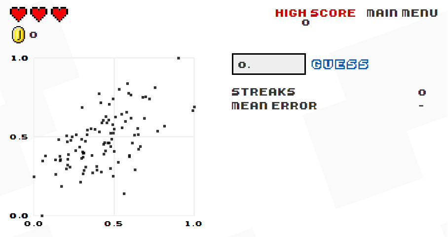

<style>

.center-middle {
  margin: 0;
  position: absolute;
  top: 50%;
  left: 50%;
  -ms-transform: translate(-50%, -50%);
  transform: translate(-50%, -50%);
}

</style>

```{r Setup, include=FALSE}
library(tidyverse)
theme_set(theme_minimal(base_size = 16))
knitr::opts_chunk$set(comment=NA, fig.width=7, fig.height=5, 
                      fig.align = 'center', out.width = 600,
                      message=FALSE, warning=FALSE, echo=TRUE)
set.seed(42)
```


<!-- ## Recap -->

<!-- -- -->

<!-- #### Week 1: Introduction to `R` -->

<!-- -- -->

<!-- #### Week 2: Visualizing Data -->

<!-- -- -->

<!-- #### Week 3: Reproducible Research -->

<!-- -- -->

<!-- #### Weeks 4-5: Data Wrangling -->

<!-- -- -->

<!-- #### Week 6: Calculus -->

<!-- -- -->

<!-- #### Weeks 7-8: Probability and Inference -->

<!-- --- -->

## Preview

--

#### October 21 & 28: Correlation

- Covariance and Linear Regression
- Matrix Algebra

--

#### November 4: Prediction

- Models and Machine Learning
- Overfitting, Cross-Validation, Regularization, and Ensembles

--

#### November 11 & 18: Causation

- Analyzing Experiments
- Observational Causal Inference

--

#### November 25: Thanksgiving

--

#### December 2 & 9: Bonus Weeks!

- *Possible Topics*: Big Data, Text-As-Data, Networks, Spatial/Geographic Data, Advanced `R`, Advanced Visualizations (Interactives/Animations)

---

## Correlation

By the end of this module you will be able to...

--

1. Compute covariance and correlation coefficients between two variables.

--

2. Estimate the slope of a line of best fit, plus confidence intervals and p-values.

--

3. Fit multivariable linear models using matrix algebra.


???

## Outline

1. Covariance and correlation; play Guess the Correlation

2. Linear Regression (Line of Best Fit)

  - The Linear Model; slope/intercept parameters; yhat; estimation; Least squares; residuals
  - `geom_smooth(method = 'lm')`
  - `lm()`
  - Now we want to be able to do that for MULTIPLE explanatory variables, and show that the solution is unique. For that we'll need matrix algebra.

3. Matrices

  - Matrices: multidimensional vectors; we've been calling them `data frames`. Show a data frame. It's a matrix. Same deal. 
  - Adding and subtracting matrices is just like you would expect (elementwise), but multiplying and dividing matrices is the tricky part.
  - Scalar multiplication vs. matrix multiplication; matrices must be *conformable* in order to multiply them; can't just multiply any two things together like you can with scalars; matrix transposes
  - Multivariable regression as a matrix multiplication problem. yhat = Xb; just a compact way of representing a big system of equations
  - Show that you can do those matrix multiplications in `R`; you need Wolfram Alpha to cheat on calculus, but `R` is actually designed for matrix algebra.
  - So you need to find the vector b that minimizes (y - Xb)(y-Xb)'
  - Turns out vector calculus is just like the calculus we saw before, except instead of *dividing* matrices, you take their inverse;  function
  - Quick primer on matrix inverses; in scalar algebra, b/b = 1, in matrix algebra BB^(-1) = I; once again the great thing about taking a political methodology course in 2020 is that I won't teach you how to solve for a matrix inverse by hand (like I was made to do in undergrad). There is literally a function called `solve()` in `R` which inputs a matrix and returns its inverse. 
  - yy' - Xby' - yX'b + XbX'b (minimize wrt b)
  - -X'y - X'y + 2XbX' = 0
  - b = (X'X)^-1(X'y)

---

class: center, middle

## Covariance and Correlation

---

## Covariance

Recall that the **variance** of a random variable is its expected squared distance from the mean:

$$\text{Var}(X) = E[(X-E(X))^2]$$

--

The **covariance** extends that definition of variance to two random variables $X$ and $Y$:

$$\text{Cov}(X,Y) = E[(X-E(X))(Y-E(Y))]$$
--

Note that:

$$\text{Cov}(X,X) = \text{Var}(X)$$

---

## Covariance

Covariance captures the degree of association between two variables. Does $X$ tend to be high when $Y$ is high?

```{r covariance, out.width='50%'}
flower_plot <- ggplot(data = iris) + 
  geom_point(mapping = aes(x = Sepal.Length, y = Petal.Length)) +
  labs(x = 'Sepal Length', y = 'Petal Length', title = 'Flower Measurements') +
  geom_vline(xintercept = mean(iris$Sepal.Length), linetype = 'dashed') +
  geom_hline(yintercept = mean(iris$Petal.Length), linetype = 'dashed')

flower_plot
```

???

Notice that whenever $X$ is greater than its mean, $Y$ tends to be greater than its mean, and vice versa. 

When two variables $X$ and $Y$ **covary** with one another, $X$ tends to be high whenever $Y$ is high, and $X$ tends to be low whenever $Y$ is low.

---

## Covariance

Because petal length tends to be larger than average whenever sepal length is larger than average (and vice versa) when you take the mean of all the the $(X-\bar{X})(Y-\bar{Y})$, you get a positive number.

```{r covariance computation}
cov(iris$Sepal.Length, iris$Petal.Length)
```

When covariance is positive, $X$ and $Y$ tend to move together. When covariance is negative, $X$ and $Y$ tend to move in opposite directions.

---

## Correlation Coefficients

The problem with covariance is that it's not easily interpretable. What does a covariance of `r cov(iris$Sepal.Length, iris$Petal.Length)` mean? How strong is that relationship?

--

The **correlation** coefficient solves that problem by standardizing the covariance.

$$\text{Cor}(X,Y) = \frac{\text{Cov}(X,Y)}{\sigma_X \sigma_Y}$$
--

This yields a value between $-1$ (perfectly anti-correlated) and $+1$ (perfectly correlated).

```{r correlation coefficient}
cor(iris$Sepal.Length, iris$Petal.Length)
```

???

Kind of like how standard deviation standardizes the variance by taking the square root.

---

## Let's Play "Guess The Correlation"

```{r game 1, echo = FALSE}
n <- 100
X <- rnorm(n,0,1)
Y <- X + rnorm(n,0,4)

ggplot(tibble(X,Y)) + 
  geom_point(aes(x=X,y=Y))
```

--

Actual Correlation: `r cor(X,Y)`

---

## Let's Play "Guess The Correlation"

```{r game 2, echo = FALSE}
n <- 100
X <- rnorm(n,0,1)
Y <- -X + rnorm(n,0,1)

ggplot(tibble(X,Y)) + 
  geom_point(aes(x=X,y=Y))
```

--

Actual Correlation: `r cor(X,Y)`

---

## Let's Play "Guess The Correlation"

```{r game 3, echo = FALSE}
n <- 100
X <- rnorm(n,0,1)
Y <- X + rnorm(n,0,2)

ggplot(tibble(X,Y)) + 
  geom_point(aes(x=X,y=Y))
```

--

Actual Correlation: `r cor(X,Y)`

---

## Let's Play "Guess The Correlation"

```{r game 4, echo = FALSE}
n <- 100
X <- rnorm(n,0,1)
Y <- -X + rnorm(n,0,3)

ggplot(tibble(X,Y)) + 
  geom_point(aes(x=X,y=Y))
```

--

Actual Correlation: `r cor(X,Y)`

---

## Let's Play "Guess The Correlation"

For more fun, try [http://guessthecorrelation.com/](http://guessthecorrelation.com/)



---

class: center, middle

## Linear Regression

---

## Linear Regression

```{r set up plots, echo = FALSE}
n <- 100
data <- tibble(X = rnorm(n,0,1),
               epsilon = rnorm(n,0,2),
               Y1 = 0.75*X + rnorm(n,0,0.66),
               Y2 = 3*X + rnorm(n,0,3))
```

Correlation coefficients are nice, but limited. Both of these have the same correlation coefficient (`r cor(data$X, data$Y1) %>% round(3)` and `r cor(data$X, data$Y2) %>% round(3)`).

.pull-left[
```{r cor1, echo = FALSE}
ggplot(data) +
  geom_point(aes(x=X,y=Y1)) +
  scale_y_continuous(limits = c(-10,10))
```
]

.pull-right[
```{r cor2, echo = FALSE}
ggplot(data) +
  geom_point(aes(x=X,y=Y2)) +
  scale_y_continuous(limits = c(-10,10))
```
]

--

We want to find the **slope** of the relationship. 

  - When we increase $X$ by 1, how much does $Y$ increase or decrease, on average?
  
--

  - We would also like to perform hypothesis tests and compute confidence intervals.

---

## Linear Regression

The two-variable linear model looks like this:

$$Y = a + bX + \varepsilon$$

--

**Terms:**

- $Y$ is a **vector** of outcomes

- $X$ is a **vector** we're using to predict the outcome

- $a$ is the y-intercept 

- $b$ is the slope of the relationship between $X$ and $Y$, and

- $\varepsilon$ is **vector** of random error

  - The difference between the true value of $Y$ and the predicted value $a + bX$.

---

## Linear Regression

$$Y = a + bX + \varepsilon$$

#### Example:

.pull-left[
$X = \begin{bmatrix} 1 \\ 3 \\ 4 \end{bmatrix}$
]

.pull-right[
$Y = \begin{bmatrix} 4 \\ 6 \\ 10 \end{bmatrix}$
]

<br>

$a = 2$, $b = 2$

--

$$\underbrace{\begin{bmatrix} 4 \\ 6 \\ 10 \end{bmatrix}}_Y = \underbrace{2 \times \begin{bmatrix} 1 \\ 1 \\ 1 \end{bmatrix}}_a + \underbrace{2 \times \begin{bmatrix} 1 \\ 3 \\ 4 \end{bmatrix}}_{bX} + \underbrace{\begin{bmatrix} 0 \\ -2 \\ 0 \end{bmatrix}}_\varepsilon$$

---

### Linear Regression Finds the "Line of Best Fit"

```{r line of best fit}
flower_plot +
  geom_smooth(aes(x=Sepal.Length, y=Petal.Length),
              method = 'lm', se = FALSE)
```

---

## How do we estimate the line of best fit?

To see how, let's first generate some random data.

```{r bivariate regression}
n <- 300 # sample size
a <- 2 # y-intercept
b <- 3 # slope

# X and epsilon are normally distributed
# Y = a + bX + epsilon
data <- tibble(X = rnorm(n, 1, 1), 
               epsilon = rnorm(n, 0, 2),
               Y = a + b*X + epsilon)

cor(data$X, data$Y)
```

---

## How do we estimate the line of best fit?

```{r plot bivariate regression DGP}
ggplot(data) +
  geom_point(mapping = aes(x=X,y=Y))
```

---

## How do we estimate the line of best fit?

To make things easier, we will ignore the y-intercept for now.

```{r demean}
demeaned_data <- data %>% 
  mutate(Y = Y - mean(Y), X = X - mean(X))
```

--

The data looks the same; we've just shifted it down and to the left.

.pull-left[
```{r non-demeaned plot, out.width = '90%'}
ggplot(data) +
  geom_point(mapping = aes(x=X,y=Y)) +
  labs(x='X',y='Y',title = 'Original Data')
```
]

.pull-right[
```{r demeaned plot, out.width='90%'}
ggplot(demeaned_data) +
  geom_point(mapping = aes(x=X,y=Y)) +
  labs(x='X',y='Y',title = 'Demeaned Data')
```
]

???

You'll thank me when we start doing the calculus.

---

## How do we estimate the line of best fit?

--

The "best" is the one that minimizes error. Specifically, we're going to find the line that minimizes the **sum of squared errors**.

$$Y = bX + \varepsilon$$
$$\varepsilon = Y - bX$$
--

Let's create a function called $f(b)$ equal to the sum of squared errors:

$$f(b) = \sum \varepsilon_i^2 = \sum(Y_i-bX_i)^2$$
--

Distribute:

$$f(b) = \sum Y_i^2 - \sum 2bX_iY_i + \sum b^2 X_i^2$$

---

## Three Steps to Minimize a Function?

--

#### Step 1: Take the derivative

$$f(b) = \sum Y_i^2 - \sum 2bX_iY_i + \sum b^2 X_i^2$$

$$\frac{\partial f}{\partial b} = -2\sum X_iY_i + 2b \sum X_i^2$$

--

#### Step 2: Set Equal to Zero

$$-2\sum X_iY_i + 2b \sum X_i^2 = 0$$
--

#### Step 3: Solve for $b$

$$2\sum X_iY_i = 2b\sum X_i^2$$
$$b = \frac{\sum X_iY_i}{\sum X_i^2}$$
---

## Slope Estimate

$$b = \frac{\sum X_iY_i}{\sum X_i^2}$$

```{r estimate slope}
slope_estimate <- 
  sum(demeaned_data$X * demeaned_data$Y) /
  sum(demeaned_data$X^2)

slope_estimate
```

---

### Slope Estimate

```{r plot estimated slope}
ggplot(demeaned_data) + 
  geom_point(mapping = aes(x=X,y=Y)) +
  geom_abline(intercept = 0, slope = slope_estimate)
```

---

## Some Terminology

The slope parameter $b$ is called the **estimand**. It is the thing we are trying to estimate.

$\frac{\sum X_iY_i}{\sum X_i^2}$ is the **estimator**. It is the equation we use to produce our estimate.

`r slope_estimate %>% round(3)` is our **estimate**.

  - Typically, we denote estimates with little hats, like this: $\hat{b} =$ `r slope_estimate %>% round(3)`.

---

## Interesting Footnote

Notice that our estimator $\frac{\sum X_iY_i}{\sum X_i^2}$ is equal to $\frac{\sum (X_i-0)(Y_i-0)}{\sum (X_i-0)^2}$, which is equal to $\frac{\sum (X_i-\bar{X})(Y_i-\bar{Y})}{\sum (X_i-\bar{X})^2}$ because $\bar{X}=0$ and $\bar{Y}=0$.

So another way of writing the estimator is $\hat{b} = \frac{\text{Cov}(X,Y)}{\text{Var}(X)}$.

--

```{r another slope estimate}
slope_estimate

cov(demeaned_data$X, demeaned_data$Y) / var(demeaned_data$X)
```

---

## Inference

We have a **point estimate** of the slope. What if we want confidence intervals and p-values? 

--

### Three Steps

--

1. Specify the Null Hypothesis $(b = 0)$

--

2. Generate Sampling Distribution of $\hat{b}$ assuming $b = 0$

--

3. Compare observed value of $\hat{b}$ to the sampling distribution

---

### Where do we get the sampling distribution?

In a linear regression, the randomness comes from the error term $\varepsilon$. Imagine that we repeatedly draw a new $\varepsilon$ vector with each sample.

--

```{r sampling function}
null_slope_estimate <- function(X){
  
  b <- 0 # null hypothesis: b = 0 
  n <- length(X)
  
  # Create random dataset assuming null hypothesis
  epsilon <- rnorm(n, 0, 2)
  Y <- b*X + epsilon
  
  # Return the slope estimate
  sum(X * Y) / sum(X^2)
}

null_slope_estimate(X = demeaned_data$X)

```
---

## Generate the Sampling Distribution

<TODO: Bump this to 20000>

```{r sampling distribution, out.width = '60%'}
sampling_distribution <- replicate(200, null_slope_estimate(X = demeaned_data$X))

tibble(sampling_distribution) %>% 
  ggplot() +
  geom_histogram(mapping = aes(x=sampling_distribution),
                 color = 'black', binwidth = 0.02) +
  labs(x='Slope Estimate (Sampling Distribution)') # a bell curved sampling distribution again! (t distribution)
```

---

## P-values

```{r p-value and confidence interval}
sum(sampling_distribution > slope_estimate) # p-value effectively zero
```

## Confidence Intervals

```{r confidence intervals}
standard_error <- sd(sampling_distribution)
standard_error

confidence_interval <- c(slope_estimate - 1.96 * standard_error,
                         slope_estimate + 1.96 * standard_error)
confidence_interval

```

---

## The One-Line Built-In `R` Function

The `lm()` function estimates the linear model parameters (slope + y-intercept) and computes confidence intervals and p-values.

```{r lm}
linear_model_fit <- lm(formula = Y ~ X, 
                       data = demeaned_data) 

coef(linear_model_fit) # get the coefficient estimates

confint(linear_model_fit) # get the confidence intervals
```

---

## The One-Line Built-In `R` Function

```{r summary(lm)}
summary(linear_model_fit)
```

???

Reports a bunch of other statistics and diagnostics that you will learn about in 7014. I gotta leave something for Mollie to teach you.

---

class: center, middle

## Multivariate Linear Regression

---

## Multivariate Linear Regression

```{r regression}
data <- tibble(c = 1,
            x1 = rnorm(100, 0, 1),
            x2 = rnorm(100, 0, 1),
            y = 2*x1 + 3*x2 + rnorm(100, 0, 1))

linear_model <- lm(y ~ x1 + x2, data = data)

summary(linear_model)

# X matrix
X <- data %>% 
  select(c, x1, x2) %>% 
  as.matrix

# y vector
y <- data %>% 
  pull(y)

# beta hat = (X'X)^-1 X'y
beta_hat <- solve(t(X) %*% X) %*% t(X) %*% y

beta_hat
linear_model # that's where the coefficients come from; the parameter estimates that minimize the sum of squared errors
```