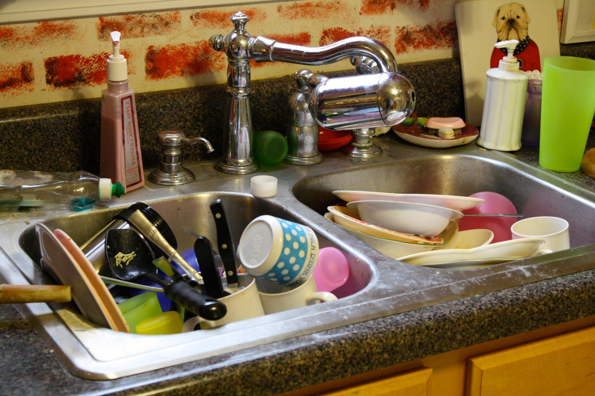

<style>

.center-middle {
  margin: 0;
  position: absolute;
  top: 50%;
  left: 50%;
  -ms-transform: translate(-50%, -50%);
  transform: translate(-50%, -50%);
}

</style>

```{r Setup, include=FALSE}
library(tidyverse)
theme_set(theme_minimal(base_size = 16))
knitr::opts_chunk$set(comment=NA, fig.width=7, fig.height=5, 
                      fig.align = 'center', out.width = 600,
                      message=FALSE, warning=FALSE, echo=TRUE)
set.seed(42)
```

## What Are Models?

A model is "low-dimensional" mathematical representation of the world. It takes all the messy, noisy complexity of a dataset and simplifies it. 

--

```{r echo = FALSE, out.width='50%'}
tibble(x = rnorm(100,0,1),
       y = 2*x + rnorm(100,0,2)) %>% 
  ggplot() +
  geom_point(aes(x=x,y=y)) +
  geom_smooth(aes(x=x,y=y), se = FALSE) +
  theme_bw()
```

--

One way to think about statistical models is that they partition the data into **signal** and **noise**.

$$Y = \underbrace{X\beta}_\text{signal} + \underbrace{\varepsilon}_\text{noise}$$

???

If I've done my job right, then the noise is unrelated to the signal, the systematic relationships that I care about.


## Outline

What are models?

1. Abstracted mathematical representations of the dataset.

2. If done right, the relationships expressed in a model separate the "signal" (an interesting phenomenon or a reliable pattern that predicts your data) from the "noise" (randomness from sampling, measurement error, or a bunch of other things that are (hopefully) orthogonal to the topic you care about).

The goal of a model is not to uncover truth, but to discover a simple approximation that is still useful.


Observed data & parameters. We fit the parameters using an *estimator*, just like we did with the linear model.


What are they good for?

1. Summarizing patterns and relationships in data (what we've been doing so far). Allows us to quantify the size and uncertainty of estimates.

2. Make predictions about unseen data.

3. Distinguish cause and effect; make **counterfactual** predictions.

Today #2, then #3. 

- Making predictions from an `lm()` model.
  - Prediction error
  - But it's not really a...prediction, is it?
- Split sample with CCES
  - `lm()` the feeling thermometer, maybe?
  
  
  
---

## Why Do We Model Data?

Broadly speaking, there are three reasons social scientists build models:

--

1. To **summarize** patterns and relationships, and to quantify our uncertainty.

--

  - This is what we've been doing so far.
  
--

2. To make **predictions** about unobserved data.

--

3. To distinguish between cause and effect; to make **counterfactual** predictions.

--

Today we discuss prediction. Next week, causal inference.

---

## Today's Objectives

By the end of this module, you will be able to...

- Make predictions using model objects in `R`

- Evaluate a model's predictive accuracy

- Cross-validate and regularize models to improve out-of-sample prediction

---

## Our Challenge Today

I want to try to **predict** how ANES survey respondents feel about journalists, using observable covariates. 

```{r load the good old ANES pilot survey}

# load the ANES pilot study
load('data/anes_pilot_2019.RData')

# recode some variables
data <- data %>% 
  mutate(age = 2019 - birthyr,
         female = as.numeric(gender == 2),
         race = case_when(race == 1 ~ 'White',
                          race == 2 ~ 'Black',
                          race == 3 ~ 'Hispanic',
                          TRUE ~ 'Other'),
         educ = case_when(educ == 1 ~ 'No HS',
                          educ == 2 ~ 'High school graduate',
                          educ == 3 ~ 'Some college',
                          educ == 4 ~ '2-year',
                          educ == 5 ~ '4-year',
                          educ == 6 ~ 'Post-grad'))

ftjournal_viz <- ggplot(data) +
  geom_histogram(aes(x=ftjournal),color = 'black', binwidth = 7)
```

---

## Our Challenge Today

```{r viz ftjournal}
ftjournal_viz
```

---

## Exercise

Estimate a linear model of `ftjournal` using observed characteristics of the respondents. What patterns do you observe?

--

```{r lm1}
data <- data %>% 
  mutate(pew_religimp = case_when(pew_religimp == 1 ~ 'Very Important',
                                  pew_religimp == 2 ~ 'Somewhat Important',
                                  pew_religimp == 3 ~ 'Not too important',
                                  pew_religimp == 4 ~ 'Not at all important'),
         vote20jb = case_when(vote20jb == 1 ~ 'Trump Voter',
                              vote20jb == 2 ~ 'Biden Voter',
                              vote20jb == 3 ~ 'Other Voter',
                              vote20jb == 4 ~ 'Non-Voter'))

linear_model1 <- lm(ftjournal ~ age + female + race + educ + pew_religimp + vote20jb, data = data)
```


---

```{r lm summary}
library(broom)

tidy(linear_model1)
```

???

So the model would predict that a 50 year old male Hispanic, high school graduate...

---

## Making Predictions

To make **predictions** using your model, use the `predict()` function!

  - The first input is a model object.
  - The second input is a dataframe that contains all the explantaory variables in your model.

```{r predict}
# create a new variable called ftjournal_prediction
data <- data %>% 
  mutate(ftjournal_prediction = predict(linear_model1, data))
```

---

## Making Predictions

```{r look at predictions, echo = FALSE}
# look at some predictions
data %>% 
  select(age, female, race, educ, pew_religimp, vote20jb, ftjournal_prediction) %>% 
  head(5) %>% 
  knitr::kable()
```

---

## Model Selection

How do you decide which variables to include in your model? 

--

- It depends on the purpose of the model.

--

Why not **ALL THE VARIABLES**?

```{r kitchen sink, out.width = '75%', echo = FALSE}

```

---


```{r separate into test and training set}

# take 70% of the data as the "training set"
train <- data %>% 
  sample_frac(0.7)

# the test set is whatever is left over (use anti_join)
test <- data %>% 
  anti_join(train, by = 'caseid')
```

---

Now, we only train our models on the `train` set. Never on the `test` set! That's only for validation.

```{r train}
lm1 <- lm(ftjournal ~ age + female + educ + race, data = train)

summary(lm1)
```
---

# Out-Of-Sample Prediction

```{r out-of-sample prediction}
test <- test %>% 
  mutate(ftjournal_hat = predict(lm1, test))

ggplot(test) + 
  geom_point(aes(x=ftjournal_hat,y=ftjournal)) +
  labs(x='Predicted Feeling Thermometer (Journalists)', 
       y='Actual Feeling Thermometer (Journalists)') +
  geom_abline(intercept = 0, slope = 1, linetype = 'dotted')
```

---

Prediction error metrics

How would you compute mean squared error?

--

```{r mean squared error}
mse <- mean((test$ftjournal - test$ftjournal_hat)^2)

mse
```