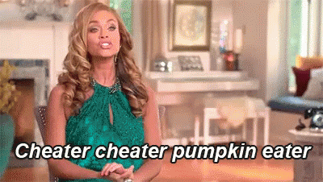
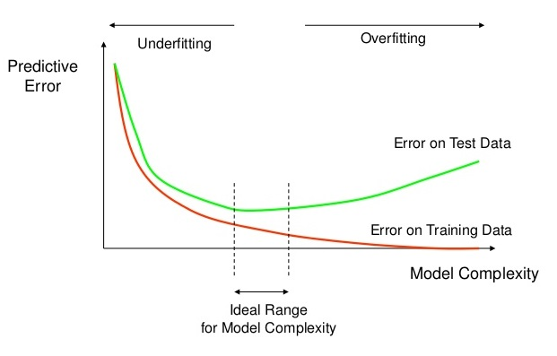

<style>

.center-middle {
  margin: 0;
  position: absolute;
  top: 50%;
  left: 50%;
  -ms-transform: translate(-50%, -50%);
  transform: translate(-50%, -50%);
}

</style>

```{r Setup, include=FALSE}
library(tidyverse)
theme_set(theme_minimal(base_size = 16))
knitr::opts_chunk$set(comment=NA, fig.width=7, fig.height=5, 
                      fig.align = 'center', out.width = 600,
                      message=FALSE, warning=FALSE, echo=TRUE)
set.seed(42)
```

## What Are Models?

A model is "low-dimensional" mathematical representation of the world. It takes all the messy, noisy complexity of a dataset and simplifies it. 

--

```{r echo = FALSE, out.width='50%'}
tibble(x = rnorm(100,0,1),
       y = 2*x + rnorm(100,0,2)) %>% 
  ggplot() +
  geom_point(aes(x=x,y=y)) +
  geom_smooth(aes(x=x,y=y), method = 'lm', se = TRUE) +
  theme_bw()
```

--

One way to think about statistical models is that they partition the data into **signal** and **noise**.

$$Y = \underbrace{X\beta}_\text{signal} + \underbrace{\varepsilon}_\text{noise}$$

???

If I've done my job right, then the noise is unrelated to the signal, the systematic relationships that I care about.


## Outline

What are models?

1. Abstracted mathematical representations of the dataset.

2. If done right, the relationships expressed in a model separate the "signal" (an interesting phenomenon or a reliable pattern that predicts your data) from the "noise" (randomness from sampling, measurement error, or a bunch of other things that are (hopefully) orthogonal to the topic you care about).

The goal of a model is not to uncover truth, but to discover a simple approximation that is still useful.


Observed data & parameters. We fit the parameters using an *estimator*, just like we did with the linear model.


What are they good for?

1. Summarizing patterns and relationships in data (what we've been doing so far). Allows us to quantify the size and uncertainty of estimates.

2. Make predictions about unseen data.

3. Distinguish cause and effect; make **counterfactual** predictions.

Today #2, then #3. 

- Making predictions from an `lm()` model.
  - Prediction error
  - But it's not really a...prediction, is it?
- Split sample with CCES
  - `lm()` the feeling thermometer, maybe?
  
  
  
---

## Why Do We Model Data?

Broadly speaking, there are three reasons social scientists build models:

--

1. To **summarize** patterns and relationships, and to quantify our uncertainty.

--

  - This is what we've been doing so far.
  
--

2. To make **predictions** about unobserved data.

--

3. To distinguish between cause and effect; to make **counterfactual** predictions.

--

Today we discuss prediction. Next week, causal inference.

---

## Today's Objectives

By the end of this module, you will be able to...

- Make predictions using model objects in `R`

- Evaluate a model's predictive accuracy

- Cross-validate and regularize models to improve out-of-sample prediction

- Fit your very first **machine learning** model

---

## Our Challenge Today

I want to try to **predict** how ANES survey respondents feel about journalists, using observable covariates. 

```{r load the good old ANES pilot survey, out.width = '50%'}
# import and tidy the ANES pilot study
# source() function calls another R script
source('tidy-anes.R')

ggplot(data) +
  geom_histogram(aes(x=ftjournal),color = 'black', binwidth = 7)
```

---

## Exercise 1

Estimate a linear model of `ftjournal` using observed characteristics of the respondents. What patterns do you observe?

--

```{r lm1}
linear_model1 <- lm(ftjournal ~ age + female + ftbiden,
                    data = data)
summary(linear_model1)
```

---

## Making Predictions

To make **predictions** using your model, use the `predict()` function!

  - The first input is a model object.
  - The second input is a dataframe that contains all the explantaory variables in your model.

```{r predict}
# create a new variable called ftjournal_prediction
data <- data %>% 
  mutate(ftjournal_prediction = predict(linear_model1, data))
```

---

## Making Predictions

```{r look at predictions}
coef(linear_model1)

# look at some predictions
data %>% 
  select(age, female, ftbiden, ftjournal_prediction, ftjournal) %>% 
  head(5)
```

---

## Making Predictions

```{r visualize predictions, out.width = '60%'}
ggplot(data) +
  geom_point(mapping = aes(x=ftjournal_prediction, y=ftjournal),
             alpha = 0.2) +
  labs(x = 'Predicted Feeling Thermometer (Journalists)',
       y = 'Actual Feeling Thermometer (Journalists)') +
  theme_bw() +
  geom_abline(intercept=0, slope = 1, linetype = 'dashed')
```

---

## Quick Clarification 

Why did we recode all of those categorical variables? Why not just leave them as numbers? 

`lm()` needs to know whether to treat a variable as continuous or categorical. 
 - If the variable is numeric, it will treat it as continuous 
 - If it's a character, it will treat it as categorical
 
--

If we leave race coded as numeric, `lm()` will do this:

```{r old coding, echo = FALSE, out.width = '50%'}
proper_data <- data

load('data/anes_pilot_2019.RData')

ggplot(data %>% filter(race != 8)) +
  geom_boxplot(aes(x=factor(race),y=ftjournal), notch = TRUE) +
  geom_smooth(aes(x=race,y=ftjournal), method = 'lm', se = FALSE) +
  labs(x='Race',y='Feeling Thermometer (Journalists)')

# revert to the proper coding
data <- proper_data
rm(proper_data)
```

---

class: center, middle

## Model Selection


---


## Model Selection

How do you decide which variables to include in your model? 

--

Why not **ALL THE VARIABLES**?

```{r kitchen sink, out.width = '75%', echo = FALSE}
knitr::include_graphics('img/piled-up-dishes-in-kitchen-sink.jpg')
```


---

## Model Selection

What constitutes the "best" model depends on what you're trying to do.

- If you're building a model to make **predictions**, then we'll evaluate it on the basis of its predictions.

- If you're building a model for **causal inference**, then we'll need a different set of tools (next week).

--

Regardless of your objective, the correct answer is almost *never* a "kitchen sink model".


---


## Prediction Error


--

A common error metric is the **root mean squared error** (RMSE).

$$RMSE = \sqrt{\frac{\sum(\hat{Y_i} - Y_i)^2}{n}}$$

--

**Exercise:** Compute the RMSE of your predictions in `R`.

---

## Prediction Error

**Exercise:** Compute the RMSE of your predictions in `R`.

--

```{r sse}
data <- data %>% 
  mutate(error = ftjournal_prediction - ftjournal,
         squared_error = error ^ 2)

data %>% 
  select(ftjournal, ftjournal_prediction, error, squared_error) %>% 
  head(4)

data$squared_error %>% mean %>% sqrt
```


---

## Prediction Error

Let's create a function to perform that computation whenever we want:

```{r rmse function}
rmse <- function(truth, prediction){
  (prediction - truth)^2 %>% 
    mean %>% 
    sqrt
}

rmse(truth = data$ftjournal,
     prediction = data$ftjournal_prediction)
```

---

class: center, middle

# Except...

---

## What We Just Did Was Cheating

--

```{r pumpkin, echo = FALSE}

```

---

## What We Just Did Was Cheating

Those weren't really *predictions*, were they?

--

Our model knew all of the outcomes ahead of time, and it found the parameters that minimized the sum of squared errors. 

--

$$\hat{\beta} = (X'X)^{-1}X'Y$$

Remember how we derived the OLS estimator? It's *literally* the $\beta$ that minimizes squared error.

---

## What We Just Did Was Cheating

```{r straw man 1, echo = FALSE}
straw_data <- tibble(X = 1:5,
                     Y = 1:5)

p <- ggplot(straw_data) +
  geom_point(aes(x=X,y=Y), size = 4)

p
```

???

It's like if I gave you these five data points and you drew a line through them and said "look at me I perfectly predicted all the data!" No you didn't. You knew the answer ahead of time.

---

## What We Just Did Was Cheating

```{r straw man 2, echo = FALSE}
straw_data <- tibble(X = 1:5,
                     Y = 1:5)

p +
  geom_smooth(aes(x=X,y=Y), method = 'lm', se = FALSE)
```

--

This is called **in-sample** prediction. The true test of a model is **out-of-sample** prediction.

---

## Best Practice: Hide some of your data from your model

Partition the data into a **training** set and a **test** set.

```{r separate into test and training set}
# keep 70% of the data as the "training set"
train <- data %>% 
  sample_frac(0.7)

# hold out the remaining 30% to test your predictions
test <- data %>% 
  anti_join(train, by = 'caseid')
```

--

Now, we only train our models on the `train` set. Never on the `test` set! That's just for validation.

---

## Exercise 2: Out-of-sample Prediction

Re-estimate your linear model on the `train` data and make out-of-sample predictions on the `test` data. Is the RMSE lower or higher than the in-sample predictions?

--

```{r out-of-sample prediction}
# train the model
lm1 <- lm(ftjournal ~ age + female + ftbiden, data = train)

# make out-of-sample predictions
test <- test %>% 
  mutate(ftjournal_prediction = predict(lm1, test))

# evaluate model fit
rmse(truth = test$ftjournal,
     prediction = test$ftjournal_prediction)
```

---

## Back To Model Selection

Let's evaluate two models, a "kitchen sink" model and a simpler model.

--

```{r in-sample lm}
kitchen_sink_lm <- lm(ftjournal ~ age + race + female + educ + liveurban + ftbiden + fttrump +
                        marstat + child18 + pew_religimp + vote20jb + ideo5 + bmi +
                        facebook_user + twitter_user + instagram_user + reddit_user + 
                        youtube_user + snapchat_user + tiktok_user, data = train)

simple_lm <- lm(ftjournal ~ female + ftbiden + fttrump + ideo5 + twitter_user, data = train)
```
--

```{r compare rmse}
# kitchen sink in-sample RMSE
rmse(truth = train$ftjournal,
     prediction = predict(kitchen_sink_lm, train))

# simple model in-sample RMSE
rmse(truth = train$ftjournal,
     prediction = predict(simple_lm, train))
```

???

Now we can return to our original question. What variables should we include? What's the "best" model?

---

## Back To Model Selection

But when you check out-of-sample RMSE...

```{r compare out-of-sample rmse}
# kitchen sink out-of-sample RMSE
rmse(truth = test$ftjournal,
     prediction = predict(kitchen_sink_lm, test))

# simple model out-of-sample RMSE
rmse(truth = test$ftjournal,
     prediction = predict(simple_lm, test))
```

---

## Overfitting

<br>

```{r overfitting, echo = FALSE}

```


---

class: center, middle

## Cross-Validation and Regularization

---

## Cross-Validation and Regularization

Two techniques for improving the out-of-sample predictive accuracy of models.

--

- **Cross-validation** checks out-of-sample predictive accuracy for every observation in the dataset.

--

- **Regularization** decreases the complexity of a model to improve out-of-sample fit.

---

## Cross-Validation

Repeat the partitions between `train` and `test` until every observation has been included in the `test` set.

--


--

If you repeat the validation process $k$ times, it is called $k$-fold cross-validation.

---

## Cross-Validation

We can automate this process with the `caret` package.

```{r cross-validation with caret}
library(caret)

# 10-fold cross-validation
train.control <- trainControl(method = "cv", number = 10)

# Train the kitchen sink model
kitchen_sink_model <- train(ftjournal ~ age + race + female + educ + liveurban + ftbiden + fttrump +
                              marstat + child18 + pew_religimp + vote20jb + ideo5 + bmi +
                              facebook_user + twitter_user + instagram_user + reddit_user + 
                              youtube_user + snapchat_user + tiktok_user, 
                            data = data, method = "lm",
                            trControl = train.control)

# Train the simple model
simple_model <- train(ftjournal ~ female + ftbiden + fttrump + ideo5 + twitter_user,
                      data = data, method = 'lm',
                      trControl = train.control)
```

---

## Cross-Validation

```{r summarize cv results}
# Summarize the results
print(kitchen_sink_model)
```

---

## Cross-Validation

```{r summarize cv results 2}
# Summarize the results
print(simple_model)
```

---

## Regularization

```{r overfitting 2, out.width = '80%', echo = FALSE}

```

When you **regularize** a model, you try to find that sweet spot in the middle.
 - Not so simple that it *underfits* the training data.
 - Not so complex that it *overfits* the training data.

???

There are some automated regularization techniques (e.g. LASSO), that you might find interesting! If you do, take Jason Anastasopoulos's machine learning class!

---

## Exercise 3

1. Compute the cross-validated prediction error for your model using the `caret` package. 

2. Then try to find the sweet spot. Add/remove predictor variables until you get the best-predicting model you can find.

---

class: center, middle

## A Taste of Machine Learning

---

## A Taste of Machine Learning

So far we've been fitting only linear models. Can we do better with some other type of model?

--


class: center, middle

## Binary Outcomes

---

## A Taste of Logit


$$P(Y = 1) = \frac{1}{1 + e^{-X\beta}}$$

It's a sigmoid function that "squishes" the output between 0 and 1.

```{r plot sigmoid, out.width = '50%'}
sigmoid_data <- tibble(x_beta = seq(-10,10,0.1),
               prob = 1 / (1 + exp(-x_beta)))

ggplot(sigmoid_data) + 
  geom_line(aes(x=x_beta, y = prob)) +
  labs(x = 'X * Beta', y = 'P(Y=1)')
```