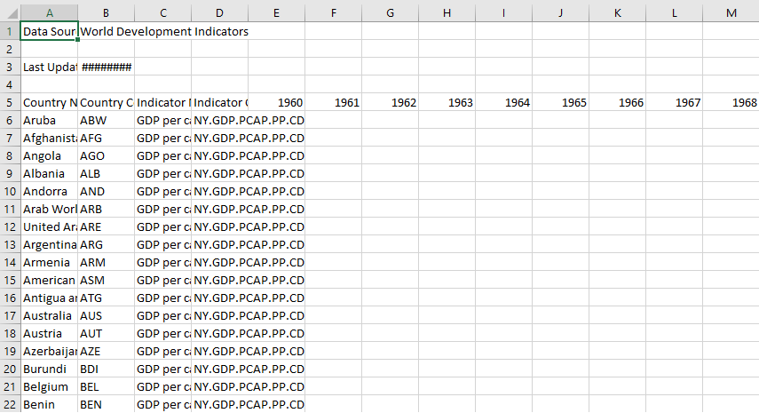
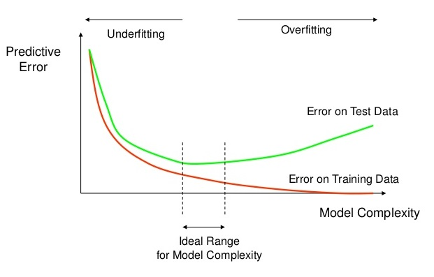
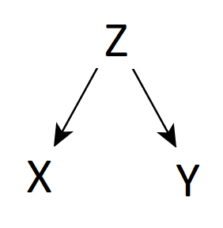
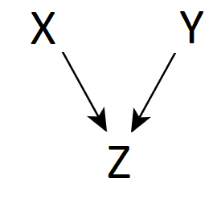
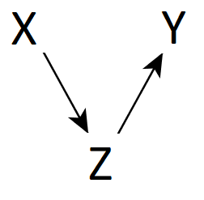
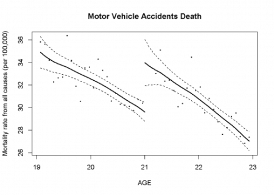

class: center, middle

```{r Setup, include=FALSE}
library(tidyverse)
theme_set(theme_minimal(base_size = 16))
knitr::opts_chunk$set(comment=NA, fig.width=7, fig.height=5, 
                      fig.align = 'center', out.width = 600,
                      message=FALSE, warning=FALSE, echo=TRUE)
set.seed(42)
```


# Week 1: R

---

# Week 1: R

`R` is a powerful, all-purpose calculator:

```{r}
(2 + 2)^2 * 2 + 4
```

--

Save information to short-term memory as **objects**:

```{r}
x <- (2 + 2)^2 * 2 + 4
```

--

Use those objects as inputs to **functions**:

```{r}
sqrt(x)

x %>% sqrt
```

???

Objects are "nouns", functions are "verbs".

---

# Week 1: R

A **vector** is an ordered set of values.

```{r}
x <- c(1,3,2,6,2)

x
```

--

A **matrix** is an ordered set of vectors. **Tidy data** is a matrix with row vectors of observations and column vectors of variables:


---

# Week 1: R

A **statistic** is a value computed from data.

```{r}
mean(x) # sum(x) / n

median(x) # the middle value

var(x) # average squared distance to the mean

sd(x) # square root of variance
```

---

class: center, middle

# Week 2: Visualizing Data

---

# Week 2: Visualizing Data

To build a `ggplot` object, we successively add **layers**, mapping those layers to vectors in a dataset.

```{r}
plot1 <- ggplot(data = mtcars) + 
  # add points
  geom_point(mapping = aes(x=wt, y=mpg, 
                           color = factor(cyl))) +
  # add a line of best fit
  geom_smooth(mapping = aes(x=wt, y=mpg),
              method = 'lm', se = FALSE, color = 'red') +
  # add labels
  labs(x = 'Weight', y = 'Miles Per Gallon',
       title = 'Some Old Cars', color = 'Cylinders') +
  # add a theme
  theme_classic(base_size = 16)
```

---

# Week 2: Visualizing Data

To build a `ggplot` object, we successively add **layers**, mapping those layers to vectors in a dataset.

```{r, out.width='70%'}
plot1
```

???

In this fashion, we can build up whatever visualization we want!

---

class: center, middle

# Week 3: Tools for Reproducible Research

???

In this week, I badgered you about the importance of **reproducible** research.

---

# Week 3: Tools for Reproducible Research

Resarch is **reproducible** if it provides a *complete set of instructions* for how to replicate the results. 

--

.pull-left[
### R Markdown

]

--

.pull-right[
### Version Control (`git`)

<br>


]

???

- R Markdown weaves together text and code so that you never say "wait how did I get that result?" You can always back-trace it to the code that produced it.
- With git, you never have a bunch of competing versions of your work; there is always a single version that you update and track changes to. With RStudio, it's all built in. Anytime you make a change to your code, just select it, click commit, and add a message saying what you did.
- If you want to upload it to a remote repository like GitHub, the ability to push and pull is built-in too.

---

class: center, middle

# Week 4-5: Data Wrangling

---

# Week 4-5: Data Wrangling

Data rarely comes to us in the form we need. Before we can understand our data, we first need to **import**, **tidy**, **transform**, and **summarize**.

--

.pull-left[
### Messy Data from Excel

]

--

.pull-right[
### Import It Like a Boss

```{r}
library(readxl)
wb_data <- read_xlsx('data/API_NY.GDP.PCAP.PP.CD_DS2_en_csv_v2_1495136.xlsx',
                     sheet = 'API_NY.GDP.PCAP.PP.CD_DS2_en_cs',
                     skip = 4)
```
]

---

# Week 4-5: Data Wrangling

Data rarely comes to us in the form we need. Before we can understand our data, we first need to **import**, **tidy**, **transform**, and **summarize**.

### Select Columns and Filter Rows

```{r}
d <- wb_data %>%
  select(`Country Name`, `1999`:`2000`) %>% 
  filter(`Country Name` %in% c('Brazil', 'China'))

d
```

---

# Week 4-5: Data Wrangling

Data rarely comes to us in the form we need. Before we can understand our data, we first need to **import**, **tidy**, **transform**, and **summarize**.

### Change The Unit of Observation

```{r}
d <- d %>% 
  pivot_longer(cols = `1999`:`2000`, # which columns contain the values?
               names_to = 'year', # create a new variable called 'year' to hold the column names
               values_to = 'gdp_per_capita') # create a new variable called 'gdp_per_capita' to hold the values
d
```

---

# Week 4-5: Data Wrangling

Data rarely comes to us in the form we need. Before we can understand our data, we first need to **import**, **tidy**, **transform**, and **summarize**.

### Merge With Other Datasets


```{r}
table1
```

---

# Week 4-5: Data Wrangling

Data rarely comes to us in the form we need. Before we can understand our data, we first need to **import**, **tidy**, **transform**, and **summarize**.

### Merge With Other Datasets

```{r}
d <- d %>% 
  rename(country = `Country Name`) %>% 
  mutate(year = as.numeric(year)) %>%  
  left_join(table1, by = c('country', 'year'))
d
```

---

# Week 4-5: Data Wrangling

Data rarely comes to us in the form we need. Before we can understand our data, we first need to **import**, **tidy**, **transform**, and **summarize**.

### Create Your Own Variables

```{r}
d <- d %>% 
  mutate(gdp_trillions = gdp_per_capita * population / 1e12,
         rich = case_when(gdp_trillions > 3 ~ 'Quite Rich',
                          gdp_trillions <= 3 ~ 'Not Quite Rich')) %>% 
  select(-cases)
d
```

---

# Week 4-5: Data Wrangling

Data rarely comes to us in the form we need. Before we can understand our data, we first need to **import**, **tidy**, **transform**, and **summarize**.

### Summarize

```{r}
d %>% 
  group_by(year) %>% 
  summarize(total_gdp = sum(gdp_trillions),
            countries_in_dataset = n())
```

---

class: center, middle

# Week 6: Calculus

---

# Week 6: Calculus

The **derivative** allows us to compute the slope of a function at any point.

```{r, echo = FALSE}

arbitrary_polynomial <- function(x){
  return((x-1)*(x+2)*(x-3)*(x+4)*(x-4))
 # return(x^5 + 3*x^4 - 2*x^3 + 5*x^2 - 6*x + 2)
}

#TODO: Set the interval really small when you're ready to publish
x <- seq(-4,4,0.001) #0.0001
y <- arbitrary_polynomial(x)

p <- ggplot(data = tibble(x,y)) +
  geom_line(aes(x=x,y=y),size=1) +
  xlab('x') + ylab('y')
  

p + 
  geom_hline(yintercept = 0) +
  geom_vline(xintercept = 0)
```

---

# Week 6: Calculus

The **derivative** allows us to compute the slope of a function at any point.

```{r, echo = FALSE}

# Add first rectangle
p + 
  geom_hline(yintercept = 0) +
  geom_vline(xintercept = 0) +
  geom_rect(aes(xmin=1.2, xmax=1.75, ymin=25, ymax=50), fill = NA, 
            color="black", alpha=0.5) 

```


---

# Week 6: Calculus

The **derivative** allows us to compute the slope of a function at any point.

```{r, echo = FALSE, out.width='50%'}
# Zoom to third rectangle
p + scale_x_continuous(limits = c(1.4775, 1.487)) +
  scale_y_continuous(limits = c(35, 35.5)) +
  geom_rect(aes(xmin=1.4775, xmax=1.487, ymin=35, ymax=35.5), fill = NA, 
            color="black", alpha=0.5) 

```

--

Zoom in on a point and compute the slope as if it's linear:

$$f'(x) = \lim_{h \to 0}\frac{f(x+h)-f(x)}{h}$$

---

# Week 6: Calculus

To compute the **partial derivative** of a multivariable function, treat everything else as a constant:

<br>

$$f(x,y) = 3x + y^2$$

<br>

.pull-left[
$$\frac{\partial f}{\partial x} = 3$$
]

.pull-right[
$$\frac{\partial f}{\partial y} = 2y$$
]

---

# Week 6: Calculus

To compute the **maxima** or **minima** of a function, find where the slope equals zero.

$$f(x) = 4x^2 - 2x$$

1. Compute the derivative.
$$f'(x) = 8x - 2$$
2. Set the derivative equal to zero.
$$8x - 2 = 0$$
3. Solve for $x$.
$$x = \frac{1}{4}$$

---

# Week 6: Calculus

The **Fundamental Theorem of Calculus** shows that taking the area under a curve is the same as taking the difference between anti-derivatives.

$$\int_a^b f(x)dx =  F(b) - F(a)$$

```{r, echo = FALSE, out.width = '70%'}
riemann_plot <- function(x_minimum, x_maximum, f, h,
                         rectangle_outline = 'black'){
  
  # create x and y variables
  x <- seq(x_minimum,x_maximum,0.1)
  y <- f(x)
  
  # rectangle dimensions
  x_rectangles <- seq(x_minimum, x_maximum - h, h)
  y_rectangles <- f(seq(x_minimum, x_maximum - h, h))
  
  # approximate area
  approximate_area <- sum(y_rectangles * h)
  
  # rectangle dataframe for plot
  rectangles <- tibble(xmin = x_rectangles,
                       xmax = seq(x_minimum + h, x_maximum, h),
                       ymin = 0,
                       ymax = f(xmin))
  
  
  # return ggplot object
  ggplot() +
    geom_line(data = tibble(x,y),
              aes(x=x,y=y)) +
    geom_rect(data = rectangles,
              aes(xmin = xmin, xmax = xmax, ymin = ymin, ymax = ymax),
              fill = 'blue', color = rectangle_outline, alpha = 0.3) +
    labs(title = paste0("h = ", h, 
                        ", Approximate Area = ", round(approximate_area, 3))) +
    theme_bw()
}


f <- function(x){
  x^3 - 2*x^2 + 2
}


riemann_plot(x_minimum = 0,
             x_maximum = 3,
             f = f,
             h = 0.05,
             rectangle_outline = TRUE)
```

---

class: center, middle

# Week 7-8: Probability and Inference

---

# Week 7-8: Probability and Inference

The **sampling distribution** plays a central role in statistical inference.

--

- Imagine that you repeatedly drew random samples from the population and computed a statistic each time.

- Then compare the sampling distribution of that statistic to what you observed in the real data

--

.center[

]

<!-- A **probability distribution function** (PDF) describes the likelihood of random events. -->

<!-- - $P(x) \geq 0$ (Nothing ha a less-than-zero chance of happening) -->
<!-- - $\sum P(x) = 1$ (The probability of **something** happening equals 1) -->

<!-- A **joint PDF** is a PDF over multiple variables. -->

---

# Week 7-8: Probability and Inference

### Example 1

Suppose you observed this relationship between gender and party ID.

```{r, echo = FALSE}
df <- read_rds('data/cces-sample.rds')

observed_table <- df %>% 
  select(gender, party) %>% 
  table

observed_table
```

--

If gender and party were **independent**, we would expect to observe a table like this:

```{r, echo = FALSE}
gender_marginal_distribution <- table(df$gender) / nrow(df)
party_marginal_distribution <- table(df$party) / nrow(df)
expected_table <- outer(gender_marginal_distribution, party_marginal_distribution) * nrow(df)

expected_table
```

--

Would our observed table be *unusual* if gender and party were independent?

---

# Week 7-8: Probability and Inference

### Example 1

Compute a **chi-squared statistic** from our observed table and compare to the sampling distribution. 

```{r, echo = FALSE}
get_null_chi_squared <- function(data, n){
  # get a random sample of the party variable
  party <- data %>% 
    pull(party) %>% 
    sample(size = n)
  # get a random sample of the gender variable
  gender <- data %>% 
    pull(gender) %>% 
    sample(size = n)
  # create the table
  null_table <- table(gender, party)
  # return the chi-squared statistic
  sum((null_table - expected_table)^2 / expected_table)
}

sampling_distribution <- replicate(1000, get_null_chi_squared(data = df, n = 1000))
chisq_plot <- tibble(sampling_distribution) %>% 
  ggplot() +
  geom_histogram(aes(x=sampling_distribution), color = 'black') +
  theme_bw() +
  labs(x = 'Sampled Chi Squared Statistics')
```

```{r, echo = FALSE}
chi_squared_statistic <- sum((observed_table - expected_table)^2 / expected_table)
```

```{r, echo = FALSE, out.width = '70%'}
chisq_plot +
  geom_vline(xintercept = chi_squared_statistic, linetype = 'dashed', color = 'red')
```

???

$(\chi^2 = \sum \frac{(O-E)^2}{E})$

---

# Week 7-8: Probability and Inference

### Example 1

Compute a **chi-squared statistic** from our observed table and compare to the sampling distribution.

```{r}
df %>% 
  select(gender, party) %>% 
  table %>% 
  chisq.test
```

---

# Week 7-8: Probability and Inference

### Example 2

Suppose you observed this relationship between age and party ID.

```{r}
df %>% 
  filter(party %in% c('Democrat', 'Republican')) %>% 
  group_by(party) %>% 
  summarize(mean_age = mean(age))
```

--

Would that be unusual if age and party were unrelated?

---

# Week 7-8: Probability and Inference

### Example 2

By the **central limit theorem**, the sampling distribution of a difference in means is approximately **normally distributed**.

```{r, echo = FALSE, out.width='70%'}
observed_difference <- mean(df$age[df$party == 'Republican']) - mean(df$age[df$party == 'Democrat'])

difference_in_means <- function(population, n1 = 100, n2 = 100){
  # get the mean age of a random sample of size n1
  mean_age_dem <- population %>%
    pull(age) %>%
    sample(size = n1) %>%
    mean
  # get the mean age of a random sample of size n2
  mean_age_rep <- population %>%
    pull(age) %>%
    sample(size = n2) %>%
    mean
  # return the difference
  mean_age_rep - mean_age_dem
}

n1 <- df %>% filter(party == 'Democrat') %>% nrow
n2 <- df %>% filter(party == 'Republican') %>% nrow
sampling_distribution <- replicate(5000, difference_in_means(df, n1 = n1, n2 = n2))

tibble(sampling_distribution) %>% 
  ggplot() + 
  geom_histogram(aes(x=sampling_distribution), color = 'black') +
  labs(x = 'Sampled Difference in Means', y = 'Count') +
  theme_bw() + 
  geom_vline(xintercept = observed_difference, linetype = 'dashed', color = 'red')
```

---

# Week 7-8: Probability and Inference

### Example 2

```{r}
df %>% 
  filter(party %in% c('Democrat', 'Republican')) %>% 
  t.test(age ~ party, data = .)
```

---

class: center, middle

# Week 9-10: Matrix Algebra & Linear Models

---

# Week 9-10: Matrix Algebra & Linear Models

By fitting a **linear model** to our data, we can represent the relationships between multiple variables simultaneously. 

--

$$\text{mpg} = \alpha + \beta_1 \text{hp} + \beta_2 \text{wt} + \varepsilon$$

### Vector Representation

$$\underbrace{\begin{bmatrix} 21.0 \\ 21.0 \\ 22.8 \\ \vdots \\ 21.4 \end{bmatrix}}_\text{mpg} = \underbrace{\alpha \times \begin{bmatrix} 1 \\ 1 \\1 \\ \vdots \\ 1 \end{bmatrix}}_\alpha + \underbrace{\beta_1 \times \begin{bmatrix} 110 \\ 110 \\ 93 \\ \vdots \\ 109 \end{bmatrix}}_{\beta_1 \text{hp}} + \underbrace{\beta_2 \times \begin{bmatrix} 2.62 \\ 2.875 \\ 2.32 \\ \vdots \\ 2.78 \end{bmatrix}}_{\beta_2 \text{wt}} + \underbrace{\begin{bmatrix} \varepsilon_1 \\ \varepsilon_2 \\ \varepsilon_3 \\ \vdots \\ \varepsilon_n \end{bmatrix}}_\varepsilon$$

---

# Week 9-10: Matrix Algebra & Linear Models

But to solve that system of equations, we needed to learn **matrix algebra**.

--

### Matrix Multiplication

.pull-left[
$A = \begin{bmatrix} 1 & 2 \\ 2 & 3 \end{bmatrix}$
]

.pull-right[
$B = \begin{bmatrix} 2 & 1 \\ 4 & 4 \end{bmatrix}$
]

Each entry in $AB$ is the dot product of a column in $A$ and a row in $B$.

$$AB = \begin{bmatrix} 1 & 2 \\ \color{red} 2 & \color{red} 3 \end{bmatrix} \begin{bmatrix} 2 & \color{red} 1 \\ 4 & \color{red} 4 \end{bmatrix} = \begin{bmatrix} 10 & 9 \\ 16 & \color{red}{14} \end{bmatrix}$$

---

# Week 9-10: Matrix Algebra & Linear Models

But to solve that system of equations, we needed to learn **matrix algebra**.

### Matrix Transposes

.pull-left[
$$A = \begin{bmatrix} 4 & 1 \\ 1 & 2 \\ 3 & 3 \end{bmatrix}$$
]

.pull-right[
$$A' = \begin{bmatrix} 4 & 1 & 3 \\ 1 & 2 & 3 \end{bmatrix}$$
]

---

# Week 9-10: Matrix Algebra & Linear Models

But to solve that system of equations, we needed to learn **matrix algebra**.

### Matrix Inverses

$$AA^{-1} = I$$

```{r}
A <- rbind(c(2, 1, 5),
           c(-2, 8, 100),
           c(7, 42, -2))

solve(A)
```

---

# Week 9-10: Matrix Algebra & Linear Models

Now this problem...

$$\underbrace{\begin{bmatrix} 21.0 \\ 21.0 \\ 22.8 \\ \vdots \\ 21.4 \end{bmatrix}}_\text{mpg} = \underbrace{\alpha \times \begin{bmatrix} 1 \\ 1 \\1 \\ \vdots \\ 1 \end{bmatrix}}_\alpha + \underbrace{\beta_1 \times \begin{bmatrix} 110 \\ 110 \\ 93 \\ \vdots \\ 109 \end{bmatrix}}_{\beta_1 \text{hp}} + \underbrace{\beta_2 \times \begin{bmatrix} 2.62 \\ 2.875 \\ 2.32 \\ \vdots \\ 2.78 \end{bmatrix}}_{\beta_2 \text{wt}} + \underbrace{\begin{bmatrix} \varepsilon_1 \\ \varepsilon_2 \\ \varepsilon_3 \\ \vdots \\ \varepsilon_n \end{bmatrix}}_\varepsilon$$

...can be restated as this problem:

$$\underbrace{\begin{bmatrix} 21.0 \\ 21.0 \\ 22.8 \\ \vdots \\ 21.4 \end{bmatrix}}_\text{mpg} = \underbrace{\begin{bmatrix} 1 & 110 & 2.62 \\ 1 & 110 & 2.875 \\ 1 & 93 & 2.32 \\ \vdots & \vdots & \vdots \\ 1 & 109 & 2.78 \end{bmatrix}}_X \underbrace{\begin{bmatrix} \alpha \\ \beta_1 \\ \beta_2 \end{bmatrix}}_\beta + \underbrace{\begin{bmatrix} \varepsilon_1 \\ \varepsilon_2 \\ \varepsilon_3 \\ \vdots \\ \varepsilon_n \end{bmatrix}}_\varepsilon = X\beta + \varepsilon$$

---

# Week 9-10: Matrix Algebra & Linear Models

And when we *minimized* the sum of squared errors (using calculus!), we got this beautiful baby:

### $$\hat{\beta} = (X'X)^{-1} X'Y$$ 

--

Which is built-in to `R` with the `lm()` function:

```{r}
lm1 <- lm(mpg ~ hp + wt, data = mtcars)
```

---

# Week 9-10: Matrix Algebra & Linear Models

```{r plotly, echo = FALSE, out.height='80%'}
library(plotly)

hp <- mtcars$hp
wt <- mtcars$wt
mpg <- mtcars$mpg

x <- 0:round(max(hp))
y <- 0:round(max(wt)+1)

zhat <- function(x,y){
  coef(lm1)[1] + coef(lm1)[2] * x + coef(lm1)[3] * y
}

plane_of_best_fit <- outer(x,y,zhat)
colnames(plane_of_best_fit) <- y
rownames(plane_of_best_fit) <- x


p <- plot_ly(z = plane_of_best_fit, type = "surface") %>% 
  layout(scene = list(
      xaxis = list(title = "Weight (wt)"),
      yaxis = list(title = "Horsepower (hp)"),
      zaxis = list(title = "Fuel Efficiency (mpg)"))) %>% 
  add_trace(x = wt, y = hp, z = mpg, type = 'scatter3d', mode = 'markers',
            marker = list(size = 5, color = "black", symbol = 104))

p
```

---

class: center, middle

# Week 11: Prediction

---

# Week 11: Prediction

Using fitted models, we can predict outcomes for unobserved observations.

```{r}
mtcars %>% 
  mutate(predicted_fuel_efficiency = predict(lm1, mtcars)) %>% 
  select(mpg, cyl, hp, wt, predicted_fuel_efficiency) %>% 
  head(10)
```

---

# Week 11: Prediction

Overly complex models tend to **overfit** to the data they are trained on. 

```{r, echo = FALSE, out.width = '80%'}

```

When fitting a predictive model, remember to test **out-of-sample** performance too.

---

class: center, middle

# Week 12-13: Causal Inference

---

# Week 12-13: Causal Inference

We can encode our beliefs about the causal structure of the universe using **directed acyclic graphs** (DAGs).

.pull-left[
```{r,echo = FALSE, out.width='50%'}

```
]

.pull-right[
```{r,echo = FALSE, out.width='50%'}

```
]

.center[
```{r,echo = FALSE, out.width='25%'}

```
]

---

# Week 12-13: Causal Inference

If you condition on the set of variables that close all backdoor paths, then the correlation between $X$ and $Y$ recovers the true causal effect.

- Experiments do it automatically!

- Linear models do it if you're willing to assume linearity.

- Matching estimators (`Matching` package) relax the linearity assumption, but require large datasets and overlap on all your covariates.

---

# Week 12-13: Causal Inference

Regression discontinuity designs (`rdrobust` package) leverage a discontinuity in treatment status to estimate causal effects.

```{r, echo = FALSE}

```

---

class: center, middle

